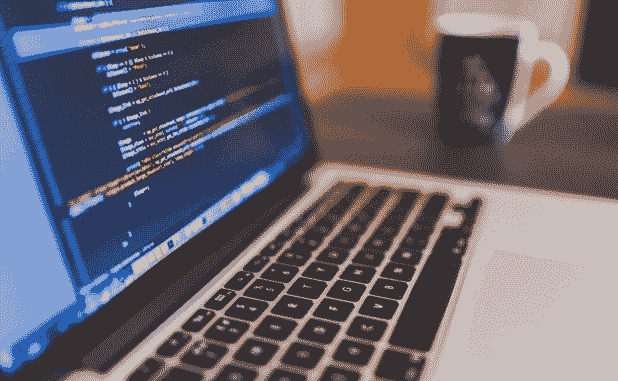

# 保护学生数据隐私的 5 个重要技巧

> 原文：<https://kalilinuxtutorials.com/5-essential-tips-to-protect-your-student-data-privacy/>

技术的快速发展使学生更容易保护他们的信息，并在课堂上与老师互动，从而使学习更容易、更高效。技术使得教师在课堂上与学生合作变得更加容易。

当使用[教育技术工具](https://www.pcworld.com/article/3214486/the-best-educational-software-for-students.html)时，你必须收集相关的学生数据，这样你才能相应地调整你的教学方法。学生信息在您手中，您有责任确保学生个人信息的安全。

你不仅有责任保证信息的安全，还有责任向你的学生展示如何保证信息的安全。保证安全的最佳方式之一是在社交媒体上保持安全，从授权来源下载，并定期更新您的软件和应用程序。这里有五种保护学生数据隐私的方法。

## 1.社交媒体上的安全

创建和维护一个专业的社交媒体账户是让父母和你的同事了解教室里发生的事情的最好方法之一。这意味着你必须检查你的社交账户的隐私设置，使其尽可能的隐私和安全。

例如，如果你有一个 Twitter 账户，你可以将其设置为“受保护”，这样只有有限数量的人可以访问你的推文。如果你在使用脸书，你应该定期查看隐私控制，并且只让你的朋友看到你的账户。

最后，当分享与你的班级相关的照片时，你应该使用照片编辑工具来隐藏你的学生的脸和其他可以暴露他们是谁的信息。商店上还有其他免费应用程序，可以用来隐藏信息和增强学生隐私，如 Luna。

## 2.教育技术工具应该加密

当您访问教育网站以获得[值得信赖的自定义任务帮助](https://assignment-helpers.co.uk/)时，您应该确保数据安全可靠地存储和传输。为此，您需要确保 URL 在 http 后面有字母“s”。如果没有，您应该在 URL 中寻找保护链接的图标。

这样，您就可以确保网站中存储的任何信息都是安全的。另一方面，用户不容易知道手机应用程序是否加密。苹果设备的好处是，它们通过强迫用户使用 https 进行通信来保证学生数据的隐私，而不像 Android 那样没有保证。

## 3.检查工具的隐私政策

对于你使用的每一个技术设备或应用程序，你都必须检查隐私政策是否到位。这意味着你必须通读政策，了解学生的数据隐私是否受到保护。老师是非常忙碌的人。

阅读隐私政策肯定会耗费大量时间。为了避免浪费时间，您需要使用经过教育部门专家测试、验证和审查的工具。例如，增强学生数据隐私的最可信和最安全的工具之一是 Classtime。

## 4.向你的学生和家长说清楚

对学生和家长说清楚，让你更容易、更方便地获得他们的信任，保持他们的信心。在学期开始前，你应该列出一些你会在课堂上用到的工具，让家长们容易拿到。您还应该链接隐私政策，以便家长能够查看这些政策。

## 5.为错误做打算

错误确实时有发生。重要的是要告诉父母，当受保护的数据被滥用或泄露时，他们将如何得到通知。你会直接联系他们吗？他们会收到 IT 部门的信吗？你也应该提供一些解决方案以防这样的事情发生。

## 结论

学生数据是当今最敏感的信息类型之一。教育工作者有义务和责任不惜一切代价保护学生信息。技术的快速进步也带来了网络攻击和犯罪的增加。

对于教育者来说，尽力保护学生的隐私是非常重要的。他们可以通过限制他们的社交媒体账户、使用加密工具、阅读隐私保护政策和提前计划错误来做到这一点。有了上面讨论的五种方法，教育工作者就能很好地处理未来出现的任何问题。

## 个人简历

约书亚·罗宾逊是一名专业作家和编辑。他喜欢定期在自己的网站上分享他对教育和技术未来的见解。在他的空闲时间，你会发现他和他的孩子一起玩或者骑马。