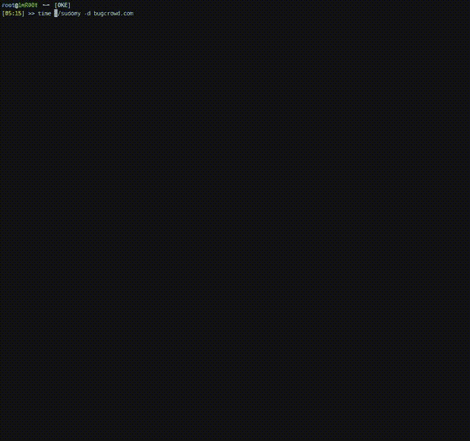
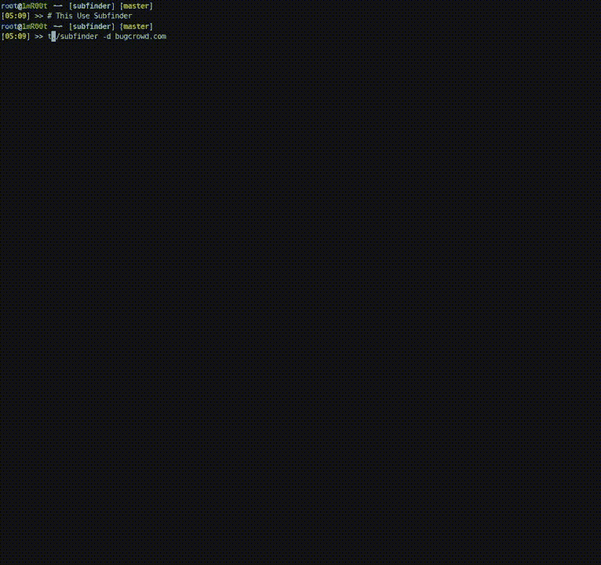
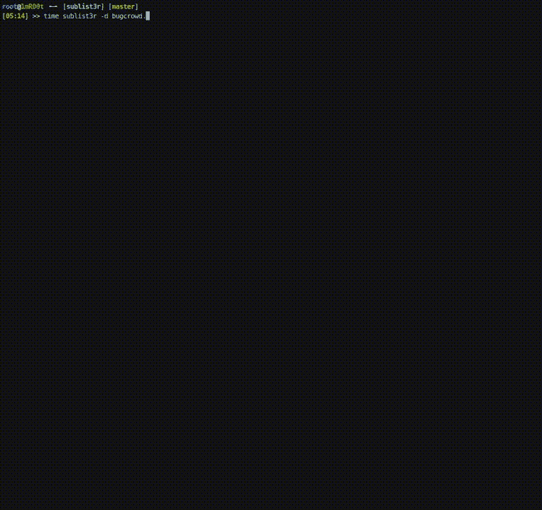
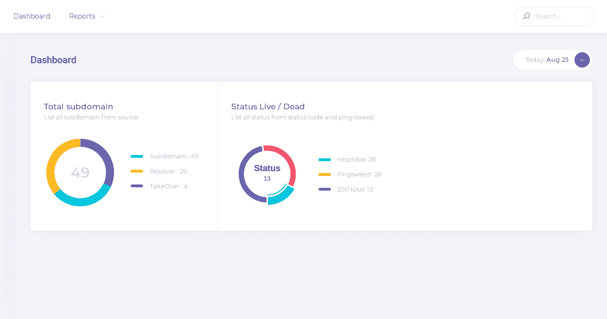
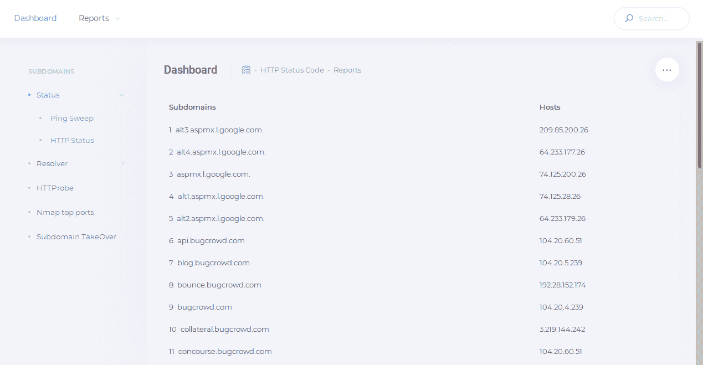

# Sudomy:使用 Bash 脚本创建的子域枚举工具

> 原文：<https://kalilinuxtutorials.com/sudomy-subdomain-enumeration-tool/>

Sudomy 是一个子域枚举工具，使用 bash 脚本创建，以快速和全面的方式分析域和收集子域。

**特性**

##### 近期来看，该工具有以下 9 个特点:

*   简单、轻便、快速且功能强大。默认情况下，Bash 脚本在几乎所有 Linux 发行版中都可用。通过使用 bash 脚本多处理特性，所有处理器都将得到最佳利用。
*   子域枚举过程可以通过使用**主动**方法或**被动**方法来实现
    *   **主动方法**
        *   它利用 Gobuster 工具，因为它在执行 DNS 子域暴力攻击(通配符支持)时具有高速性能。所使用的单词列表来自包含大约 300 万个条目的组合 SecList(发现/DNS)列表
    *   **被动方法**
        *   通过选择第三方站点，可以优化枚举过程。用更少的时间可以获得更多的结果。它可以从这些精心策划的 16 个第三方网站收集数据:
            *   [**https://dnsdumpster.com**](https://dnsdumpster.com)
            *   **[**https://web.archive.org**](https://web.archive.org)**
            *   ****[**https://shodan . io**](https://shodan.io)****
            *   ****[**https://virustotal.com**](https://virustotal.com)****
            *   ******[**https://CRT . sh**](https://crt.sh)******
            *   ****[**https://www . binary edge . io**](https://www.binaryedge.io)****
            *   ****[**https://securitytrails.com**](https://securitytrails.com)****
            *   ******[**https://sslmate.com/certspotter**](https://sslmate.com/certspotter)******
            *   ******[**https://censys . io**](https://censys.io)******
            *   ****[**https://threatminer.org**](https://threatminer.org)****
            *   ******[**http://DNS . buffer over . run**](http://dns.bufferover.run)******
            *   ****[**https://hackertarget.com**](https://hackertarget.com)****
            *   ******[**https://www.entrust.com/ct-search/**](https://www.entrust.com/ct-search/)******
            *   ******[**https://www.threatcrowd.org**](https://www.threatcrowd.org)******
            *   ******[**https://谜语者. io**](https://riddler.io)******
            *   ****[**https://findsubdomains.com**](https://findsubdomains.com)****

 *******   测试收集的子域列表，并探测工作的 http 或 https 服务器。该功能使用第三方工具[http probe](https://github.com/tomnomnom/httprobe)。
*   基于 Ping 扫描和/或通过获取 HTTP 状态代码的子域可用性测试。
*   检测虚拟主机(解析为单个 IP 地址的几个子域)的能力。它会将收集到的子域名解析为 IP 地址，如果有几个子域名解析为一个 IP 地址，它会对它们进行分类。这个特性对于接下来的渗透测试/bug 奖励过程非常有用。例如，在端口扫描中，单个 IP 地址不会被重复扫描
*   从收集的子域/虚拟主机 IP 地址执行端口扫描
*   测试子域接管攻击
*   获取子域名的截图
*   HTML 或 CSV 格式的报告输出

**又读-[4 can:开源安全工具发现现代汽车安全漏洞](https://kalilinuxtutorials.com/4can-security-tool-security-vulnerabilities-cars/)**

**数独是如何运作的**

Sudomy 使用 cURL 库从第三方站点获取 HTTP 响应体，然后执行正则表达式来获取子域。这个过程充分利用多处理器，更多的子域将收集更少的时间消耗。

**对比**

以下是 Sublist3r、Subfinder 和 Sudomy 的被动枚举 DNS 测试结果。在这个比较中使用的域名是**bugcrowd.com**。

**安装**

Sudomy 目前用以下工具扩展。下面链接了如何安装和使用该应用程序的说明。

| 工具 | 许可证 | 信息 |
| --- | --- | --- |
| [捉鬼敢死队](https://github.com/OJ/gobuster) | Apache 许可证 2.0 | 不是强制性的 |
| [http 探测](https://github.com/tomnomnom/httprobe/) | 汤姆·哈德森 | 命令的 |
| [nmap](https://github.com/nmap/nmap) | GNU 通用公共许可证 2.0 版 | 不是强制性的 |

**依赖关系**

**$ pip install-r requirements . txt**

Sudomy 要求 [jq](https://stedolan.github.io/jq/download/) 运行并解析。更多信息，请在这里下载并安装 jq

**# Linux** apt-get 安装 jq nmap phantomjs

**# Mac** brew 木桶安装 phantomjs
brew 安装 jq nmap

**如果您有一个现成的 Go 环境，这很容易:**

**导出 GOPATH=$HOME/go
导出 PATH = $ PATH:$ GOROOT/bin:$ GOPATH/bin【github.com/tomnomnom/httprobe】go get-u
go get-u github.com/OJ/gobuster**

**从 Github 下载 Sudomy**

**#克隆此库** git 克隆-递归 https://github.com/screetsec/Sudomy.git

**#进入库** sudomy-help

**运行在码头集装箱里**

**#从 DockerHub** 拉一个映像 docker Pull screetsec/sudomy:v 1 . 1 . 0

**#运行映像，您可以在自定义目录上运行映像，但您必须在当前目录上复制/下载配置 sudomy . API**
docker Run-v " $ { PWD }/output:/usr/lib/sudomy/output "-v " $ { PWD }/sudomy . API:/usr/lib/sudomy/sudomy . API "-it-RM screetsec

**安装后**

在第三方网站查询前需要 API Key，比如`**Shodan, Censys, SecurityTrails, Virustotal,**`**`**BinaryEdge**`**。****

 ***   API 键设置可以在 sudomy.api 文件中完成。

**# shod an
# URL:http://developer . shod an . io
# Example:
#–shod an _ API = " vghpc1 m 0 bxbszwwkvghmcgxlbao "**
shod an _ API = " "

**# Censys
# URL:https://censys.io/register**
Censys _ API = " "
Censys _ SECRET = " "

**# virus total
# URL**

**用途**

快速子域名枚举分析器
http://github.com/screetsec/sudomy
用法:sud⍥my.sh[-h[–help]][-s[–source]][-d[–domain =]]
示例:sud⍥my.sh-d example.com
sud⍥my.sh-s shod an，virus total-d example.com
sud▽my . sh-PS-RS-sc-nt-ss-d example.com

可选参数:
-a，–all 运行所有枚举，no nmap & gobuster
-b， –HTML 将报告输出转换为 HTML
-s，–source 使用源来枚举子域
-tO，–takeover 子域 take over 漏洞扫描器
-pS，–Ping-Sweep 使用方法检查实时主机 Ping Sweep
-rS，–resolver 将域列表转换为无重复的解析 IP 列表
-sC，–status-code 获取状态代码，来自域列表的响应
-nT，–nmap-使用来自域列表的 nmap 对顶级端口进行顶级端口扫描
-sS

要使用所有 16 个源和探测器来运行 http 或 https 服务器:

**$苏丹-hackerone.com**

要使用一个或多个来源:

**$ sudomy -s shodan，dnsdumpster，web archive-d hackerone.com**

要使用一个或多个插件:

**$苏多米-pS-sC-sS-d hackerone.com**

使用所有插件:测试主机状态，http/https 状态码，子域接管和截图

**$ sudomy–全能 hackerone.com**

创建 HTML 格式的报告

**$ sudomy–全三维 hackerone.com–html**

HTML 报告示例:

[**Download**](https://github.com/Screetsec/Sudomy)********