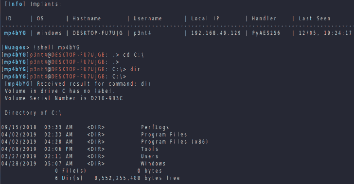
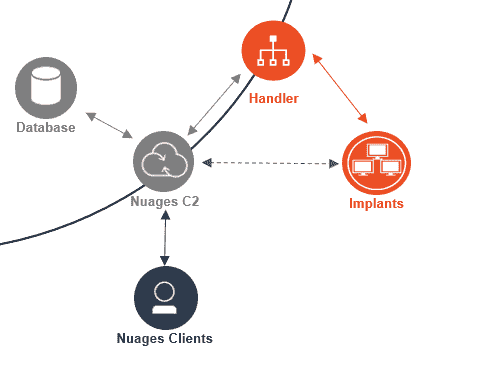

# nu ages:2019 年模块化 C2 框架

> 原文：<https://kalilinuxtutorials.com/nuages-modular-c2-framework/>

Nuages 的目标是成为一个 C2 框架，其中后端元素是开源的，而植入物和处理程序必须由用户专门开发。因此，它没有提供生成植入物的方法，而是提供了一个开发和管理兼容植入物的开源框架，该框架可以利用已经开发的所有后端资源。

这种设计希望通过促进定制植入物的开发和降低植入物被防御解决方案检测到的可能性来促进渗透测试。

虽然 Nuages 正在运行，但它仍是一项进行中的工作，欢迎贡献，无论是单纯的测试，还是开发新的模块和兼容的客户端。

作为测试和参考，本报告中提供了一个植入物和操作器的例子。

**架构**

Nuages C2: 它是 C2 的核心，管理植入物，它是开源的，应该不需要定制。它公开了 Nuages API，可通过 REST 或 Socket.io 访问。

**植入:**在目标设备上运行的自定义代码，它们可以通过自定义协议与处理程序通信，或者直接与 Nuages API 通信。

**处理程序:**自定义代码，作为植入程序和 Nuages API 之间的代理，实现自定义通信协议(DNS 隧道、域名转发、IRC 等)。

**客户端:**客户端依赖于 Nuages API，可以以任何形式实现，如 cli 或 web 应用程序。

**免责声明**

这个项目是为安全研究人员和渗透测试人员设计的，不应该用于任何非法活动。

[**Download**](https://github.com/p3nt4/Nuages)