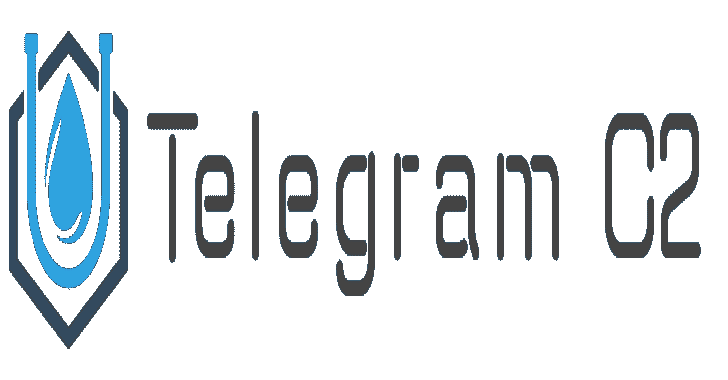
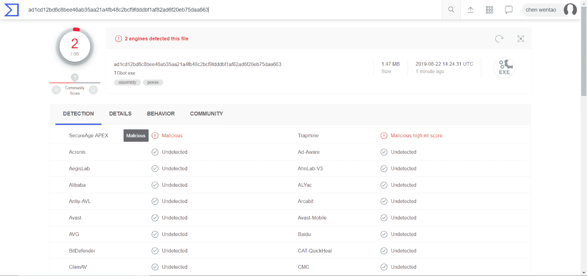
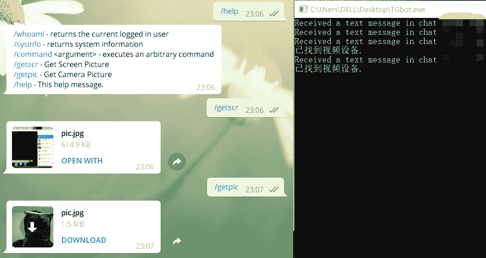

# telegra cs harp C2:C #编写的命令和控制

> 原文：<https://kalilinuxtutorials.com/telegra-csharp-c2/>

Telegra Csharp C2 是一个用于 C#编写的命令和控制工具。TelegramBotClient 允许您为 Bot API 连接使用代理。

**病毒总量检查结果**

不要再传给病毒总了。我已经为你试过了。

**安装**

###### 下载这些包

使用系统。木卫一；
利用电报。Bot
使用电报。Bot . Args
利用电报。Bot . Types.InputFiles
用一个词。视频；
用一个词。控制；
用一个词。Video . DirectShow

**也可阅读-[Nuages:模块化 C2 框架 2019](https://kalilinuxtutorials.com/nuages-modular-c2-framework/)**

在“引用”中添加相关类

系统。绘图；
系统。Windows . Forms

**如何使用**

修改您的程序令牌

static void Main(){
bot client = new TelegramBotClient(" token ")；//你的令牌
botClient。on message+= Bot _ on message；
僵尸客户端。start receiving()；
线程。睡眠(int。max value)；
}

**代理**

TelegramBotClient 允许您为 Bot API 连接使用代理。

**HTTP**

对于 HTTP 代理，您可以将 IWebProxy 传递给 bot 客户端。

//使用 System.Net；
var httpProxy = new WebProxy(" https://example . org "，8080)
{
Credentials = new network credential(" USERNMAE "，" PASSWORD ")
}；
var bot client = new TelegramBotClient(" YOUR _ API _ TOKEN "，http proxy)；

**袜子 5**

你可以使用一个外部的 NuGet 包: [HttpToSocks5Proxy](https://www.nuget.org/packages/HttpToSocks5Proxy/) 提供

**//使用 MihaZupan** var proxy = new httptosocks 5 proxy(socks 5 server address，socks 5 server port)；
**//或者如果需要代理服务器的凭证:** var proxy = new httptosocks 5 proxy(
socks 5 server address，Socks5ServerPort，" USERNAME "，" PASSWORD "
)；
**//允许您使用只允许连接到电报的代理
//需要一些代理**
代理。ResolveHostnamesLocally = true
var botClient = new TelegramBotClient(" YOUR _ API _ TOKEN "，proxy)；

**如何编译**

**如何将所有 DLL 文件编译成一个 EXE 文件**

首先，你需要下载 ILMerge 工具，这是一个合并所有引用的工具。NET 程序。

ilmerge.exe/target:exe/out:tgbot . exe ConsoleApp1.exe AForge.Controls.dll AForge.dll AForge.Imaging.dll AForge.Math.dll AForge.Video.DirectShow.dll AForge.Video.dll Newton soft . JSON . dll Telegram . bot . dll/target platform:v4

/target-> library = > DLL exe = > exe
/target platform:v4->编译器平台是。net 4.0
/out - >合并输出文件，参数后面跟需要合并的文件

最后，在 out 参数指定的目录中生成输出

**信用:相思鸟**

[**Download**](https://github.com/sf197/Telegra_Csharp_C2)