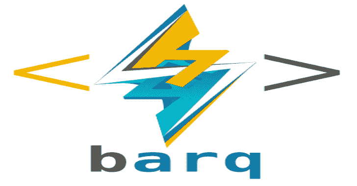

# barq:AWS 云后期开发框架

> 原文：<https://kalilinuxtutorials.com/barq-aws-cloud-exploitation-framework/>

Barq 是一个后利用框架，允许您轻松地对正在运行的 AWS 基础设施进行攻击。它允许您在没有原始实例 SSH 密钥对的情况下攻击正在运行的 EC2 实例。

它还允许您对 AWS 中存储的秘密和参数执行枚举和提取。

**先决条件**

*   现有的 AWS 帐户访问密钥 id 和密码(在某些情况下也是令牌)
*   Python 2 或 3。它可以运行两者。要运行 msfvenom 有效负载，您需要 msfvenom 在您的工作站上可用，并且路径设置正确。

**另请阅读-[说服你整合系统的五大优势](https://kalilinuxtutorials.com/five-benefits-that-will-convince-you-to-integrate-your-systems/)**

**安装**

对于 python 2:

**pip install-r requirements . txt**

对于 python3

**pip 3 install-r requirements . txt**

最好为工具创建一个虚拟的环境。请注意，不建议将 sudo 与 pip 一起使用。

**主要特点**

*   在不知道密钥对或连接配置文件/密码的情况下攻击 EC2 实例。
*   转储 EC2 机密和参数。
*   枚举 EC2 实例和安全组。
*   针对 EC2 实例启动 Metasploit 和 Empire 有效负载的能力。
*   测试攻击和功能的培训模式，不会干扰运行的生产环境。
*   基于菜单的导航系统中的选项卡完成的命令。
*   能够转储 EC2 实例元数据详细信息。
*   使用 EC2 密钥或令牌的能力(例如从受损的实例或泄露的源代码中获得)
*   在 cli 模式下为您打印 msfconsole 的监听命令，以便于复制粘贴。

**待办事项**

*   为框架中的菜单创建一个基于插件的类系统
*   添加从安全组中排除攻击者定义的 IP 和端口的功能。
*   添加持久性功能。
*   对拉姆达、S3 和 RDS 发动攻击。
*   以 nmap 就绪格式导出主机名、IP 和端口以供扫描。
*   与 Metasploit 和 Empire REST APIs 完全集成。

信用:穆罕默德·阿尔杜布

[**Download**](https://github.com/Voulnet/barq)