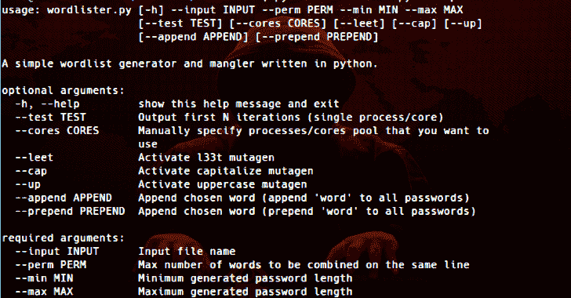

# Wordlister:一个用 Python 编写的简单的单词列表生成器& Mangler

> 原文：<https://kalilinuxtutorials.com/wordlister-simple-wordlist-generator/>

Wordlister 是一个用 python 编写的简单的单词列表生成器和代码转换器。它利用 python 的多处理能力来加速他的工作(CPU 密集型)。

**支持的排列**

*   资本
*   上面的
*   1337
*   附加
*   预先考虑

**附加功能**

*   测试/试运行
*   多重处理
*   多心的
*   手动调整核心/进程数量的可能性。
*   每个生成的密码不会包含两次相同的单词。

**又念——[hash catch:自动捕捉附近 WiFi 网络的握手](https://kalilinuxtutorials.com/handshakes-wifi-networks/)**

**预览**

**sage:**word lister . py[-h]–INPUT INPUT–PERM PERM–敏敏–MAX MAX
[–TEST TEST][–CORES CORES][–leet][–cap][–up]
[–APPEND APPEND][–PREPEND PREPEND]
**一个用 python 写的简单的单词列表生成器和 mangler。**
**可选参数:
-h， –help**显示此帮助消息并退出
**–TEST TEST**输出前 N 次迭代(单个进程/内核)
**–CORES**手动指定您想要使用的进程/内核池

**–leet**激活 l33t 诱变剂
**–cap**激活大写诱变剂
**–up**激活大写诱变剂
**–t
**必需参数:
–INPUT INPUT**输入文件名
**–PERM PERM**同一行最大组合字数
**–敏敏**最小生成密码长度
**–Max Max 最大生成密码长度****

这个项目仅用于教育目的。不要用于非法活动。我不支持也不宽恕非法或不道德的行为，我不能对可能滥用该软件负责。

[**Download**](https://github.com/4n4nk3/Wordlister)