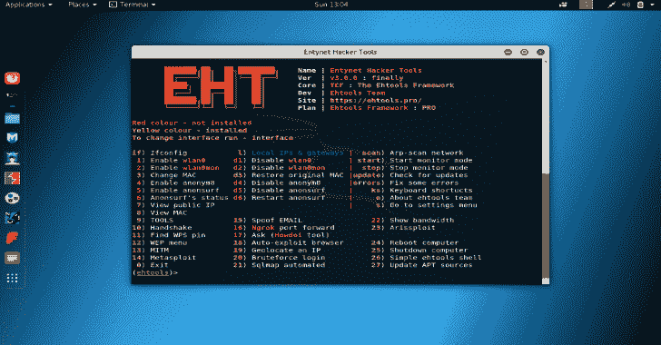
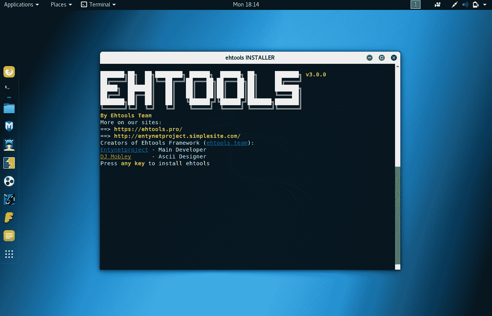
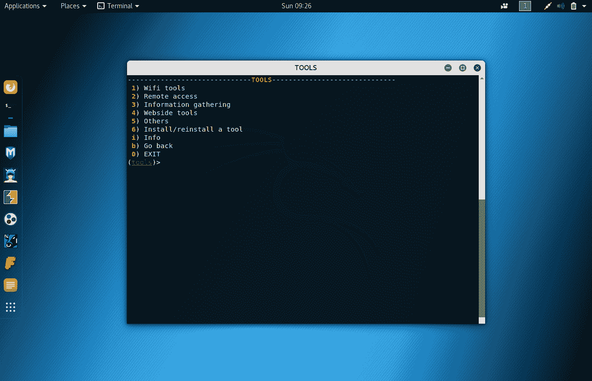
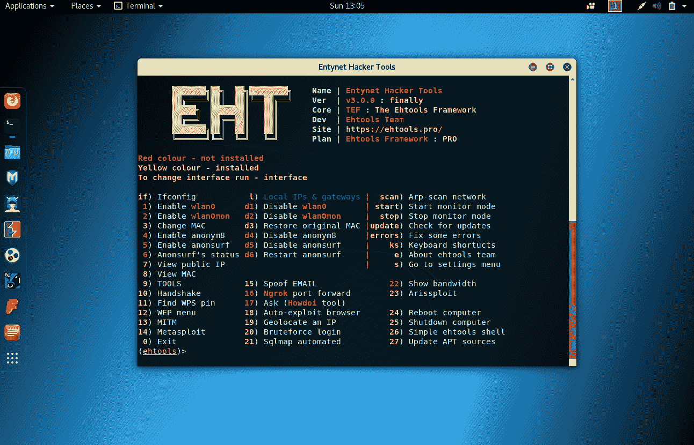
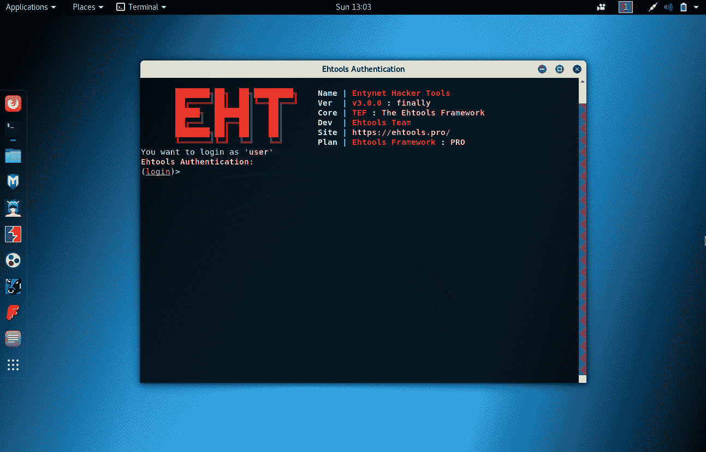
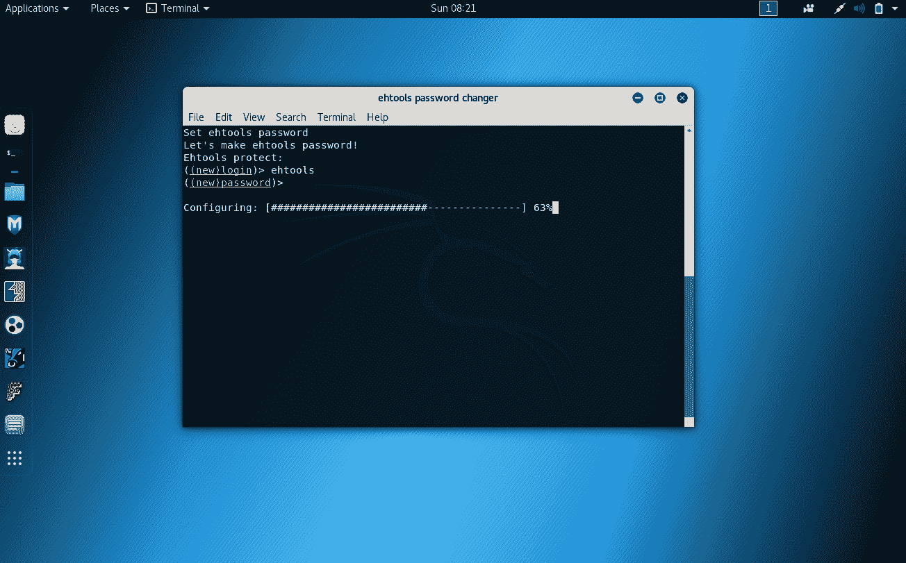

# Ehtools:易于探索的渗透工具

> 原文：<https://kalilinuxtutorials.com/ehtools-penetration-tools/>

Wi-Fi 工具对初学者来说变得越来越容易访问，而 **Ehtools** 框架是一个包含大量渗透工具的框架，可以在其中轻松探索。

这个强大而简单的工具可以用于任何事情，从安装新的附加组件到在几秒钟内抓取 WPA 握手。此外，它易于安装、设置和使用。

**如何安装？**

**CD ehtools
chmod+x install . sh
。/install.sh**

**选择框架版本**

**信息:**执行 install.sh 后，将要求您选择 Ehtools 框架的版本–PRO OS LITE。如果您没有购买 Ehtools Framework PRO，请选择 LITE。如果您购买了 Ehtools Framework PRO，请选择 PRO。

**。/install.sh**

您希望安装哪个版本的 Ehtools 框架？(pro/lite):
如果您没有购买 Ehtools Framework PRO，请选择 lite！如果你买了 Ehtools 框架专业版，选择专业版！(版本)>

如果您选择 Ehtools Framework PRO，您将需要使用 Ehtools 激活密钥来激活它，您需要从 Ehtools 网站购买激活密钥。如果您有 Ehtools 激活密钥，请阅读以下说明。

**也可阅读-[星座:以图形为中心的数据可视化&互动分析应用](https://kalilinuxtutorials.com/constellation-graph-focused-data-visualisation-interactive-analysis/)**

**如何激活 ehtools PRO** ？

你可以在 ehtools 网站上花一美元买到这个密钥！此密钥用于激活 ehtools PRO。在 install.sh 文件中的激活密钥输入字段中输入此密钥，然后您可以安装 ehtools 并仅将其用于教育目的！

**警告:**钥匙只工作一周就变了！在更新之前，您需要有时间输入它！

**。/install.sh**

*   输入您的 ehtools 激活密钥！
*   你可以在 ehtools 网站上购买！
*   (激活密钥)>

此外，我们不建议更改 ehtools 的源代码，因为它非常复杂，您可能会搞砸一些事情并破坏框架！

警告:我们不建议更改 ehtools 源代码，因为您可能会破坏框架！

**如何卸载 ehtools？**

**条件工具-r**

**警告:**如果您想重新安装您购买的 ehtools PRO，请不要这样做，因为您将需要再购买一次！

**攻击框架**

大多数新的 Wi-Fi 黑客工具依赖于许多相同的底层攻击，而使用其他更熟悉的工具(如 airplay-ng)自动化的脚本通常被称为框架。这些框架试图以智能或有用的方式组织工具，使它们超越原始程序的功能或可用性。

这方面的一个很好的例子是集成了 Airodump-ng 等扫描工具、WPS Pixie-Dust 等攻击和 Aircrack-ng 等破解工具的程序，为初学者创建了一个易于跟踪的攻击链。这样做使得使用这些工具的过程更容易记住，并且可以被看作是一种有指导的游览。虽然这些攻击中的每一个都可能在没有手握的情况下发生，但结果可能比自己尝试这样做更快或更方便。

我们已经讨论过的一个例子是 Airgeddonframework，这是一个无线攻击框架，它做了一些有用的事情，如自动化目标选择过程，并消除了用户在程序之间复制和粘贴信息所花费的时间。这为即使是经验丰富的 pentesters 节省了宝贵的时间，但缺点是阻止初学者了解攻击的“幕后”发生了什么。虽然这是真的，但这些框架中的大多数都是快速、高效且非常易于使用的，即使是初学者也能攻击并瘫痪整个网络。

**面向初学者的 UX/UI 改进**

ehtools 框架启动时只需在终端窗口中键入字母 Ehtools 或 eht，然后在第一次运行后它会询问您的网络接口的名称。

它使用您提供的名称连接到执行您选择的任何攻击所需的工具。除了初始输入之外，大多数可能的攻击都可以通过从菜单中选择选项号来执行。

这意味着你可以抓取一个网络握手或下载一个新的黑客工具，如 Pupy，只需从一个菜单选项中进行选择。

**使用基本网络工具**

首先，我们可以从主菜单中访问有关我们当前连接的网络以及任何网络接口的数据。在这里，我们只需输入 l 就可以找到本地信息，调出本地 IP 信息，如下所示。

这允许我们做一些事情，比如扫描网络中的其他设备。Ehtools 框架的这一部分使我们能够更好地了解网络，并了解我们周围有哪些设备。各种信息可以细分如下:

【T0(条件工具)>如果

**INFO:** 运行 ifconfig 并给出所有网络设备的名称和信息。

【T0(条件工具)> 1

**信息:**使能 wlan0。
(d1 禁用)

【T0(条件工具)> 2

**信息:**启用 wlan0mon。
(d2 禁用)

**【条件工具】T2【3】t1**

**信息:**将 MAC 地址随机化或设置为特定值。

**【条件工具】T2【7】t1**

**信息:**查看您的电脑在您访问的网站上留下的公共 IP 地址。

【T0(条件工具)> 19

**INFO:** 查找给定 IP 地址的物理地址，以确定其相对位置。

【T0(条件工具)>扫描

**信息:**在网络上启动 ARP 扫描以发现附近的设备。

【T0(条件工具)>开始

信息:在无线网络适配器上启动监视器模式。

【T0(条件工具)>停止

信息:停止网络适配器上的无线监视器模式。\

**安装新工具**

Ehtools 框架的部分乐趣在于向我们的武库中添加新工具是多么容易。为了演示这一点，让我们下载 Pupy，这是一个基于 Python 的 RAT，旨在控制网络上的其他计算机。我们可以选择选项 9 来访问 Ehtools 框架中的工具列表。

信息:我们的框架在 ehtools 存档中有超过 100 个包(在服务器上这个存档:2.3 Tb)！

在下一个菜单中，工具分为几个主要类别，并带有管理脚本安装的选项。提供的选项有:

*   **Wi-Fi 工具(攻击无线网络的工具)。**

**INFO:** Wi-Fi 选项这是攻击无线网络和网络数据库的工具。

*   **远程访问(用于远程访问其他设备并对其进行远程管理的工具)。**

**信息:**远程访问是指访问其他设备并对其进行远程管理的工具。

*   信息收集(收集人们或网站上的情报)。

**信息:**信息收集工具，收集人们或网站上的情报的工具。

*   **网站工具(利用或攻击网站的工具)。**

**信息:**网站工具，利用或攻击网站和网络数据库的工具。

*   **其他(其他黑客工具的杂集)**

信息:其他工具这是各种黑客工具的集合。

您还可以通过访问选项 6 来管理已安装的工具。要下载 Pupy，我们将进入选项 2，即远程访问。在这里，我们将看到用于远程访问的不同工具的列表，我们可以为 Pupy 选择选项 3。

**使用 ehtools 快速访问**

**信息:** ehtools 快速访问，这是当您运行 Ehtools 时，例如 ehtools -r 删除 Ehtools！

运行它以打开快速访问菜单:

**条件工具-o**

运行它以更新 ehtools:

**条件工具-u**

运行它以删除 ehtools:

**条件工具-r**

运行它进行握手:

**条件工具-h**

运行它打开 WPS 菜单:

**条件工具-在**中

**信息:**对于此快捷方式，您不需要输入您的 ehtools 密码！

**为什么要 ehtools 框架？**

**默认安装了 58 个以上的测试工具**

**INFO:** 超过 58 个默认安装的选项你可以在 ehtools 中找到，这就是 MetaSploit、WireShark 等工具！

**密码保护和配置加密**

**信息:**在 2.1.6 版本中，我们添加了密码保护，我们为那些认为他/她的朋友或父母会变成 ehtools 并将删除或破坏它的用户添加了密码保护。我们只为这些人创建 Ehtools 框架的密码保护🙂

**简单易学，这是初学者的最佳框架**

Ehtools Framework 的 TUI 对于初学者来说非常简单，你可以通过从主菜单中选择一个选项来开始攻击本地网络。这很简单，不是吗？

**面向初学者的 UX/UI 改进**

**INFO:** 它使用您提供的名称连接到执行您选择的任何攻击所需的工具！除了初始输入之外，大多数可能的攻击都可以通过从菜单中选择选项号来执行。这意味着你可以抓取一个网络握手或下载一个新的黑客工具，如 Pupy，只需从一个菜单选项中选择！

**您可以从 ehtools 或 ehtoolslite 安装 100 多种工具**

信息:我们的框架在 ehtools 存档中有超过 100 个包(在服务器上这个存档:2.3 Tb)！

**系统要求**

**完全根访问和对/root 文件夹的访问**

**信息:**所有 ehtools 文件和文件夹将复制到/root、/bin 和/etc 系统文件夹中，以便将 ehtools 数据复制到您需要 root 访问权限的系统中！

**Bourne-again shell 和 Gnome-terminal shell**

ehtools GUI 需要 Bourne-again shell 和 Gnome-terminal shell，但没有 Gnome-terminal shell 模块，如(eht1、eht2 等)。)就不行了！

**为服务器支持提供良好的互联网连接(仅限 ehtools PRO)**

**信息:**对 ehtools PRO 的服务器支持是系统要求之一，需要它来收集有关 ehtools 崩溃的信息，还需要它来检查产品状态，例如(您购买了 ehtools/您没有购买 ehtools)

**Ehtools 实用程序**

**【ucci】**

**uie cache—**(卸载 ehtools 缓存)该实用程序可以帮助您清理/卸载 ehtools 缓存，如登录日志或。配置文件！

**用法:uiecache [OPTION…]
版权所有(C) 2019，Entynetproject。保留所有权利。**
–全部卸载所有 ehtools 缓存。
(standard old uie cache)
–path 从你的 path 中卸载 ehtools 缓存。
(从路径卸载缓存)
–重启重启所有 ehtools 进程和服务。
(重启 ehtools 系统)
–帮助给出此帮助列表。

**如何保护 ehtools**

**用 install.sh:** 做

**COUNCIL:** 从 install.sh 创建登录名和密码(默认值:login: ehtools password: sloothe)

当您要退出 ehtools 时，请这样做:

**COUNCIL:** 当你要退出框架时，用快捷键-0 退出或者退出。

当您要退出 ehtools 时，请不要这样做:

**警告:**不要关闭 ehtools 窗口！

[**Download**](https://github.com/entynetproject/ehtools)