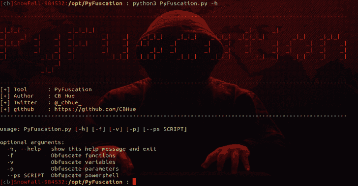

# PyFuscation:通过替换函数名、变量和参数来混淆 Powershell 脚本

> 原文：<https://kalilinuxtutorials.com/pyfuscation-function-names-variables-parameters/>

**PyFuscation** 是一个通过替换函数名、变量和参数来混淆 powershell 脚本的程序。它需要 python3。

**用途**

**pyfuscation . py[-h][-f][-v][-p][–PS SCRIPT]**

**也可阅读-[Barq:AWS 云发布开发框架](https://kalilinuxtutorials.com/barq-aws-cloud-exploitation-framework/)**

可选参数:

-h，–帮助显示此帮助消息并退出
-f 混淆函数
○先做这个…这可能是最有可能工作良好的
-v 混淆变量
○如果你要混淆变量也做参数。
-p 混淆参数
○如果你要混淆参数也做变量。

**必需参数:–PS<脚本>混淆 PowerShell 脚本**

ython 3 pyfuscation . py-fvp–PS。/Scripts/Invoke-mimikatz . PS1

[**Download**](https://github.com/CBHue/PyFuscation)