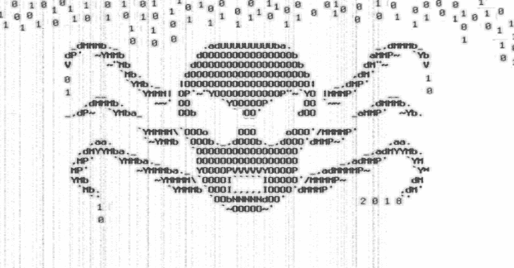

# EMAGNET:泄露数据库 97.1%准确抓取邮件+密码

> 原文：<https://kalilinuxtutorials.com/emagnet-leaked-databases-grab-mail-password/>

Emagnet 是一个非常强大的工具，它的目的是从上传到 pastebin 的泄露数据库中捕获电子邮件地址和密码。当密码不在 pastebin.com[的列表中时，几乎不可能找到泄露的密码。](http://pastebin.com)

要么他们已经被 pastebin 的技术人员删除，要么上传的只是人群中的一员。老实说，这是大海捞针，然后在 pastebin 上找到我们想要收集的数据的过时上传更容易。

将在下一次推送中修复的已知问题！

*   SSH Bruterforcer 不再完全工作了
*   使用 termux 应用程序时，android 设备的需求包不能与暴力工具+屏幕一起工作
*   将错误的数据发送到 emagnet.log，而哪些文件包含正确的数据

**也读-[Wordlister:一个简单的单词列表生成器&用 Python 写的 Mangler](https://kalilinuxtutorials.com/wordlister-simple-wordlist-generator/)**

**提示**

##### 暴力行为后果自负。

对于喜欢分类的人来说。如果你的硬盘上存储了一些泄露的数据库(或者很小),但你懒得去弄清楚如何尝试它们是否能在 spotify 或 gmail 上工作，那么只需在“$HOME/”中创建一个随机的文本文件。config/emagnet/tmp/some-random-file”-将所有登录添加为:mail:password 每行一个-

现在只要像往常一样运行 emagnet，你将强制所有你添加到文件中的帐户，所有破解的帐户将被存储在日志目录中！一旦完成，你将有一个很好的帐户列表，实际上是真实的，或者至少你知道哪些帐户你可以放在你的文本文件的顶部，你知道是合法的。

如果您想使用 socks5 代理/ ssh 隧道，请不要忘记使用 vpn、tor 或仅编辑 curl 命令:对于 socks5 代理，请使用:curl–socks 5-hostname localhost:port……对于 tor，请使用 curl–socks 5 127 . 0 . 0 . 1:9150……

**演示–工作原理**

左边是你所看到的——右边是背景中实际发生的事情

**Linux/ma cosx 入门**

**git 克隆 https://github . com/Wu Eman/emane
CD emane
chmod+x emane *
。
。/磁铁–磁铁**

**通过 Termux 开始使用 Android】**

性爱视频

*   从 play store [这里](https://play.google.com/store/apps/details?id=com.termux&hl=en_US)下载 termux

安装后，复制并粘贴以下命令:

echo-e '
pkg update
pkg upgrade-y
pkg install wget curl git-y
git clone https://github.com/wuseman/emagnet
CD emagnet
bash emagnet–emagnet '>emagnet-termux . sh
bash emagnet-termux . sh

**通知**

通过 emagnet 攻击你没有被授权或允许攻击的不同类型的帐户是严格禁止的，这违反了法律。惩罚是严厉的，在一些国家，你甚至会因为试图攻击他人而被关进监狱。

也就是说，所有用户都意识到这一点是很重要的，当你克隆或下载时，每个用户都要对自己的行为负责。wuseman 不对任何用户的行为负责，所有使用 Emagnet 的用户自行负责。

开发者:“我所有的暴力攻击的预览都是在拥有者 100%完全许可的控制下进行的。如果您对此有任何疑问，欢迎联系我或店主。”

**讨厌的人会讨厌**

如果你是那些不喜欢*EMAGNET*的人之一，并且认为开发该程序的原因会违反法律，那么我对参与你的意见不感兴趣，把它们留给*你自己*！Emagnet】不会向开发者或其他任何人泄露任何数据。

没有任何统计数据来跟踪任何用户，所以如果你想联系我，问可能是谁谁下载了电子邮件，一个具体的日期是完全没有用的，因为我真的不知道，老实说，我不在乎。

请随意阅读关于 emagnet 的历史[这里](https://github.com/wuseman/EMAGNET/wiki/About)以及这个项目的一切是如何开始的。

emagnet 的开发正在进行中，并且经常更新，如果您报告问题/错误，请使用最新版本。

[**Download**](https://github.com/wuseman/EMAGNET)