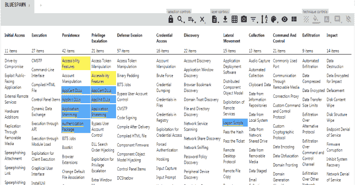

# BLUESPAWN:基于 Windows 的主动防御和 EDR 工具，为蓝队提供支持

> 原文：<https://kalilinuxtutorials.com/bluespawn-windows-based-active-defense-edr-tool/>

**BLUESPAWN** 通过检测异常活动，帮助 blue 团队实时监控 Windows 系统，防范活跃的攻击者。我们出于多种原因创建并开源了这个工具，其中包括:

*   **行动更快**:我们需要专门设计的工具来快速识别系统上的恶意活动
*   **了解我们的覆盖范围**:我们想确切地知道我们的工具可以检测到什么，并且不那么依赖黑盒软件(即反病毒程序)。这种方法将有助于我们更好地将我们的努力集中在具体的努力方向上，并对他人的状况有信心。
*   **更好地理解**:我们希望更好地理解 Windows 攻击面，以便更好地防御它
*   **更多开源的蓝队软件**:虽然有很多开源的红队工具，但是绝大多数最好的蓝队工具都是闭源的(例如 AVs、EDRs、SysInternals 等)。我们不应该需要通过默默无闻来依靠安全来防止恶意行为者(显然非常困难，但却是值得努力的事情！)
*   展示 Windows API 的特性:我们梳理了大量的微软文档、StackOverflow 答案和更多的内容来创建这个。希望其他人会发现一些有用的代码。

[点击此处](https://ion28.github.io/BLUESPAWN/#layerURL=https%3A%2F%2Fion28.github.io%2FBLUESPAWN%2Fassets%2Fcoverage.json)了解更多信息。

**也可阅读-[Ehtools:可以轻松探索的穿透工具](https://kalilinuxtutorials.com/ehtools-penetration-tools/)**

**努力方向**

BLUESPAWN 由下面列出的 5 个主要模块组成。这些模块中有几个有下面列出的子模块(可能还没有在代码库中创建)，并且都处于不同的计划、研究和开发阶段。

*   **狩猎**
    *   配置和设置
    *   文件系统
    *   打猎
    *   处理
*   **监视器**
    *   ETW
    *   文件监视器
    *   过程监视器
    *   注册表监视器
    *   用户挂钩
*   **反应**
    *   反应
*   **BLUESPAWN(程序主)**
*   **测井**

[**Download**](https://github.com/ION28/BLUESPAWN)