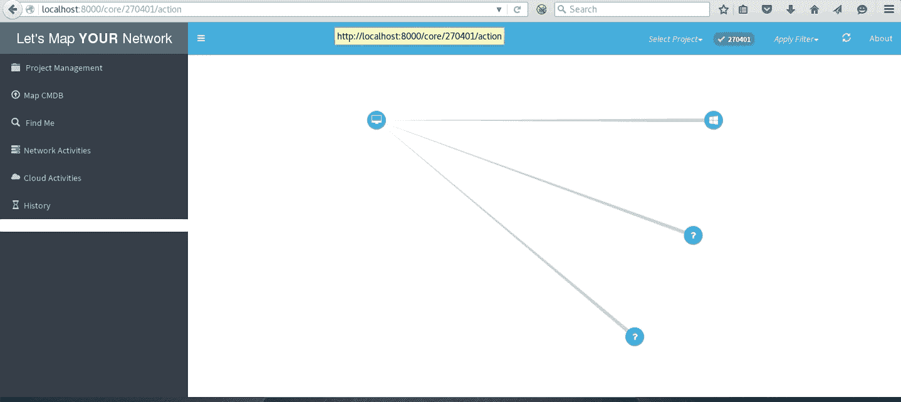
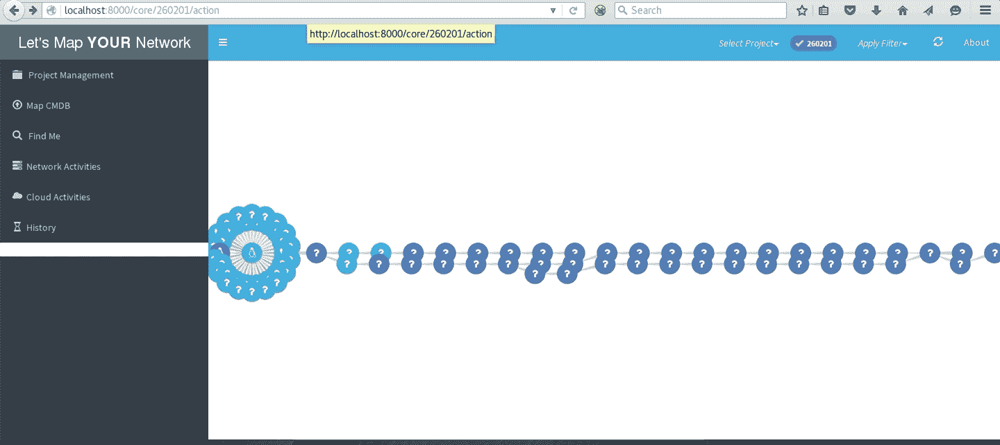
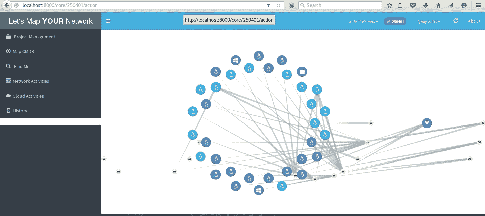

# LMYN:让我们绘制你的网络来可视化你的物理网络

> 原文：<https://kalilinuxtutorials.com/lmyn-lets-map-your-network/>

**LMYN 或 Lets Map 您的网络**使您能够以图表的形式直观显示您的物理网络，而不会出现任何手动错误。

对任何安全工程师来说，在保护网络安全之前，首先了解他们的网络是至关重要的，而“真正”了解一个广泛分布的网络是一项艰巨的任务。

在中大型组织的网络中，拥有网络体系结构图并不能提供完整的理解，手动验证是一场噩梦。

因此，为了确保整个网络的安全，对连接到您网络的所有系统有一个完整的了解是很重要的，不管它们的类型、功能、技术等如何。

**底线——你不能保护你不知道的东西。**

Let's Map Your Network (LMYN)旨在为安全工程师和网络管理员提供一个易于使用的界面，使他们的网络以图形形式呈现，零人工错误，其中一个节点代表一个系统，节点之间的关系代表连接。

**LMYN 分两个阶段进行:**

*   学习:在这个阶段，LMYN 通过执行网络命令和查询 API 来“学习”网络，然后利用响应建立图形数据库。用户可以在任何时间点执行任何学习活动，LMYN 会将结果纳入现有的数据库。
*   监控:这是一个连续的过程，LMYN 监控“范围内”网络的任何变化，将其与现有信息进行比较，并相应地更新图形数据库。

该工具使用了以下技术:

*   Django Python
*   Neo4j 数据库
*   适马 JS
*   芹菜和兔子

**也可阅读-[Ehtools:可以轻松探索的穿透工具](https://kalilinuxtutorials.com/ehtools-penetration-tools/)**

**为什么是**

*   以图形形式显示基础设施网络使其更加“可见”,对于安全工程师和网络管理员来说，执行分析和确定关键关注领域变得非常容易
*   此外，让我们绘制您的网络图完全基于“种子”系统执行的网络操作(将成为实际网络的一部分)或查询 API。因此，在网络映射中不会出现人工错误

**用在哪里**

*   网络架构'验证'
*   网络管理员的故障排除
*   内部网络漏洞评估和渗透测试

**LMYN 在行动**

**本地子网网络**

**具有到多个目的地的跟踪路由的网络**

**CMDB 上传**

**云网**

**贷项:varchashva**

[**Download**](https://github.com/varchashva/LetsMapYourNetwork)