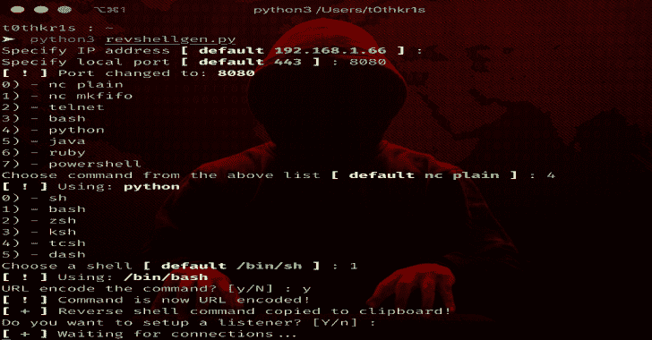

# Revshellgen:用 Python 写的反向外壳生成器

> 原文：<https://kalilinuxtutorials.com/revshellgen-reverse-shell-generator/>

Revshellsgen 是一个独立的 python 脚本，用于轻松地生成反向 shell，并自动完成 URL 编码命令和设置监听器等枯燥的工作。

**下载**

**git 克隆 https://github.com/t0thkr1s/revshellgen**

**也可阅读-[Ehtools:可以轻松探索的穿透工具](https://kalilinuxtutorials.com/ehtools-penetration-tools/)**

**安装**

该脚本有两个依赖项:

*   [pyperclip](https://pypi.python.org/pypi/pyperclip)
*   [colorama](https://pypi.python.org/pypi/colorama)

您可以通过键入以下命令来安装它们:

**python3 setup.py 安装**

**免责声明**

该工具仅用于测试和学术目的，并且只能在严格同意的情况下使用。请勿用于非法目的！最终用户有责任遵守所有适用的地方、州和联邦法律。开发人员不承担任何责任，也不对该工具和软件造成的任何误用或损坏负责。

[**Download**](https://github.com/t0thkr1s/revshellgen)