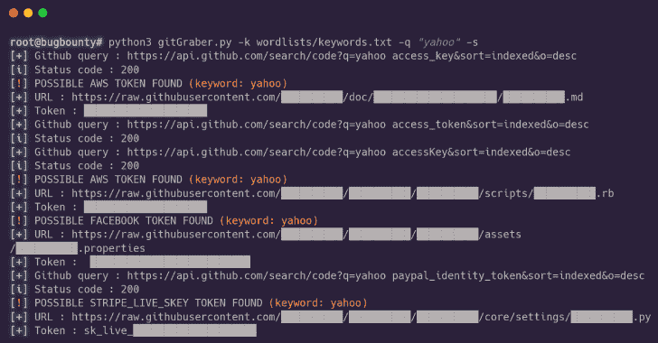

# GitGraber:监控 GitHub 以搜索和查找敏感数据

> 原文：<https://kalilinuxtutorials.com/gitgraber-monitor-github/>

**GitGraber** 是 Python3 开发的一个工具，用于监控 Github 实时搜索和查找不同在线服务的敏感数据，如:谷歌、亚马逊、Paypal、GitHub、Mailgun、脸书、Twitter、Heroku、Stripe。

它是如何工作的？

重要的是要明白 gitGraber 不是设计来检查存储库历史的，许多工具已经可以做到这一点。最初开发 gitGraber 是为了监控和解析 GitHub 上最近索引的文件。如果 gitGraber 发现一些有趣的东西，你会在你的 Slack 频道上收到通知。您还可以使用它直接在命令行上得到结果。

根据我们的经验，我们确信泄漏不仅来自组织本身，还来自服务提供商和员工，他们不一定有表明他们为某个特定组织工作的“个人资料”。

正则表达式应该比可能的更精确。有时，也许你会有假阳性，请随意改进 recon 并为模式检测添加新的正则表达式。

我们倾向于减少误报，而是为每个“标准”API 键发送通知，这些键可能被 gitGraber 找到，但与您的监控无关。

**也可阅读-[Mondoo:原生安全&漏洞风险管理](https://kalilinuxtutorials.com/mondoo-security-vulnerability-risk-management/)**

**如何使用 gitGraber？**

用法:git graber . py[-h][-k KEYWORDSFILE][-q QUERY][-s][-w WORDLIST]
可选参数:
-h，–help 显示此帮助消息并退出
-k KEYWORDSFILE，–KEYWORDSFILE
指定一个关键字文件(-k keywordsfile.txt)
，–q QUERY，–QUERY
指定您的查询(-q“API key”)
-s，–slack Enable slack notifications
-w WORDLIST，–word

**依赖关系**

gitGraber 需要一些依赖项，以便在您的环境中安装它们:

**pip 3 install-r requirements . txt**

**配置**

在启动 **gitGraber** 之前，您需要修改配置文件`config.py`:

*   添加您自己的 Github 令牌:`**GITHUB_TOKENS = ['yourToken1Here','yourToken2Here']**`
*   添加您自己的 Slack Webhook : `**SLACK_WEBHOOKURL = 'https://hooks.slack.com/services/TXXXX/BXXXX/XXXXXXX'**`

[**如何创建 Slack Webhook URL**](https://get.slack.help/hc/en-us/articles/115005265063-Incoming-WebHooks-for-Slack)

启动和使用 gitGraber : `**python3 gitGraber.py -k wordlists/keywords.txt -q "uber" -s**`

我们建议创建一个定期执行脚本的 cron:

`***/15 * * * * cd /BugBounty/gitGraber/ && /usr/bin/python3 gitGraber.py -k wordlists/keywords.txt -q "uber" -s >/dev/null 2>&1**`

**鸣谢:雷普图& Hisxo**

[**Download**](https://github.com/hisxo/gitGraber)