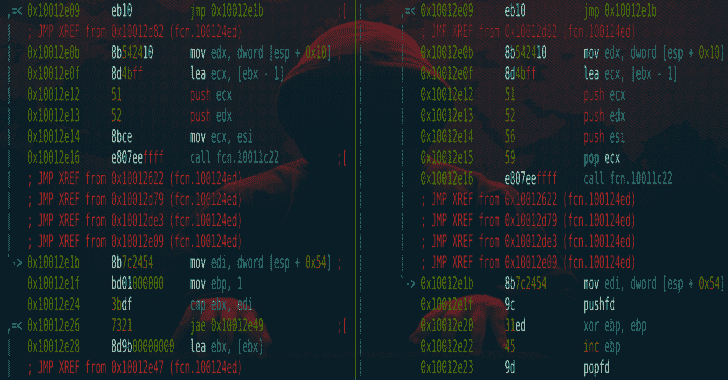
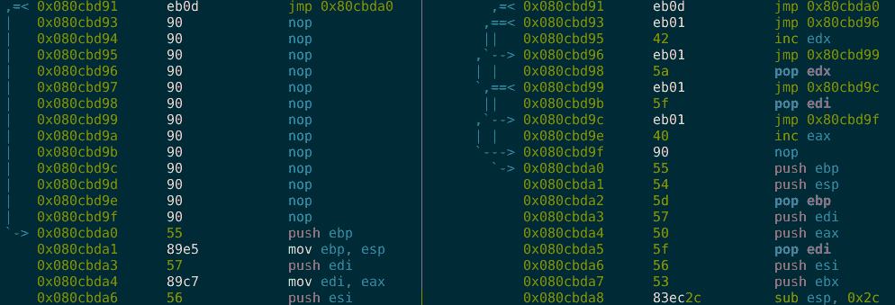
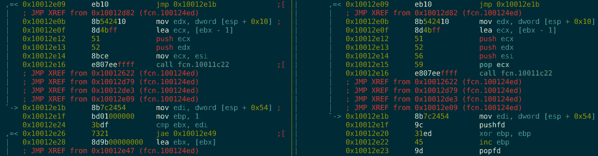

# Metame:用于任意可执行文件的变形代码引擎

> 原文：<https://kalilinuxtutorials.com/metame-metamorphic-code-engine/>

Metame 是一个用于任意可执行文件的简单变形代码引擎。变形代码是在某种解释下运行时输出其自身代码的逻辑等效版本的代码。

这是计算机病毒用来躲避杀毒软件的模式识别。It 实施是这样工作的:

*   打开给定的二进制文件并分析代码
*   随机替换逻辑和大小相等的指令
*   复制并修补原始二进制文件以生成变异的变体

它目前支持以下架构:

*   x86 32 位
*   x86 64 位

此外，它支持各种文件格式，因为[radar 2](http://radare.org/)用于文件解析和代码分析。

突变前后的代码示例:

**另请阅读-[ping castle:在 20%的时间内获得 80%的活动目录安全性](https://kalilinuxtutorials.com/pingcastle-active-directory-security/)**

**安装**

pip 安装元数据

这也应该安装需求。

你还需要[雷达 2](http://radare.org/) 。安装说明参考官网。

`**simplejson**` 也是一个“很高兴拥有”的小业绩提升:

**pip 安装 simplejson**

**用法**

original.exe-mutation.exe-d

使用`**metame -h**`寻求帮助。

[**Download**](https://github.com/a0rtega/metame)