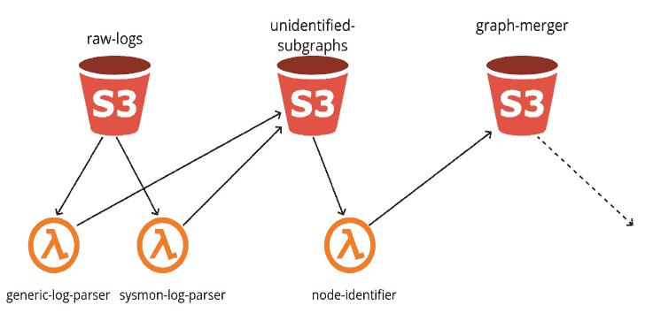
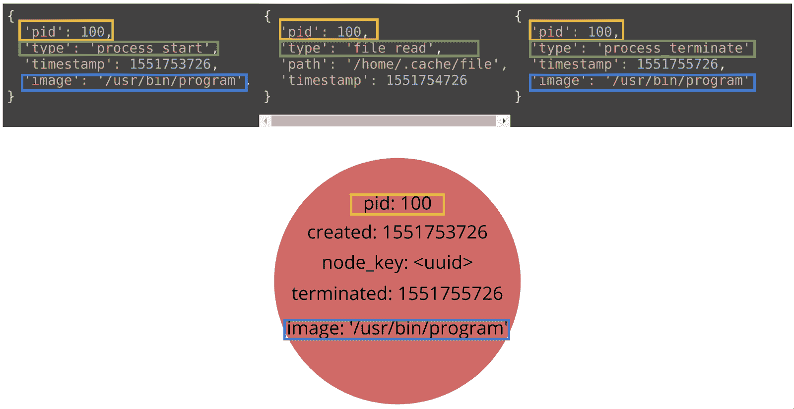
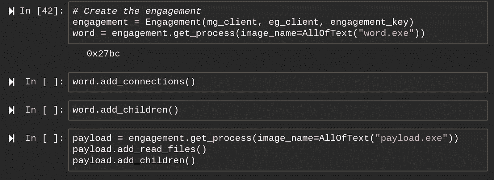
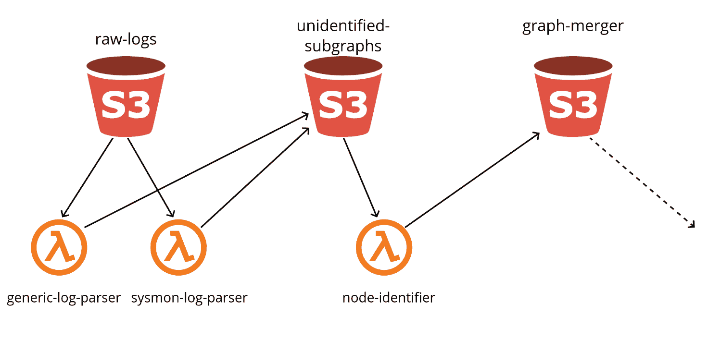
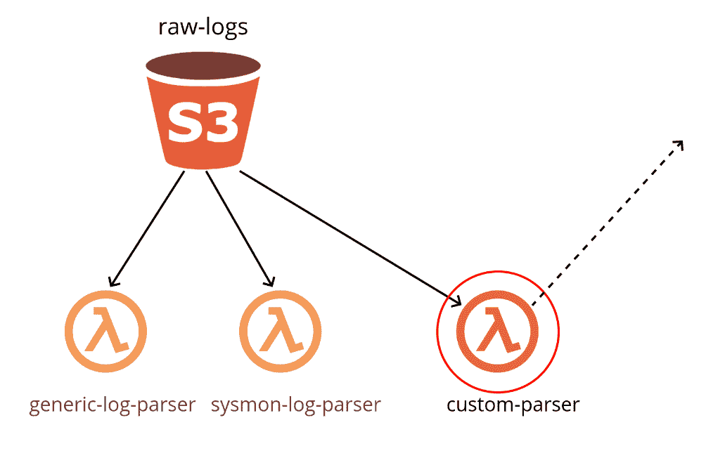

# Grapl:用于检测和响应的图形平台

> 原文：<https://kalilinuxtutorials.com/grapl-graph-platform-for-detection-and-response/>

**Grapl** 是一个用于检测和响应的图形平台。简而言之，Grapl 将获取原始日志，将它们转换成图形，并将这些图形合并成一个主图形。然后，它将协调您的攻击签名的执行，并提供工具来执行您的调查。

Grapl 支持以下节点:

*   流程(测试版)
*   文件(测试版)
*   网络(阿尔法)

并且当前解析 Sysmon 日志或通用 JSON 日志格式来生成这些图形。

**也读-[rev shellgen:用 Python 写的反向外壳生成器](https://kalilinuxtutorials.com/revshellgen-reverse-shell-generator/)**

**主要特征**

**身份**

如果您熟悉 Sysmon 之类的日志源，那么最好的特性之一就是为进程赋予标识。Grapl 应用相同的概念，但是对于任何支持的日志类型，采用伪标识符，如进程 id 和识别规范身份。

这降低了存储成本，并为您提供了查看数据的集中位置，而不是将数据分散到数千个日志中。例如，给定一个流程的规范标识符，您可以通过选择节点来查看它的所有信息。

**分析仪(测试版)**

分析器是你的攻击者签名。它们是 Python 模块，部署在 grapl 的 S3 桶中，编排成在 Grapl 主图发生变化时执行。

主图更新时，分析器实时执行。

Grapl 提供了一个分析器库(alpha ),因此您可以使用纯 Python 编写攻击者签名。参见本[回购示例](https://github.com/insanitybit/grapl-analyzers)。

下面是一个如何检测`svchost.exe`的可疑执行的简单示例

valid _ parents = get _ svchost _ valid _ parents()
p =(
process query()
。with _ process _ name(eq = valid _ parents)
。with _ children(
)process query()。with _ process _ name(eq = " svchost . exe ")
)
。query_first(client，contains _ node _ key = process . node _ key)

将您的分析仪保持在代码中意味着您可以:

*   对您的警报进行代码检查
*   编写测试，集成到 CI 中
*   构建抽象，重用逻辑，并遵循维护软件的最佳实践

**约定(α)**

Grapl 提供了一个叫做约定的调查工具。约定是一个孤立的图，表示您的分析器认为可疑的子图。

使用 AWS Sagemaker 托管的 Jupyter 笔记本，Grapl 将(很快)提供一个 Python 库来与参与度图进行交互，允许您快速旋转并以代码形式维护您的调查记录。

Grapl 提供了一个实时更新的敬业度图视图，您可以在笔记本中与它进行交互，目前在 alpha 中。

**事件驱动和可扩展**

Grapl 旨在扩展——没有哪种服务能够满足每个组织的需求。每个本地 Grapl 服务都是通过发送和接收事件来工作的，这意味着为了扩展 Grapl，你只需要开始订阅消息。

这使得 Grapl 很容易扩展或集成到您现有的服务中。

**设置**

设置 Grapl 的基本游戏版本非常简单。

要开始，你需要安装 [npm](https://www.npmjs.com/) 、 [typescript](https://www.typescriptlang.org/index.html#download-links) 和 [aws-cdk](https://github.com/awslabs/aws-cdk#getting-started) 。

您的 aws-cdk 版本应该与 Grapl 的 package.json 文件中的版本相匹配。

克隆回购:

**git 克隆 https://github . com/insanity it/grapl . git**

将目录切换到`**grapl/grapl-cdk/**`文件夹。应该已经有构建二进制文件了。

执行`**npm i**` 来安装 aws-cdk 依赖项。

添加一个`**.env**`文件，并填写:

BUCKET_PREFIX=" <unique prefix="" to="" differentiate="" your="" buckets="">"</unique>

运行部署脚本`**./deploy_all.sh**`

这将需要确认对安全组的一些更改，并且需要几分钟时间才能完成。

这将为您提供一个足以测试服务的图形设置。

您可以通过转到 grapl repo 的根目录并调用:`**python ./gen-raw-logs.py <your bucket prefix>**`来向服务发送一些测试数据。

这需要 [boto3](https://github.com/boto/boto3) 和 [zstd](https://pypi.org/project/zstd/) Python 模块。

请注意，这可能会向您的 AWS 帐户收取费用。

[**Download**](https://github.com/insanitybit/grapl)