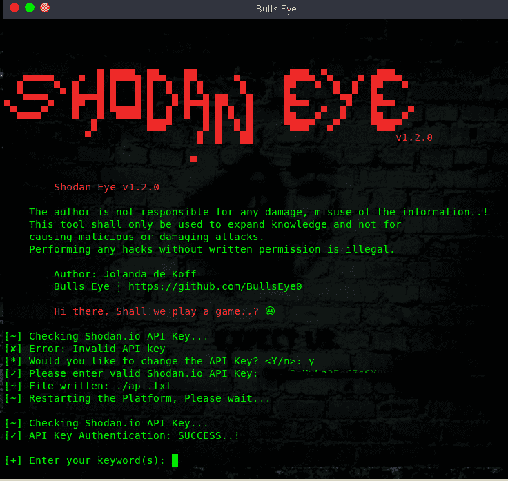
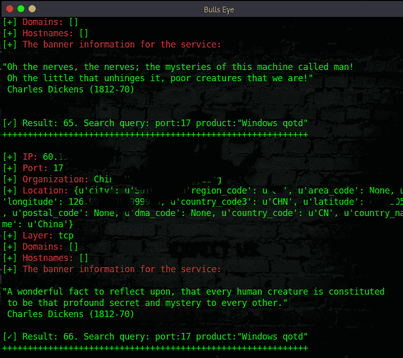
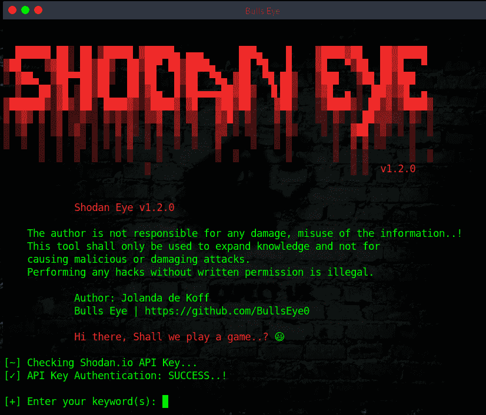

# Shodan Eye:该工具收集所有直接连接到互联网的设备的所有信息

> 原文：<https://kalilinuxtutorials.com/shodan-eye/>

**Shodan** Eye tool 使用您输入的指定关键字收集所有直接连接到互联网的设备的所有信息。这样你就有了一个完整的概览。

被编入索引的设备类型可以有很大的不同:从小型台式机、冰箱到核电站，以及介于两者之间的任何东西。您可以使用“您自己的”指定关键字找到所有内容。示例可在所附文件中找到:

用这个工具获得的信息可以应用于许多领域，举个小例子:

*   网络安全，密切关注公司或家中所有与互联网相关的设备。
*   漏洞。还有更多。

**也可以阅读-[file GPS:一个帮助您猜测您的 Shell 如何被重命名为](https://kalilinuxtutorials.com/filegps/)** 的工具

**庄丹**

是一个搜索引擎，让用户找到特定类型的计算机(网络摄像头、路由器、服务器等。)使用各种过滤器连接到互联网。有些人还将其描述为服务横幅的搜索引擎，服务横幅是服务器发送回客户端的元数据。

***谷歌与另一个搜索引擎有什么区别:*** 最根本的区别是，Shodan Eye 在互联网上爬行，Google 在万维网上。然而，支持万维网的设备只是实际连接到互联网的一小部分。

YouTube 上的视频 shod an Eye

https://www.youtube.com/watch?v=fOqmlOLiMsQ&feature=youtu.be

**Python**

我用 python 2.7 编写了这个脚本(以后我可以——我会把它改成 python 3)，但是现在我认为 python 2 更好，更漂亮，更好。“这是一种个人”

**在 Linux 上安装 Shodan Eye:**

git 克隆[https://github.com/BullsEye0/shodan-eye.git](https://github.com/BullsEye0/shodan-eye.git)
CD shodan-eye
pip install-r requirements . txt

**使用**

**蟒蛇皮蛇眼**

(您将被要求输入 Shodan API 密钥)

[**Download**](https://github.com/BullsEye0/shodan-eye)