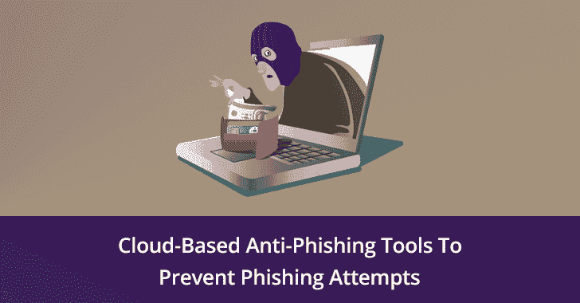

# 基于云的反网络钓鱼工具有助于防止网络罪犯的网络钓鱼企图

> 原文：<https://kalilinuxtutorials.com/cloud-anti-phishing-tools/>

**网络钓鱼**过去、现在和将来都是一种威胁。最先进的基于云的反网络钓鱼工具不仅可以帮助您应对企业面临的此类威胁，还可以教育您的员工提高对此类漏洞的认识和警惕。

人们已经在计算机和互联网上工作了足够长的时间，知道什么是网络钓鱼。他们也知道这会对他们以及他们赖以谋生的机构造成损害。因此，探讨一些反钓鱼工具就变得势在必行。

与此同时，我们还将研究如何战胜任何网络钓鱼企图。然而，对于门外汉来说，我们将简要介绍一下网络钓鱼的定义，这样每个人都有相同的理解。

## **什么是钓鱼**？

**网络钓鱼**是一种黑客行为，试图诱使恶意电子邮件的收件人打开邮件，与网络罪犯进行互动。受害者收到一封电子邮件，声称是从一个信誉良好的来源发送的，如银行、著名的百货商店，甚至是受害者的雇主。

What is phishing

该电子邮件可能带有恶意附件，通过安装恶意软件可以对您的计算机系统造成严重破坏。或者，电子邮件可能包含一些看起来无害的链接，这些链接看起来合法，但会导致用户泄露机密数据，如用户 id、密码、信用卡号等。

## 如何解决这个问题？

处理此类网络钓鱼企图的理想方式是在您的系统上安装[反网络钓鱼工具](https://www.phishprotection.com/content/anti-phishing-software/anti-phishing-tools-free-download/)。与所有在线技术一样，反网络钓鱼服务提供商也开发了出色的基于云的解决方案。我们现在将了解如何使用这种反网络钓鱼服务来防止机密数据的丢失。

*   **免费的反网络钓鱼工具栏**

反钓鱼工具栏可能不是理想的解决方案，但它们可以提供第一道防线，特别是对那些不太熟悉计算机的用户。这种反网络钓鱼工具栏可以在互联网上免费获得。但是，建议安装更好的反网络钓鱼保护来保护您的企业。

*   **准备好你的研究**

毕竟，黑客是一群聪明人。许多反网络钓鱼工具栏本身就是网络钓鱼攻击的设备。因此，人们应该浏览评论，阅读用户对程序的评论。如果你发现很多对工具栏的抱怨，还是远离它比较好。

*   **利用免费试用**

互联网上大多数反网络钓鱼软件都有免费试用期。在承诺购买该软件的付费版本之前，使用这个免费试用期来试用它。

这些免费试用版并不具备全部功能，但它们会让您大致了解会发生什么。如果觉得方便，不如投资付费版。一笔小小的投资可以保护珍贵的数据不被窃取。

*   **付费版本永远是最好的**

全付费版本配备了所有反网络钓鱼保护工具。他们还提供无风险试用，让你在投资之前习惯这个系统。使用最新版本总是有益的，因为黑客总是试图领先一两步。

## **一些最佳的反网络钓鱼解决方案**

一些最好的免费反钓鱼工具是微星简单费西合唱团和 BetterCloud。其他基于云的[反钓鱼公司](https://www.csoonline.com/article/3066532/10-companies-that-can-help-you-fight-phishing.html/)包括 Cofense、PhishLabs 等。这是其他几家著名的公司，它们开展反网络钓鱼培训项目，向用户传授黑客的作案手法。这些培训项目有助于提高用户意识，降低员工对[鱼叉式网络钓鱼](https://gbhackers.com/spear-phishing/)的敏感度。一些有用的反网络钓鱼解决方案包括:

*   **[费西合唱团保护](https://www.phishprotection.com/)邮件保护**

这款反网络钓鱼软件具有阻止威胁邮件入侵您收件箱的功能。该软件可以进行实时网站扫描，并向用户和管理员发出警报。这种企业解决方案是一种全方位的反网络钓鱼服务。

*   **反网络钓鱼工作组**

这种反网络钓鱼服务主张教育用户，让他们意识到网络钓鱼攻击。这种意识有助于您应对黑客用来破坏最新安全措施的即兴行为。

### **遗言**

网络钓鱼者似乎总能找到新的方法来继续他们的邪恶活动。但是，最先进的基于云的反网络钓鱼工具可以在防止此类网络钓鱼攻击方面发挥重要作用。

其中一些工具还有助于教育您的员工，培养他们的意识，从而带来最佳效果。警惕的员工可以识别即使是最好的反网络钓鱼工具也可能错过的黑客攻击企图。