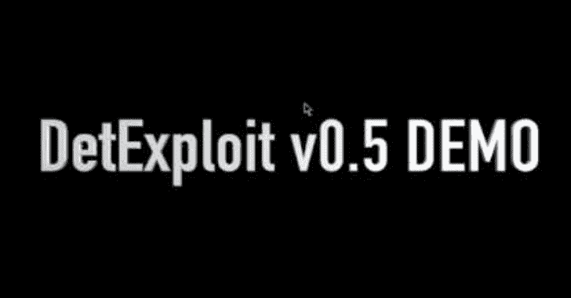

# 用于 Windows 平台的操作系统漏洞扫描器

> 原文：<https://kalilinuxtutorials.com/detexploit-oss-vulnerability-scanner-windows/>

**DetExploit** 是检测系统中易受攻击的应用程序和未安装的重要操作系统更新，并通知用户的软件。

众所周知，大多数网络攻击利用的是一年前发布的漏洞。

我认为这是一个巨大的问题，这种技术应该比检测未知恶意软件或漏洞的技术更强大。

**演示**

演示视频剪辑(v0.5，英文，点击跳转到 YouTube 播放视频)

[https://www.youtube.com/embed/VBev9dtGtEM?feature=oembed&enablejsapi=1](https://www.youtube.com/embed/VBev9dtGtEM?feature=oembed&enablejsapi=1)

**也可以阅读-[file GPS:一个帮助您猜测您的 Shell 如何被重命名为](https://kalilinuxtutorials.com/filegps/)** 的工具

**要求**

Windows 平台(在 Windows 10 上测试)
Python 3.x(在 3.7 上测试)
用 requirements.txt 编写的模块(pip install-r requirements . txt)
win32 com(py win32:Python for Windows extensions)

**如何运行**

可执行版本现在不可用。计划在稳定版本中提供。

**安装要求
C:\ PATH \ to \ detex lopit>pip Install-r requirements . txt
移动到 src 目录
C:\ PATH \ to \ detex lopit>CD src
使用 python 运行 CUI 版本(如果没有需要配置路径。)
C:\ PATH \ to \ detex lopit \ src>python main . py
使用 python 运行 GUI 版本(如果没有需要配置路径。)
C:\ path \ to \ det exploit \ src>python GUI . py**

**支持的数据库**

*   ExploitDB
*   JVN(日本漏洞注释)
*   NVD(国家脆弱性数据库)
*   美国证书
*   JPCERT

[**Download**](https://github.com/detexploit/DetExploit)