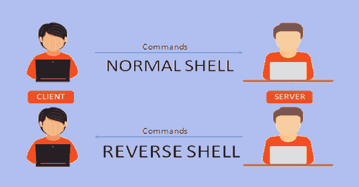

# TinkererShell:一个简单的 Python 反向 Shell

> 原文：<https://kalilinuxtutorials.com/tinkerershell-simple-python-reverse-shell/>

TinkererShell 是一个简单的 python 反向 Shell，只是为了好玩而写的。

用 python 3.7 写的简单反向 shell 只是为了好玩。实际上，它支持 Windows 和 Linux 操作系统，并集成了一些基本功能，如键盘记录和 AES 加密通信。

**支持的操作系统:**

*   Windows 操作系统
*   Linux 操作系统

**功能及特点:**

*   反接。
*   AES 加密通信。
*   多线程。
*   支持多个机器人同时连接。
*   键盘记录器。
*   可能采取机器人的监视器截图。
*   使用机器人的网络摄像头拍照的可能性。
*   窃取机器人剪贴板内容的可能性。
*   启用或禁用持久性的可能性(在有效载荷交付之前或之后通过远程控制)。
*   启用或禁用键盘记录器的可能性(在有效载荷交付之前或之后通过远程控制)。
*   简单的 DNS 欺骗器(通过主机文件)。
*   能够从机器人上传和下载文件。

**又读-[GitGraber:监控 GitHub 搜索&找到敏感数据](https://kalilinuxtutorials.com/gitgraber-monitor-github/)**

**待办事项:**

*   在 Linux 上彻底测试持久化功能。
*   彻底测试 Windows 上的持久性功能。
*   添加网络摄像头流和麦克风录音(理想情况下从机器人流和本地保存到主)。

**免责声明**

这个项目仅用于教育目的。不要用于非法活动。我不支持也不宽恕非法或不道德的行为，我不能对可能滥用该软件负责。

[**Download**](https://github.com/4n4nk3/TinkererShell)