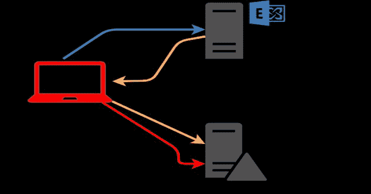

# PrivExchange:通过滥用 Exchange 将您的权限交换为域管理员权限

> 原文：<https://kalilinuxtutorials.com/privexchange/>

**PrivExchange** 是一个通过滥用 Exchange，用你的权限换取域管理员权限的工具。这些工具需要[撞击](https://github.com/SecureAuthCorp/impacket)。可以用`**pip install impacket**`从 pip 安装，但建议使用 GitHub 的最新版本。

该工具只需登录 Exchange Web 服务即可订阅推送通知。这将使 Exchange 连接回您并作为系统进行身份验证。

**另请阅读-[Pyrdp:MITM&Python 3 库，能够实时或事后观察连接](https://kalilinuxtutorials.com/pyrdp-mitm-library-for-python-3-with-the-ability-to-watch-connections-live-or-after-the-fact/)**

**http tack . py**

攻击模块，可与 ntlmrelayx.py 一起使用，在没有凭据的情况下执行攻击。要让它工作起来:

*   修改`**httpattack.py**`中的攻击者 URL，以指向 ntlmrelayx 将运行的攻击者服务器
*   从 github 克隆 iimpactt
*   将该文件复制到`**/impacket/impacket/examples/ntlmrelayx/attacks/**`目录中。
*   `**cd impacket**`
*   用`**pip install . --upgrade**` **或** `**pip install -e** .`安装 impacket 的修改版

[**Download**](https://github.com/dirkjanm/PrivExchange)