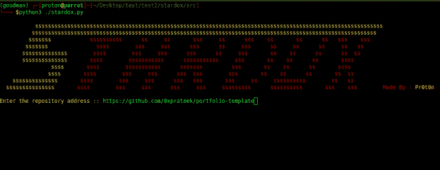
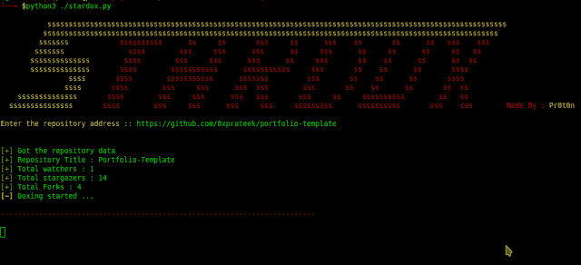

# Stardox : Github Stargazers 信息收集工具

> 原文：<https://kalilinuxtutorials.com/stardox-github-stargazers-information-gathering-tool/>

Stardox 是一个先进的 github stargazers 信息收集工具。它从 Github 中提取信息，并在列表树视图中显示出来。它可以用来收集你的/某人的储存库观星者详细信息。

##### 它获取什么数据:

*   总库存
*   总星级
*   关注者总数
*   以下总计
*   观星者的邮件

页（page 的缩写）s:很多新的东西很快就会添加进来。

**画廊**

**获取仓库数据**

**提取数据的列表树视图**

**另请阅读—[基于云的反网络钓鱼工具有助于防止网络罪犯的网络钓鱼企图](https://kalilinuxtutorials.com/cloud-anti-phishing-tools/)**

**入门**

**设置步骤:**

git 克隆 https://github.com/0xprateek/stardox
CD stardox
pip 安装-r 要求. txt

**首发吧:**

cd stardox/src
**使用命令行参数** python 3 stardox . py https://github.com/Username/repository-URL
**没有命令行参数** python3 stardox.py

**用法**

**stardox . py[-h][-v]repository yurl**

##### 立场论点:

仓库到仓库的 URL 路径。

##### 可选参数:

-h，–help 显示此帮助消息并退出
-v，–Verbose

[**Download**](https://github.com/0xprateek/stardox)