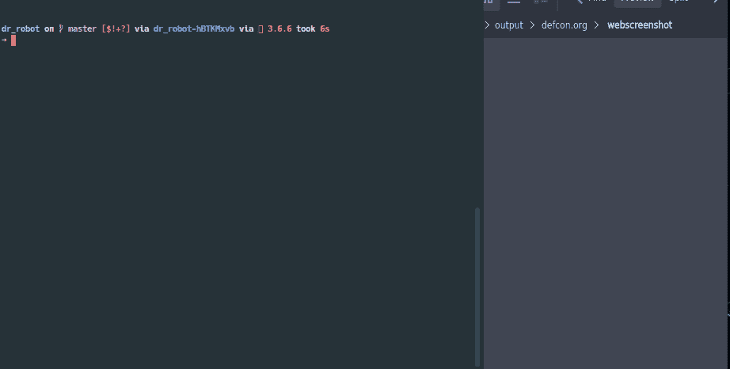
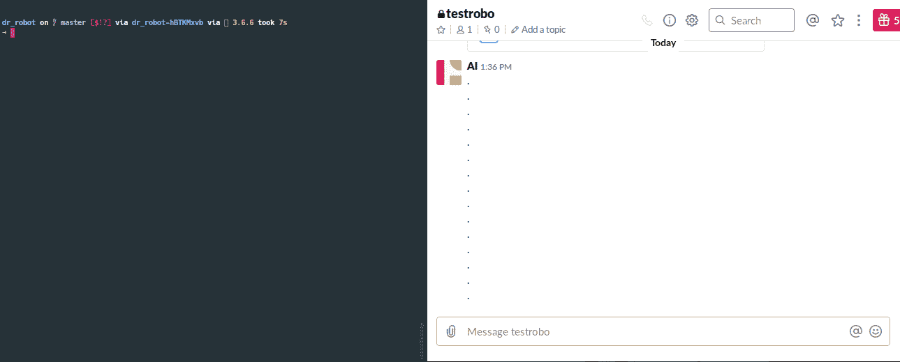
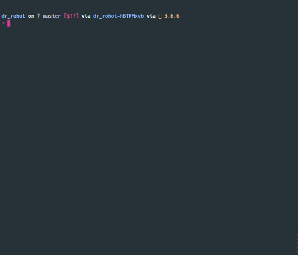
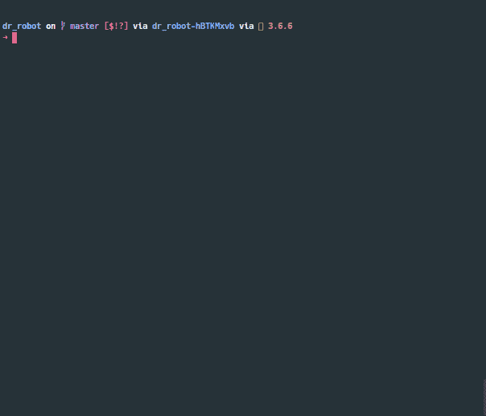
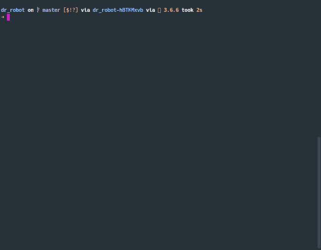

# Dr_Robot:用于枚举与公司相关的子域的工具

> 原文：<https://kalilinuxtutorials.com/dr_robot-enumerate-the-subdomains-associated-with-a-company/>

**Dr_Robot** 是**领域侦察和枚举**的工具。通过利用容器来减少处理依赖性、跨操作系统的不一致性和不同语言的开销，Dr. ROBOT 被构建为高度可移植和可配置的。

**用例**:收集目标组织拥有的所有面向公众的服务器。查询 DNS 资源使我们能够快速开发一个大的可能目标列表，您可以在其上运行进一步的分析。

**注意**:机器人博士不仅仅是一匹只会一招的小马。您可以轻松定制用于收集信息的工具，这样您就可以享受使用最新、最棒的产品以及久经考验的产品的好处。

**安装并运行**

**检查**

**上传时差**

**转储数据库**

**输出**

**发球**

**也可阅读-[DetExploit:用于 Windows 平台的操作系统漏洞扫描器](https://kalilinuxtutorials.com/detexploit-oss-vulnerability-scanner-windows/)**

**命令示例**

*   使用 Sublist3r 和 Aquatone 和 Shodan 运行 gather`**python drrobot.py example.domain gather -sub -aqua -shodan**`
*   使用 Sublist3r 和代理`**python drrobot.py --proxy http://some.proxy:port example.domain gather -sub**` 运行聚集
*   使用目击者进行检查`**python drrobot.py example.domain inspect -eye**`
*   使用 httpscreenshot 和抓取标题运行 inspect】
*   使用 Mattermost/Slack 运行上传`**python drrobot.py example.domain upload -matter**`

**主**

用法:dr robot . py[-h][–PROXY DNS DNS][–verbose]
[–DBFILE DBFILE]
{收集、检查、上传、重建、转储数据库、输出、服务}
……

Docker DNS recon 工具
位置参数:
{收集、检查、上传、重建、转储数据库、输出、服务}
收集针对指定域运行的扫描程序并收集关联的
系统。您可以选择使用配置中包含的任何
docker_buildfiles/webtools 来运行。
根据从收集步骤
收集的域信息检查运行进一步的工具。注意:您必须提供一个包含 IP/主机名列表的文件
，或者目标
域必须在 dbs 文件夹中有一个 db 文件
上传侦察数据到 Mattermost。目前仅使用包含 PNG 图像的文件夹
。
重建使用以前运行时的附加文件/所有文件
重建数据库
转储数据库将 ip、主机名和标语转储到文本文件
输出
生成指定格式的输出。包含来自扫描的所有
信息(图像、标题、主机名、
IP)
使用 django

在 docker 容器中提供服务器数据库文件可选参数:
-h，–帮助显示此帮助消息并退出
–代理代理服务器 URL 设置 DOCKER http _ PROXY too
–DNS DNS DNS 服务器添加到 DOCKER 容器的 resolv . conf
–详细显示详细语句
–DBFILE DBFILE 指定什么 db 文件

**聚集**

用法:dr robot . py Domain gather[-h][-aqua][-sub][-s finder][-T0][-knock][-amass][-recong][-shod an][-Arin]
[-hack][-dump][-virus][–IGNORE][–IGNORE]
[–headers]

位置参数:
要针对

运行扫描的域可选参数:
-h，–help 显示此帮助消息并退出
Sublist3r Sublist3r 是一个 python 工具，旨在使用 OSINT
-brute 枚举网站的
子域，Subbrute SubBrute 是一个社区驱动的项目，目标是
创建最快、最准确的子域
枚举工具。
-sfinder，–sub finder
sub finder 是一个子域发现工具，它通过使用被动在线
源为网站发现
有效的子域
-knock，–Knock py 是一个 python 工具，旨在通过单词表
-amass，–Amass OWASP Amass 工具套件通过
抓取数据源、
抓取 web 档案、置换/更改名称和
获取子域名称 recon 是一个用 Python 编写的全功能网络侦察框架。DrRobot 在这个框架中使用了几个
recon/hosts-domain 模块。
-shodan，–shod an Query shod an 查询给定域名的公共站点
-arin，–Arin 查询 arin 的公共 CIDR 范围。这是一个更好的
强力选项，因为 ranges
-hack，–hacker target
该查询将显示使用上述数据集发现的转发 DNS 记录
。
-dump，–Dumpster 使用 DNSDumpster 的有限响应。需要 API
访问以获得更好的结果。
-virus，–VirusTotal 利用 virus total 的观察者子域搜索
–IGNORE IGNORE Space 要忽略的子网的分隔列表
–headers(如果应该从收集的 ip 地址中抓取标题)

**检查**

用法:main . py inspect[-h][-httpscreen][-eye][–PROXY PROXY][–DNS DNS]
[–FILE FILE]
位置参数:
domain 要运行扫描的域
可选参数:
-h，–help 显示此帮助消息并退出
-httpscreen，–HTTPScreenshot
用于抓取屏幕网站的 Post 枚举工具。
所有的图片都将被下载到一个输出文件:
httpscreenshot.tar 和解压缩的 httpscreenshots
-eye，一个用于抓屏网站的目击者帖子枚举工具。
所有图像将被下载到 outfile:
Eyewitness.tar 并在 witness
中解压缩–代理代理代理服务器 URL 为 DOCKER http_proxy
设置–DNS DNS DNS 服务器用于 DOCKER 容器的 resolv . conf
–FILE FILE(不工作)文件，其中包含主机名以进一步运行
检查

**上传**

用法:dr robot . py Domain upload[-h][-matter][-Slack][–file path file path]

位置参数:
Domain Domain to run scan against

可选参数:
-h，–help 显示此帮助消息并退出
-matter most matter most 服务器将结果上传到
Mattermost 服务器
-slack，–Slack Slack Slack 服务器
–file path file path 包含要上传的图像的文件夹的文件路径。
这是相对于指定的域。默认情况下，
这将是输出文件夹的路径

**重建**

用法:dr robot . py rebuild[-h][-f[FILES[FILES…]]]

可选参数:
-h，–help 显示此帮助消息并退出
-f [FILES [FILES …]]，–FILES[FILES…]
除了
配置文件中的文件之外，要提供的其他文件

**Dumpdb**

用法:drrobot.py dumpdb [-h]

位置参数:
域要对其运行扫描的域

可选参数:
-h，–help 显示此帮助消息并退出

**输出**

用法:dr robot . py Domain OUTPUT[-h][–OUTPUT OUTPUT]{ json，xml}

位置参数:
{json，xml}在 outputs 文件夹下生成 JSON 文件(格式)
domain Domain 转储
的输出
可选参数:
-h，–help 显示此帮助消息并退出
–OUTPUT 输出替代位置创建输出文件

**发球**

用法:dr robot . py domain serve[-h]

可选参数:
-h，–help 显示此帮助消息并退出

## 配置

该工具高度依赖于您提供给它的配置。为您提供了一个 **default_config.json** ，您可以将它用作您的 **user_config.json** 的简单模板。**扫描仪**下的大部分配置已经为您完成，可以按原样使用。请注意在本节和其他章节中使用了默认的**。**

默认值:指定 Docker 或 Ansible 实例。确保根据它们的用途调整配置。

*   Docker 配置要求
    *   示例:

" sublist 3r ":{
" name ":" sublist 3r "，
"default" : true，
"mode" : "DOCKER "，
"docker_name": "sub "，
"network_mode": "host "，
" default _ conf ":" DOCKER _ build files/DOCKER file。Sublist3r.tmp "，
" active _ conf ":" docker _ build files/docker file。Sublist3r "、
"描述":" Sublist3r 是一个 python 工具，用于使用 OSINT 枚举网站的子域"、
" src ":" https://github . com/Aboul 3la/sublist 3r "、
"output": "/root/sublist3r "、
" output _ folder ":" sublist 3r "
}、

*   可行的配置要求
    *   例子

" HTTPScreenshot ":{
" name ":" HTTPScreenshot "，
"short_name" : "http "，
"mode" : "ANSIBLE "，
" ansi ble _ arguments ":{
" config ":" $ config/HTTPScreenshot _ play . yml "，
" flags ":"-e ' $ extra '-I ansi ble _ plays/inventory . yml "，
" extra _ flags ":{
" 1 ":" variable _ host 所有图像将被下载到 outfile:httpscreenshot.tar 和 unpacked httpscreenshots "，
"output" : "/tmp/output "，
" infile ":"/tmp/output/aggregated _ protocol _ hostnames . txt "，
"enabled" : false

*   名称:您正在使用的程序/实用程序的可识别名称
*   默认:(暂时禁用)
*   模式:ANSIBLE(选择时将 Ansible 与此工具一起使用)
*   ansible_arguments:特定信息的 Json 配置
    *   config:要使用的剧本(发出 ansible playbook 命令时，config 关键字将替换文件的完整路径)
    *   flags:指定与 ansible 命令一起使用的额外标志(对于您想要使用的任何额外标志特别有用)
    *   额外标志:只要与其他键不同，这个键就无关紧要。这些额外的标志都将被应用到有问题的 ansible 文件
*   描述:工具的描述(可选)
*   src:工具的来源(可选)
*   输出:输出将存储在外部文件系统中的位置
*   infile:(对于某些模块是唯一的)这个程序将使用什么文件作为程序的输入。在这种情况下，您会注意到它在/tmp/output 中搜索 aggregated _ protocol _ hostnames . txt。

*   Web 模块
    *   示例:

" hacker target ":
{
" short _ name ":" hack "，
"class_name" : "HackerTarget "，
"default" : false，
"description ":"此查询将显示使用上述数据集发现的转发 DNS 记录。"、
" API _ call _ unused ":" https://API . hacker target . com/host search/？q = example . com "、
" output _ file ":" hacker . txt "
}，

*   short_name:在 CLI 中使用的快速参考名称
*   class_name:这必须与您在相应的模块名称下为给定的类指定的名称相匹配
    *   这背后的原因是运行时模块的加载需要使用 importlib。这将从通过 CLI 选项提供的类名中加载相应的类。
*   默认值:false(暂时禁用)
*   api_call_unused:(旧的，以后可能会用到…)
*   描述:工具的描述(可选)

*   服务模块:
    *   例子

" Serve" : {
"name" : "Django "，
" command ":" python manage . py runserver 0 . 0 . 0 . 0:8888 "，
"docker_name": "django "，
"network_mode": "host "，
" default _ conf ":" Serve _ API/docker file。Django.tmp "，
" active _ conf ":" serve _ API/docker file。Django "，
"描述" : "用于托管数据库的 Django 容器"，
"端口":{
"8888" : "8888"
}
}

*   命令:在 docker 容器上启动服务器的命令(注意:现在只使用 Docker)
*   docker_name:运行`docker images`时的 docker 镜像名称
*   network_mode:创建容器时使用的网络模式。主机使用主机网络
*   default_conf:用于构建表单的模板 Dockerfile
*   active_conf:将在运行时使用的目标特定配置
*   描述:工具的描述(可选)
*   端口:docker 的本地主机到容器的端口映射

**网络工具配置示例**

在**配置**下，您会发现一个 default_config，它包含了您可以使用的大多数默认扫描仪。如果您希望扩展**网络工具**列表，只需遵循以下步骤:

*   将新工具添加到 user_config.json 中

{
" web tools ":
{
" new tool ":
{
" short _ name ":" ntool "，
"class_name": "NewTool "，
" description ":" new tool description "，
"output_file" : "newtool.txt "，
"api_key" : null，
"endpoint" : null，
"username" : null，
"password" : null
}，

*   打开 **src/web_resources.py** ，用上一步指定的 **class_name** 制作一个类。 ***确保与*** 完全匹配

class new tool(web tool):
def**init**(self， **kwargs): super()。init(** kwargs)
…
def do_query(self):
…。查询…
将结果存储在
self.results 中

**码头集装箱的示例配置**

在 **configs** 下，你会发现一个 **default_config** ，它包含了你可以使用的大多数默认扫描仪。如果您希望扩展**扫描仪**列表，只需遵循以下步骤:

*   将 **json** 添加到**配置**文件中(用户如果生成)。

" Scanners ":{
…
" new tool ":{
" name ":" new tool "，
"default" : true，
"mode" : DOCKER，
"docker_name": "ntool "，
"network_mode": "host "，
" default _ conf ":" DOCKER _ build files/DOCKER file。NewTool.tmp "，
" active _ conf ":" docker _ build files/docker file。NewTool "、
"描述":" NewTool 是一个很棒的域枚举工具"、
" src ":" https://github . com/new tool "、
"output": "/home/newtool "、
" output _ file ":" new tool . txt "
}、
…
}

*   注意 *network_mode* 是一个专门针对 docker 容器的选项。它在使用 docker 时实现了`--network`标志

### 可行配置示例

在 **configs** 下，你会发现一个 **default_config** ，它包含了你可以拥有的大多数默认扫描仪。然而，对于这一步，我们将看看如何配置一个检验工具**目击者**，以便与**负责人**一起使用。

*   将 **json** 添加到**配置**文件中(用户如果生成)。

"枚举":{
"目击者":{
"姓名":"目击者"、
"简称":"眼"、
"docker_name ":"眼"、
"模式":" ANSIBLE "、
"network_mode": "host "、
" default _ conf ":" docker _ build files/docker file。witness.tmp "，
" active _ conf ":" docker _ build files/docker file。witness "、
" ansi ble _ arguments ":{
" config ":" $ config/witness _ play . yml "、
" flags ":-e ' $ extra '-I ansi ble _ plays/inventory "、
" extra _ flags ":{
" 1 ":" variable _ host = localhost "、
"2" : "variable_user=root "、
" 3 ":" infile = $ infile/aggregated _ protocol _ hostnames . txt 所有图像将被下载到 outfile:Eyewitness.tar 并在 witness "、
"output" : "/tmp/output "、
" infile ":"/tmp/output/aggregated/aggregated _ protocol _ hostnames . txt "、
"enabled" : false
}、
}

*   正如您所看到的，这里有几个项目一开始可能会令人困惑，但在这里会得到澄清:

*   模式:允许您指定如何部署您想要使用的工具。目前 **DOCKER** 或 **ANSIBLE** 是唯一可用的部署方法。
*   在为 **ANSIBLE** 开发时， **ansible_configuration** 之外的所有选项都将被忽略。
*   *ansible_arguments* 下的选项
    *   **配置**:指定使用哪个剧本
    *   **flags** :将哪些标志传递给 **ansible-playbook** 命令。除了 **$extra** 标志，你可以在这里添加任何你想独特完成的东西。
    *   **extra_flags** :这对应于上面看到的 **$extra** 标志。这将用于填充您输入到行动手册中的变量。当利用 ansible 和 Dr. Robot 向脚本添加文件和其他实用程序时，您可以使用它来提供命令行参数。
        *   **变量 _ 主机**:在清单文件中找到的主机名别名
        *   **变量 _ 用户**:登录变量 _ 主机的用户
        *   **infile** :与上述工具一起使用的文件。目击者需要格式为`https://some.url`的主机名，因此*aggregated _ protocol _ hostnames . txt*
        *   注意前缀 **$infile** 的使用——这些名称都匹配，因为它们是默认位置的占位符，这些位置在**输出/目标名称/聚集**中与 **$infile** 相对应
        *   如果您在另一个位置有一个文件，您可以只指定完整的路径，而不会出现任何错误。
        *   **outfile** :输出文件的位置
        *   与上面的 infile **一样，名称中的＄outfile**只是位置**输出/目标名称/** 的一个键
        *   您可以为其他用途指定一个硬编码路径。只需记住上传的位置或用机器人医生进行其他处理
        *   **outfolder** :解压/下载文件的输出文件夹
        *   与上面的 infile **一样，名称中的＄outfile**只是位置**输出/目标名称/** 的一个键
        *   这是 witness 和 HttpScreenshot 的特例，你可以在他们的剧本里看到。他们生成大量文件，而不是单独下载每个文件，让他们将文件打包，作为剧本中的一个步骤，然后解压缩，这样可以实现一定的完整性。
        *   下面一个简单的例子展示了我们如何使用 **extra_flags** 为 ansible 的剧本提供主机名。

**松弛**

请查看以下内容，了解如何为消息传递设置 Python bot 的指南。

[https://github.com/slackapi/python-slackclient](https://github.com/slackapi/python-slackclient)

**SQLite DB 文件模式**

表数据:| domain id | INTEGER | PRIMARY KEY |————|——| | IP | VARCHAR | | hostname | VARCHAR | | headers | VARCHAR | | http _ headers | TEXT | | https _ headers | TEXT | | domain | VARCHAR | FOREIGN KEY

表域:| domain | VARCHAR |主键|——|——-|

**发球**

通常情况下，拥有一个 API 有利于自动化。在 serve-api 文件夹下，有一个简单的 Django 服务器实现，您可以在本地或通过 Docker 提供服务。为了服务于 datak，您需要将您的数据库文件夹复制到根目录下的 **serve-api** ，并将该文件重命名为 **drrobot.db** 。如果您想使用其他名称，只需在 Django**serve _ _ _ _-API/dr robot/dr robot/settings . py**中更改名称。

[**Download**](https://github.com/sandialabs/dr_robot)