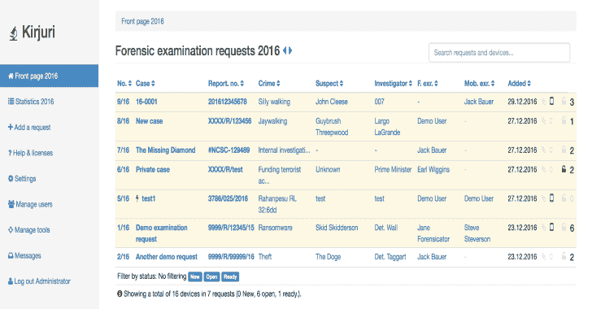
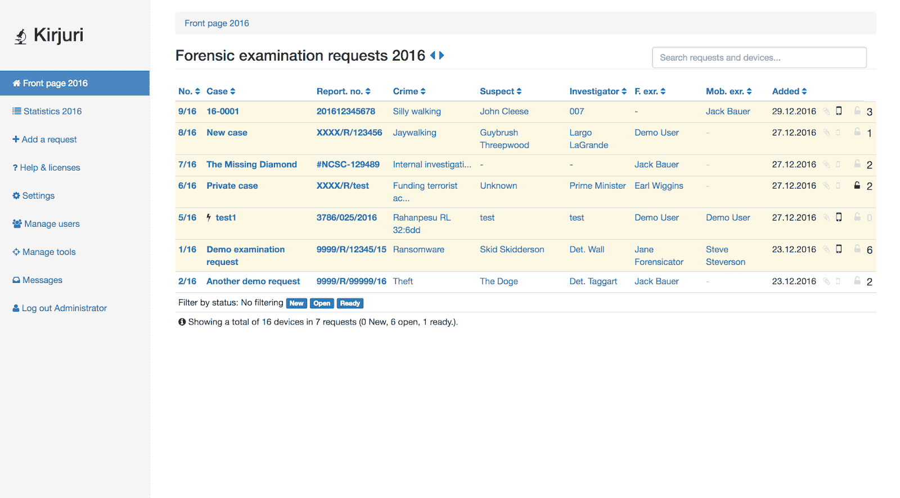
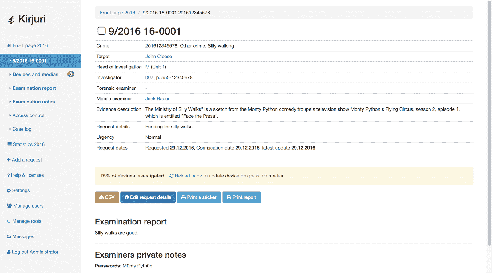
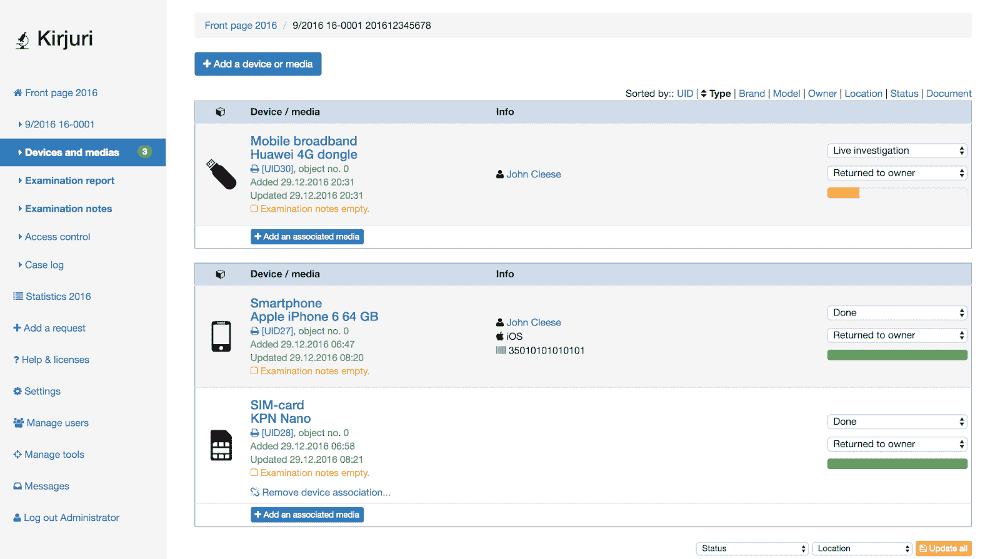
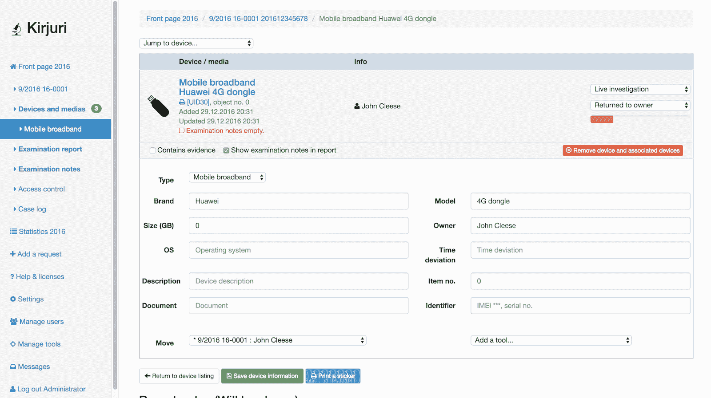
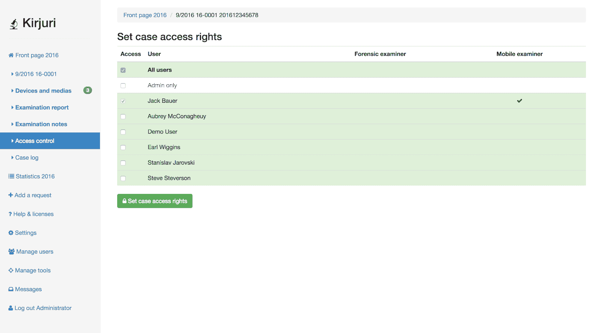
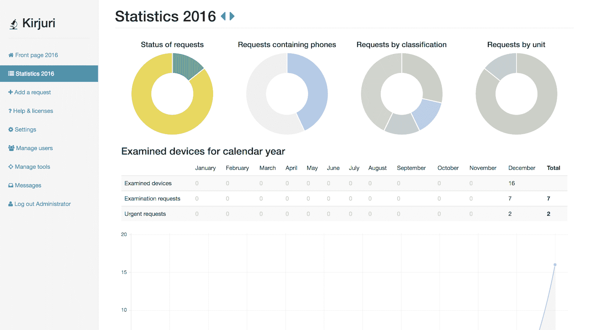
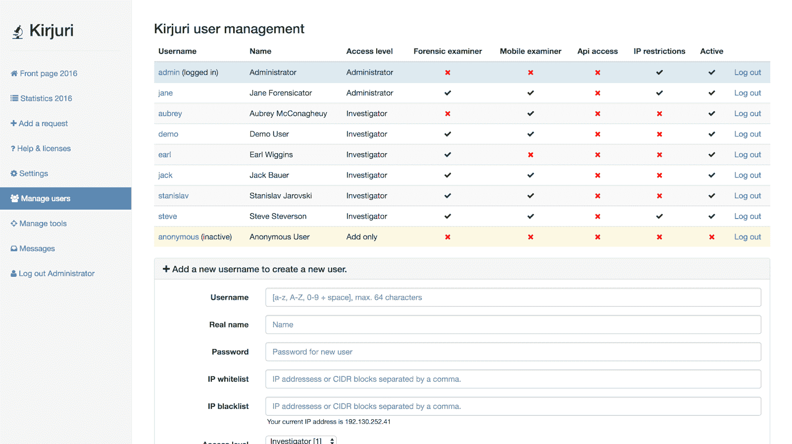
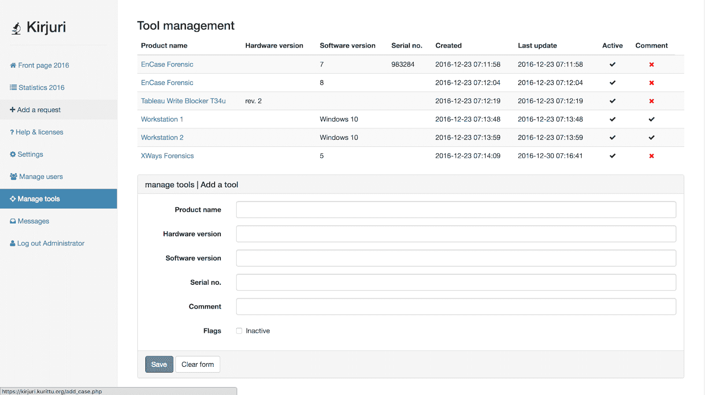
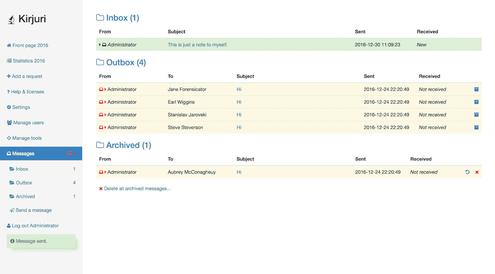

# Kirjuri:用于管理案件和法医物证项目的 Web 应用程序

> 原文：<https://kalilinuxtutorials.com/kirjuri-web-application-for-managing-cases/>

Kirjuri 是一个简单的 php/mysql 网络应用程序，用于管理物证项目。它旨在用作接收、预订、记录和可能报告调查结果的工作流程工具。

它简化并有助于在处理大型(或小型！)提交进行法医分析的器械数量。Kirjuri 需要 PHP7。

更多详情请参见 Kirjuri 官方主页。

注意:自 2017 年 9 月以来，Kirjuri 不再积极开发，因为我再也没有时间做这个项目了。如果你有兴趣进一步开发这个工具，请联系我。

**也可阅读-[tinker Shell:一个简单的 Python 反向 Shell](https://kalilinuxtutorials.com/tinkerershell-simple-python-reverse-shell/)**

**概述&执照**

Kirjuri 由 Antti Kurittu 开发。它是作为内部工具在赫尔辛基警察局开始的。在 MIT 许可下发布的原始开发。一些组件随它们自己的许可证一起分发，请查看文件夹和帮助了解详细信息。

**变更日志**

参见 [CHANGELOG.md](https://github.com/AnttiKurittu/kirjuri/blob/master/CHANGELOG.md)

**想参与吗？**

*   鼓励所有感兴趣的人提交代码和增强功能。如果你对提交代码没有信心，你可以提交语言文件和本地化的设备列表等。这些将被欣然接受。

**截图**

[**Download**](https://github.com/AnttiKurittu/kirjuri)