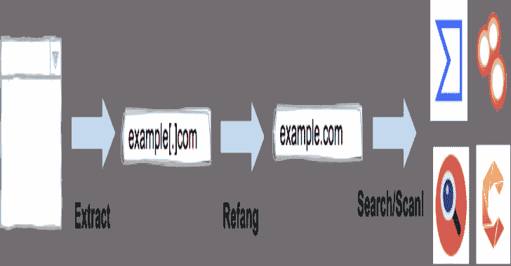
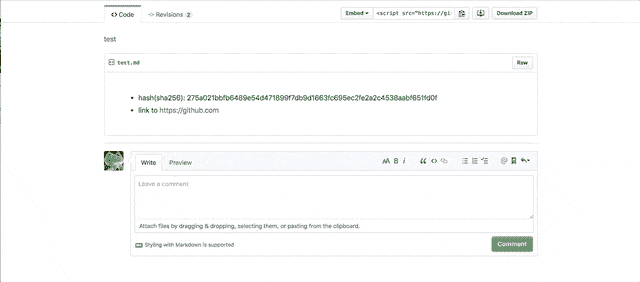
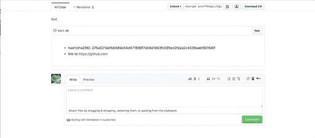
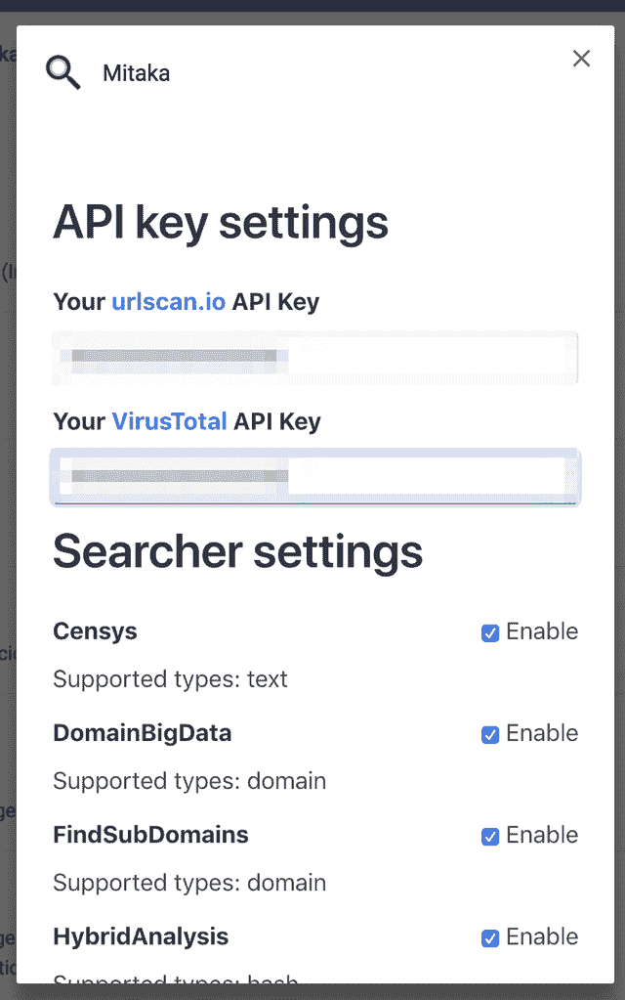

# mitaka:OSINT 搜索的浏览器扩展

> 原文：<https://kalilinuxtutorials.com/mitaka-browser-extension-osint-search/>

**Mitaka** 是 OSINT 搜索的浏览器扩展，它可以:

*   从选定的文本块中提取 IoC 并重新排列。
    *   如`**example[.]com**` **到** `**example.com**` **，** `**test[at]example.com**` **到** `**test@example.com**` **，** `**hxxp://example.com**` **到** `**http://example.com**` **等。**
*   在各种引擎上搜索/扫描。
    *   如 VirusTotal、urlscan.io、Censys、Shodan 等。

**特性**

**支持的国际奥委会类型**

| 名字 | desc。 | 例如 |
| --- | --- | --- |
| 文本 | 自由文本 | 任何字符串 |
| 互联网协议（Internet Protocol 的缩写） | IPv4 地址 | `8.8.8.8` |
| 领域 | 域名 | `github.com` |
| 全球资源定位器(Uniform Resource Locator) | 统一资源定位器 | `https://github.com` |
| 电子邮件 | 电子邮件地址 | `test@test.com` |
| 平均取样数（Average Sample Number 的缩写） | 法国核安全局 | `AS13335` |
| 混杂 | md5 / sha1 / sha256 | `44d88612fea8a8f36de82e1278abb02f` |
| cve | CVE 数 | `CVE-2018-11776` |
| btc | BTC 地址 | `1A1zP1eP5QGefi2DMPTfTL5SLmv7DivfNa` |
| gaPubID | Google Adsense 发布者 ID | `pub-9383614236930773` |
| gaTrackID | 谷歌分析跟踪器 ID | `UA-67609351-1` |

**亦读-[Act 平台:收集&交换威胁情报信息](https://kalilinuxtutorials.com/act-platform-semi-automated-cyber-threat-intelligence/)的开放平台**

**支持的搜索引擎**

| 名字 | 全球资源定位器(Uniform Resource Locator) | 支持的类型 |
| --- | --- | --- |
| AbuseIPDB | [https://www.abuseipdb.com](https://www.abuseipdb.com/) | 互联网协议（Internet Protocol 的缩写） |
| archive.org | [https://archive.org](https://archive.org/) | 全球资源定位器(Uniform Resource Locator) |
| 存档.今天 | [http://archive.fo](http://archive.fo/) | 全球资源定位器(Uniform Resource Locator) |
| BGP 视图 | [https://bgpview.io](https://bgpview.io/) | ip / asn |
| 二元边缘 | [https://app . binary edge . io](https://app.binaryedge.io/) | ip /域 |
| 比特币滥用 | [https://www.bitcoinabuse.com](https://www.bitcoinabuse.com/) | btc |
| Blockchain.com | [https://www.blockchain.com](https://www.blockchain.com/) | btc |
| 方块密码 | [https://live.blockcypher.com](https://live.blockcypher.com/) | btc |
| Censys | [https://censys.io](https://censys.io/) | ip /域/ asn /文本 |
| crt.sh | [https://crt.sh](https://crt.sh/) | 领域 |
| DNSlytics | [https://dnslytics.com](https://dnslytics.com/) | ip /域 |
| DomainBigData | [https://domainbigdata.com](https://domainbigdata.com/) | 领域 |
| 域名工具 | [https://www.domaintools.com](https://www.domaintools.com/) | ip /域 |
| 域名观察 | [https://domainwat.ch](https://domainwat.ch/) | 域/电子邮件 |
| 电子邮件回复 | [https://emailrep.io](https://emailrep.io/) | 电子邮件 |
| 查找子域 | [https://findsubdomains.com](https://findsubdomains.com/) | 领域 |
| FOFA | [https://fofa.so](https://fofa.so/) | ip /域 |
| 福图那多 | [https://fortiguard.com](https://fortiguard.com/) | ip / url / cve |
| 谷歌安全浏览 | [https://transparencyreport.google.com](https://transparencyreport.google.com/) | 域/ url |
| 灰色噪音 | [https://viz.greynoise.io](https://viz.greynoise.io/) | ip /域/ asn |
| 切碎 | [https://hashdd.com](https://hashdd.com/) | ip /域/哈希 |
| 杂交分析 | [https://www.hybrid-analysis.com](https://www.hybrid-analysis.com/) | ip /域/哈希(仅限 sha256) |
| 智力 | [https://intelx.io](https://intelx.io/) | ip /域/ url /电子邮件/ btc |
| IPinfo | [https://ipinfo.io](https://ipinfo.io/) | ip / asn |
| IPIP | [https://en.ipip.net](https://en.ipip.net/) | ip / asn |
| 乔沙盒 | [https://www.joesandbox.com](https://www.joesandbox.com/) | 混杂 |
| madshare | https://mal share . com | 混杂 |
| 多元宇宙 | [https://www.maltiverse.com](https://www.maltiverse.com/) | 域/哈希 |
| NVD | [https://nvd.nist.gov](https://nvd.nist.gov/) | cve |
| OOCPR | [https://data.occrp.org](https://data.occrp.org/) | 电子邮件 |
| 奥尼菲 | [https://www.onyphe.io](https://www.onyphe.io/) | 互联网协议（Internet Protocol 的缩写） |
| OTX | [https://otx.alienvault.com](https://otx.alienvault.com/) | ip /域/哈希 |
| PubDB | [http://pub-db.com](http://pub-db.com/) | gaPubID / gaTrackID |
| 公共 WWW | [https://publicwww.com](https://publicwww.com/) | 文本 |
| 脉冲驱动 | [https://pulse ve . com](https://pulsedive.com/) | ip /域/ url /哈希 |
| RiskIQ | [http://community.riskiq.com](http://community.riskiq.com/) | ip /域/电子邮件/ gaTrackID |
| 安全轨道 | [https://securitytrails.com](https://securitytrails.com/) | ip /域/电子邮件 |
| 肖丹 | [https://www.shodan.io](https://www.shodan.io/) | ip /域/ asn |
| Sploitus | [https://sploitus.com](https://sploitus.com/) | cve |
| SpyOnWeb | [http://spyonweb.com](http://spyonweb.com/) | ip / domain / gaPubID / gaTrackID |
| 塔洛斯 | [https://talosintelligence.com](https://talosintelligence.com/) | ip /域 |
| 威胁连接 | [https://app.threatconnect.com](https://app.threatconnect.com/) | ip /域/电子邮件 |
| 威胁人群 | [https://www.threatcrowd.org](https://www.threatcrowd.org/) | ip /域/电子邮件 |
| 威胁矿工 | [https://www.threatminer.org](https://www.threatminer.org/) | ip /域/哈希 |
| 小费 | [https://threatintelligenceplatform.com](https://threatintelligenceplatform.com/) | ip /域 |
| Urlscan | [https://urlscan.io](https://urlscan.io/) | ip /域/ asn / url |
| 查看 DNS | [https://viewdns.info](https://viewdns.info/) | ip /域/电子邮件 |
| VirusTotal | [https://www.virustotal.com](https://www.virustotal.com/) | ip /域/ url /哈希 |
| 瓦尔蒙特 | [https://vulmon.com](https://vulmon.com/) | cve |
| VulncodeDB | [https://www.vulncode-db.com](https://www.vulncode-db.com/) | cve |
| vcube | [http://vxcube.com](http://vxcube.com/) | ip /域/哈希 |
| WebAnalyzer | [https://wa-com.com](https://wa-com.com/) | 领域 |
| 我们泄露信息 | [https://weleakinfo.com](https://weleakinfo.com/) | 电子邮件 |
| x 力交换 | [https://exchange.xforce.ibmcloud.com](https://exchange.xforce.ibmcloud.com/) | ip /域/哈希 |
| 佐梅耶 | [https://www.zoomeye.org](https://www.zoomeye.org/) | 互联网协议（Internet Protocol 的缩写） |

**支持的扫描引擎**

| 名字 | 全球资源定位器(Uniform Resource Locator) | 支持的类型 |
| --- | --- | --- |
| Urlscan | [https://urlscan.io](https://urlscan.io/) | ip /域/ url |
| VirusTotal | [https://www.virustotal.com](https://www.virustotal.com/) | 全球资源定位器(Uniform Resource Locator) |

**下载量**

*   chrome:[https://chrome . Google . com/web store/detail/mitaka/bfjbejmeoibbdpfdbmbacmefcbannnbg](https://chrome.google.com/webstore/detail/mitaka/bfjbejmeoibbdpfdbmbacmefcbannnbg)
*   火狐:[https://addons.mozilla.org/en-US/firefox/addon/mitaka/](https://addons.mozilla.org/en-US/firefox/addon/mitaka/)

**如何使用？**

这个浏览器扩展根据您选择的 IoC 类型显示上下文菜单，然后您可以选择您想要搜索/扫描的内容。

**例子:**

**注:**

请在启用 urlscan.io 和病毒总计扫描的选项页面中设置您的 urlscan.io 和病毒总计 API 密钥。

**选项**

您可以根据自己的喜好在选项页面上启用/禁用搜索引擎。

**关于权限**

此浏览器扩展需要下列权限。

*   `**Read and change all your data on the websites you visit**`:
    *   这个扩展基于你在网站上的选择动态地创建上下文菜单。
    *   这意味着该扩展需要读取您访问的网站上的所有数据。(这个扩展不会改变网站上的任何内容)
*   `**Display notifications**`:
    *   这个扩展在出错时发出通知。

我不会(也永远不会)从用户那里收集任何信息。

**如何构建(面向开发者)**

这个浏览器扩展用[类型脚本](https://www.typescriptlang.org/)编写，由 [webpack](https://webpack.js.org/) 构建。

TypeScript 文件将从`src`目录开始，通过 TypeScript 编译器运行，然后是 webpack，最后是`dist`目录中的 JavaScript 文件。

**git 克隆 https://github.com/ninoseki/mitaka.git
CD mitaka
NPM 安装
npm 运行测试
npm 运行构建**

[**Download**](https://github.com/ninoseki/mitaka)