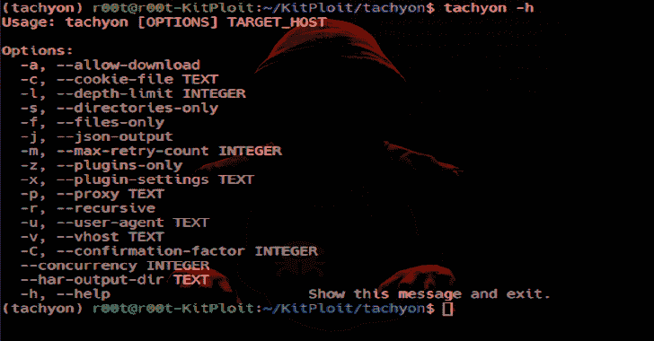

# 超光速粒子:快速 Http 死文件查找器

> 原文：<https://kalilinuxtutorials.com/tachyon-fast-http-dead-file-finder/>

**Tachyon** 是一款快速的 web 应用安全侦察工具。它专门用于抓取 web 应用程序，并查找剩余的或没有索引的文件，以及泄漏内部数据的报告页面或脚本。

**用户需求**

*   Linux 操作系统
*   Python 3.5.2

**用户安装**

**安装**

**$ mkdir 超光速粒子
$ python3 -m venv 超光速粒子/
$ cd 超光速粒子
$源仓/激活
$ pip 安装超光速粒子 3
$超光速粒子-h**

**升级**

**$ cd tachyon
$源箱/激活
$ pip 安装-忽略-安装-升级 tachyon3**

**用途**

**$ cd 超光速粒子
$源仓/激活
$超光速粒子-h**

**也可阅读-[Aura 僵尸网络:一个超级便携的僵尸网络框架，带有基于 Django 的 C2 服务器](https://kalilinuxtutorials.com/aura-botnet-django-based-c2-server/)**

**开发者安装**

**$吉特克隆 https://github.com/delvelabs/tachyon.git
$ mkdir 超光速粒子
$ python3 -m venv 超光速粒子/
$源超光速粒子/bin/activate
$ cd 超光速粒子
$ pip install-r requirements-dev . txt**

**入门**

注意:如果你有源代码版本，在下面的例子中用 python3 -m 超光速粒子替换超光速粒子。

**$ cd 超光速粒子
$源仓/激活**

**使用默认设置运行发现:**

**超光速粒子 http://example.com/**

**通过代理运行发现:**

**超光速粒子-p http://127 . 0 . 0 . 1:8080 http://example.com/**

**仅搜索文件:**

http://example.com/超光速粒子

**仅搜索目录:**

**超光速粒子 http://example.com/**

**将结果输出为 JSON 格式:**

http://example.com/超光速粒子

**命令行选项**

**用法:main.py【选项】TARGET_HOST
选项:
-a，–allow-download
-C，–cookie-file TEXT
-l，–深度限制整数
-s，–仅目录
-f，–仅文件
-j，–JSON-output
-m，–max-retry-count 整数
-z，–仅插件
-x，–插件设置文本
-p，**

**cookie 文件的格式**

**cookie 0 = value 0；
cookie 1 = value 1；
cookie 2 = value 2；**

**插件**

**现有插件:**

*   HostProcessor :这个插件处理主机名来生成主机和相关的文件名。
*   **PathGenerator** :用字母和数字生成简单路径(例如:/0)。
*   **Robots** :将 robots.txt 中的路径添加到路径数据库中。
*   **SitemapXML** :将站点地图中找到的路径和文件添加到数据库中。
*   **Svn** : Fetch /。svn/entries 并解析目标路径。

**插件设置**

设置可以通过-x 选项传递给插件。每个选项都是一个键/值对，键和值之间用冒号连接。每个设置使用一个新的-x。

**超光速粒子-x 设置 0:数值 0 -x 设置 1:数值 1 -x 设置 2:数值 2 http://example.com/**

[Download](https://github.com/delvelabs/tachyon)