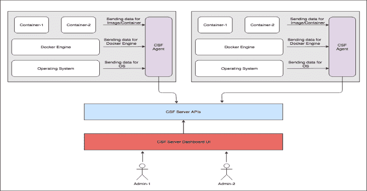
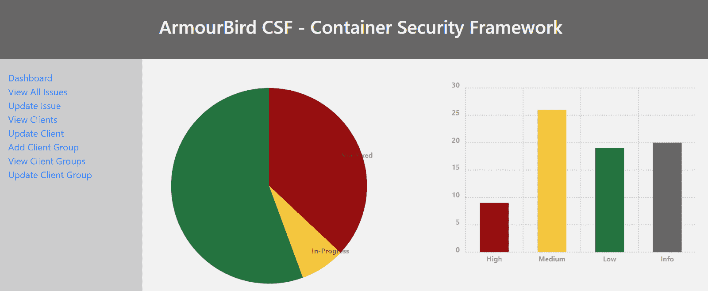
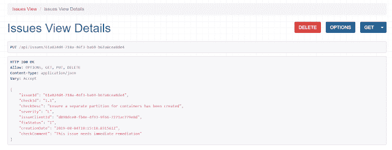

# armour bird CSF–集装箱安全框架

> 原文：<https://kalilinuxtutorials.com/armourbird-csf-container-security-framework/>

**armour bird CSF–集装箱安全框架**是一个可扩展、模块化、API 优先的框架，用于根据 CIS 和其他自定义安全检查对码头设备和集装箱进行常规安全监控。

ArmourBird CSF 具有客户端-服务器架构，因此分为两个部分:

**CSF 客户端**

*   该组件负责监控目标机器上的 docker 安装、容器和映像
*   在最初的版本中，它将根据 Docker CIS 基准进行检查
*   CSF 客户端中的检查将是可配置的，因此将在未来的版本和更新中扩展
*   为了安全起见，它被建在码头工作台上

**也可以阅读-[fudgec 2:一个用 Python3 编写的紫色团队合作 C2 框架，Powershell &。](https://kalilinuxtutorials.com/fudgec2-a-collaborative-c2-framework-for-purple-teaming-written-in-python3-powershell-net/)网**

**CSF 服务器**

*   这将是由各种分布式 CSF 客户端(安装在多个物理/虚拟机上)生成的安全日志的接收方代理
*   它还有一个 UI 子组件，用于统一管理和显示 CSF 客户端记录的各种漏洞/问题
*   该服务器还将公开可用于与其他系统集成的 API

**重要提示**:该工具目前处于测试模式。因此 django (CSF 服务器)的调试标志被启用，SQLite 被用作同一个 docker 容器中的 DB。因此，创建一个新的 docker 容器将会重置数据库。

**建筑示意图**

**API CSF 服务器**

**发布 API**

**发布/发布**

*   用于报告来自 CSF 客户的问题

**GET /issues/{issueId}**

*   列出{id}的特定问题

**获取/发布**

*   用于列出所有 CSF 客户报告的所有问题

**PUT /issues/{issueId}**

*   用于更新特定问题(如严重性、评论等。)

**删除/issues/{issueId}**

*   用于删除特定问题

**客户端 API**

**帖子/客户**

*   用于添加 CSF 客户端

**GET /clients/{clientId}**

*   用于列出特定的 CSF 客户

**获取/客户端/**

*   列出所有 CSF 客户

**PUT /clients/{clientId}**

*   用于更新 CSF 客户端(例如 IP 地址等。)

**删除/clients/{clientId}**

*   用于从网络中删除 CSF 客户端

**客户端组 API**

**帖子/客户群**

*   将客户端添加到特定组(例如，产品 1、HRNetwork、产品 2 等)。)

**GET/client group/{ groupID }**

*   用于列出客户端组的详细信息

**GET /clientGroup/**

*   用于列出所有客户端组

**PUT/client group/{ groupID }**

*   用于更新客户端组

**删除/clientGroup/{groupId}**

*   用于删除客户端组

**安装/使用**

**CSF 客户端**在运行 docker 安装的计算实例上作为 docker 容器运行。可以使用 hub.docker.com 上托管的 docker 映像，通过以下命令来执行它:

**dock run-it–net host–PID host–users host–cap-add audit _ control \
e docker _ content _ trust = $ docker _ content _ trust \
e CSF _ cdn = " \
-v/etc \
-v/usr/bin/docker 容器 d:/usr/bin/docker 容器 d \** 

确保使用 CSF 服务器 URL 更新上述命令中的 CSF_CDN 环境变量。

一旦容器被执行，它将开始定期向 CSF 服务器发送问题日志。

CSF 服务器可以作为 docker 容器运行，或者本地运行在 web 服务器上，各种 CSF 客户端将在该服务器上发送数据。

您可以使用托管在 hub.docker.com 上的 docker 映像，使用以下命令在您的服务器上运行它

**坞站运行-p 80:8000 -d 臂鸟/csf_server**

通过以下链接浏览 CSF 服务器

*   dashboard:http://< your-domain >/dashboard/
*   API:http://< your-domain >/API/

**建筑码头工人图片**

**为 CSF 客户端构建 docker 映像**

**git 克隆 git @ github . com:armourbird/CSF . git
CD CSF _ client
dock build。-t csf_client**

**为 CSF 服务器构建 docker 映像**

git clone git @ github . com:armourbird/CSF . git
CD CSF _ server
dock build。-t CSF _ 服务器

**潜行高峰**

**API 视图**

[Download](https://github.com/armourbird/csf)