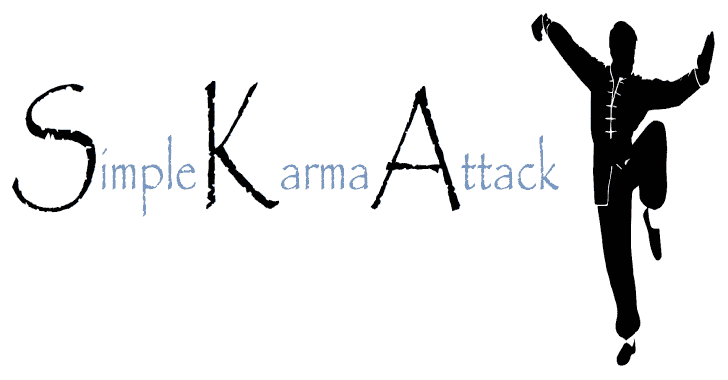
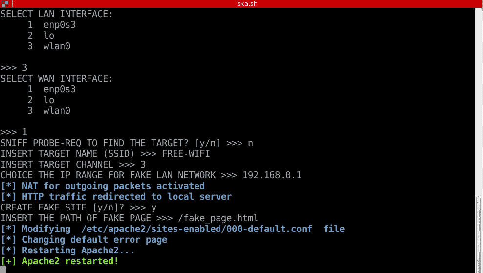
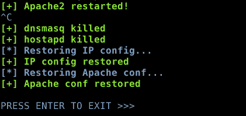

# 斯卡:简单的因果报应攻击

> 原文：<https://kalilinuxtutorials.com/ska-simple-karma-attack/>

SKA 允许你实施一个非常简单快速的因果攻击。

您可以嗅探探针请求来选择假的 AP 名称，或者，如果您愿意，您可以手动插入 AP 的名称(evil twin attack)。

当目标连接到您的无线局域网时，您可以激活 HTTP 重定向并执行 MITM 攻击。

**详情**

**脚本实现这些步骤:**

*   为攻击选择网卡(一个用于局域网，一个用于广域网)
*   捕获选择假 AP 名称的探测请求(tcpdump)
*   激活假 AP (hostapd 和 dnsmasq)
    *   新的 AP 具有 DHCP 服务器，该服务器向目标提供有效的 IP，并防止受害者设备上可能的警报
*   激活 HTTP 重定向(iptables)
    *   只有 HTTP 请求被重定向到虚假站点，而 HTTPS 流量继续正常路由
*   激活 apache 服务器以托管钓鱼网站
*   在攻击结束时，脚本清除所有更改并恢复 Apache 配置

**也可理解为-[Dr _ Robot:用于列举与](https://kalilinuxtutorials.com/dr_robot-enumerate-the-subdomains-associated-with-a-company/)T3 公司相关的子域名的工具**

**截图**

按 CTRL-C 终止所有进程并恢复配置文件。

**总之**

禁用网络管理器配置文件中的 DNS 行(查看/etc/NetworkManager/):

dn〔t0〕s = dnsmasq〔t1〕

在未被管理的设备之间插入无线适配器的 MAC，以允许 hostapd 正常工作:

**未被管理的设备= MAC:XX:XX:XX:XX:XX:XX:XX**

**免责声明**

作者不承担任何责任，也不对该程序造成的任何误用或损害负责。

SKA 的发布是希望它有用，但没有任何保证；甚至没有对适销性或特定用途适用性的暗示担保。

更多细节请参见 GNU 通用公共许可证。

[Download](https://github.com/Leviathan36/SKA)