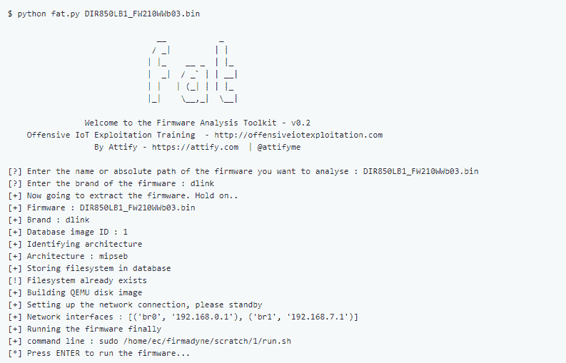

# 固件分析工具包:模拟固件并分析其安全漏洞

> 原文：<https://kalilinuxtutorials.com/firmware-analysis-toolkit/>

**固件分析工具包**是一个模拟固件并分析其安全漏洞的工具包。FAT 是一个工具包，旨在帮助安全研究人员分析和识别物联网和嵌入式设备固件中的漏洞。

固件分析工具包建立在以下现有工具和项目之上:

*   **Firmadyne**
*   **Binwalk**
*   **固件-模块-套件**
*   **MITMproxy**
*   **Firmwalker**
*   **设置指令**

如果您是一名培训学生，并且将此设置为培训的先决条件，建议将工具安装在/root/tools 文件夹中，并将各个工具安装在那里。

**也读作-[Pixload:图像有效载荷创建/注入工具](https://kalilinuxtutorials.com/pixload-image-payload-creating-injecting/)**

**安装人行道**

git 克隆 https://github . com/devttys 0/binwalk . git
CD binwalk
sudo。/deps.sh
sudo python。/setup . py install
sudo apt-get install python-lzma:*(适用于 python 2 . x)
sudo-h pip install git+https://github . com/ahupp/python-magic

注意:或者，您也可以执行 sudo apt-get install binwalk

**建立公司**

**sudo apt-get install busybox-static fake root git k partx netcat-openbsd nmap python-psycopg 2 python 3-psycopg 2 SNMP UML-utilities util-Linux VLAN QEMU-system-arm QEMU-system-MIPS QEMU-system-x86 QEMU-utils**

**git 克隆–递归 https://github.com/firmadyne/firmadyne.git**

**cd。/firmadyne；。/download.sh**

**编辑 firmadyne.config，使 FIRMWARE_DIR 指向 firmadyne 文件夹的当前位置。**

**建立数据库**

*   **sudo apt-get 安装 postgresql**
*   **sudo -u postgres 创建 user -P firmadyne，密码为 firmadyne**
*   **sudo -u postgres 创建 db -O firmadyne 固件**
*   **sudo -u postgres psql -d 固件<。/firmadyne/database/schema**

**设置固件分析工具包(FAT)**

**首先安装 pexpect。**

**pip 安装 PE expect**

现在将回购克隆到您的系统中。

**git 克隆 https://github.com/attify/firmware-analysis-toolkit
mv 固件-分析-工具包/fat.py。
mv 固件-分析-工具包/reset.py。
chmod +x fat.py** 

在 fat.py 和 reset.py 中调整到 firmadyne 和 binwalk 的路径，另外提供 root 密码。

Firmadyne 的某些操作需要 root 权限。脚本本身提供了 root 密码来自动执行该过程。

**配置-根据您的系统 firmadyne _ path = "/home/EC/firmadyne "
bin walk _ path = "/usr/local/bin/bin walk "
root _ pass = " root "
firmadyne _ pass = " firmadyne "**

**设置固件模块套件**

**sudo apt-get 安装 git build-essential zlib 1g-dev liblzma-dev python-magic
git 克隆 https://github.com/brianpow/firmware-mod-kit.git**

使用哪个 binwalk 找到 binwalk 的位置。修改 shared-ng.inc 文件，将变量 BINWALK 的值更改为/usr/local/bin/binwalk 的值(如果这是安装 binwalk 的位置)。。

**设置 MITMProxy**

**pip 安装 mitmproxy 或 apt-get 安装 mitmproxy**

**设置 Firmwalker**

**git 克隆 https://github.com/craigz28/firmwalker.git**

这就是运行 FAT 所需的全部设置。

**跑步胖**

一旦你完成了以上步骤，你就可以跑步了。运行 fat 的语法是

**$ python fat.py**

提供固件文件名作为脚本的参数。如果没有提供，脚本会在运行时提示输入。

然后，脚本会要求您输入品牌名称。输入固件所属的品牌。这纯粹是为了数据库存储和分类目的。

该脚本将显示分配给创建的网络接口的 IP 地址。记下来。

最后，它会说运行固件。按回车键，等待固件启动。Ping 上一步中显示的 IP，或在浏览器中打开。

恭喜你。固件最终被仿真。下一步将是在 Firefox 中设置代理并运行 mitmproxy。

**要删除所有已分析的固件映像，请运行**

**$ python reset.py**

**示例运行**

[Download](https://github.com/attify/firmware-analysis-toolkit)