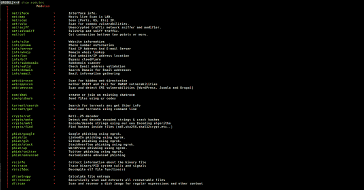
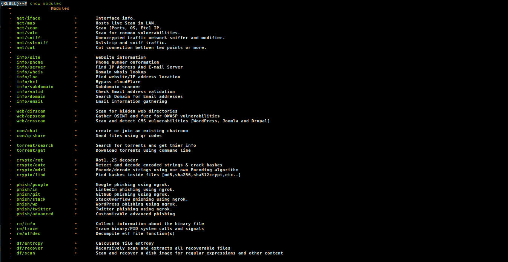
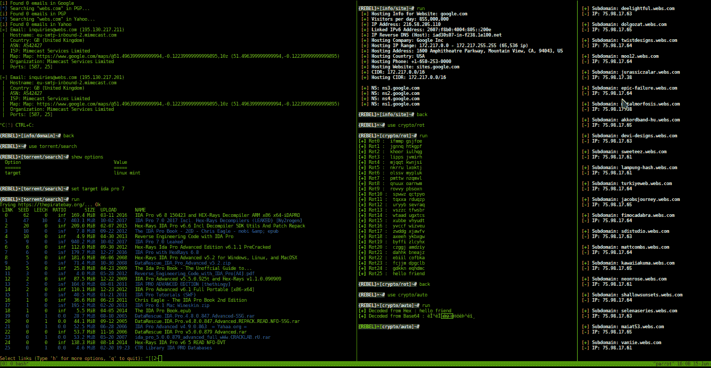

# Rebel 框架:渗透测试框架

> 原文：<https://kalilinuxtutorials.com/rebel-framework-penetration-testing-framework/>

Rebel 框架是一个先进且易于使用的渗透测试框架。

**开始**

**git 克隆 https://github.com/rebellionil/rebel-framework.git
CD rebel-framework
bash setup . sh
bash rebel . sh**

**模块**

**截图**

**演示**

**支持的发行版**

| 分配 | 版本检查 | 支持 | 依赖关系
已经安装 | 状态 |
| --- | --- | --- | --- | --- |
| Kali Linux | 4.4.0 | 是 | 是 | 工作 |
| 鹦鹉操作系统 | 4.14.0 | 是 | 是 | 工作 |

**也读作-[SysAnalyzer:自动化恶意代码分析系统](https://kalilinuxtutorials.com/sysanalyzer-automated-malcode-analysis-system/)**

**把你自己的工具移植到反叛吧！**

**scan.py**

┌**──[root @ parrot]──[~]
└──╼# python scan . py-h
-h——帮助打印用法
用法。/scan.py**

**controller.sh 示例**

**！/bin/bash

normal = ' \ e[0m '
arr[0]= ' \ e[1；94m’；blue = $ { arr[0]}
arr[1]= ' \ e[1；31m’；red = $ { arr[1]}
arr[2]= ' \ e[1；33m’；yellow = $ { arr[2]}
arr[3]= ' \ e[1；35m’；purp = $ { arr[3]}
arr[4]= ' \ e[1；32m’；green = $ { arr[4]}
arr[5]= ' \ e[97m]；white = $ { arr[5]}
gray term = ' \ e[1；40m '
module = $(echo $ 1 | cut-d '/'-f 2)** 
**if[$ module！= " scan "]]；然后
echo -e "${red}[x]错误的模块名"
exit
fi

misc(){
if[[$ 1 = = " back "]]| |[[$ 1 = = " exit "]]|[[$ 1 = = " quit "]]；然后
退出
elif [[ $1 == '！']] ;然后
$ 2
elif[[$ 1 = = " clear "]]| |[[$ 1 = = " reset "]]；然后
清除
elif [[ $1 == "help" ]] || [[ $1 == "？”]] ;然后
bash print _ help _ modules . sh help
elif[[$ 1 = = " banner "]]；然后
rand = " $[$ RANDOM % 6]"
color = " $ { arr[$ rand]} " # select RANDOM color
echo-e $ color
python print _ banner . py
elif[[$ 1 = = " "]；然后
:
else
echo-e " $ { purp }[-]无效参数使用 show 'help '了解更多信息"
fi
}
target = " site . com "

while IFS = read-e-p " $(echo-e $ white；回声-e ${grayterm}{rebel}➤[${white}$1]~#${normal})“cmd 1；do
history-s " $ cmd 1 "
if[[$ { 1 } = ~ ' re/']]；然后
if[[$(echo $ cmd 1 | cut-d " "-f1)= = " show "]]；然后
if[[$(echo $ cmd 1 | cut-d " "-F2)= = " options "]]；然后
{
echo-e " Option \ t \ t \ t \ t | Value "
echo-e " = = = = = = = \ t \ t \ t \ t | = = "
echo-e " target \ t \ t \ t | $ target "
} | column-t-s " | "
elif[[$(echo $ cm D1 | cut-d " "-f 2)= = " modules "]]；然后
bash print _ help _ modules . sh modules
elif[[$(echo $ cmd 1 | cut-d " "-F2)= = " help "]]；然后
bash print _ help _ modules . sh help
fi
elif[[$(echo $ cmd 1 | cut-d " "-f1)= = ' set ']]；然后
if[[$(echo $ cmd 1 | cut-d " "-F2)= ' target ']]；然后
target = $(echo $ cmd 1 | cut-d " "-F3-| sed " s/'//g ")
fi
elif[[$(echo $ cmd 1 | cut-d " "-f1)= = ' run ']]；然后
python scan . py $ target
else
misc $ cmd 1
fi
fi
done**
**if[[$ module！= " scan "]]；然后
echo -e "${red}[x]错误模块名"
退出
fi

misc(){
if[[$ 1 = = " back "]]| |[[$ 1 = = " exit "]]|[[$ 1 = = " quit "]]；然后
退出
elif [[ $1 == '！']] ;然后
$ 2
elif[[$ 1 = = " clear "]]| |[[$ 1 = = " reset "]]；然后
清除
elif [[ $1 == "help" ]] || [[ $1 == "？”]] ;然后
bash print _ help _ modules . sh help
elif[[$ 1 = = " banner "]]；然后
rand = " $[$ RANDOM % 6]"
color = " $ { arr[$ rand]} " # select RANDOM color
echo-e $ color
python print _ banner . py
elif[[$ 1 = = " "]；然后
:
else
echo-e " $ { purp }[-]无效参数使用 show 'help '了解更多信息"
fi
}
target = " site . com "

while IFS = read-e-p " $(echo-e $ white；回声-e ${grayterm}{rebel}➤[${white}$1]~#${normal})“cmd 1；do
history-s " $ cmd 1 "
if[[$ { 1 } = ~ ' re/']]；然后
if[[$(echo $ cmd 1 | cut-d " "-f1)= = " show "]]；然后
if[[$(echo $ cmd 1 | cut-d " "-F2)= = " options "]]；然后
{
echo-e " Option \ t \ t \ t \ t | Value "
echo-e " = = = = = = = \ t \ t \ t \ t | = = "
echo-e " target \ t \ t \ t | $ target "
} | column-t-s " | "
elif[[$(echo $ cm D1 | cut-d " "-f 2)= = " modules "]]；然后
bash print _ help _ modules . sh modules
elif[[$(echo $ cmd 1 | cut-d " "-F2)= = " help "]]；然后
bash print _ help _ modules . sh help
fi
elif[[$(echo $ cmd 1 | cut-d " "-f1)= = ' set ']]；然后
if[[$(echo $ cmd 1 | cut-d " "-F2)= ' target ']]；然后
target = $(echo $ cmd 1 | cut-d " "-F3-| sed " s/'//g ")
fi
elif[[$(echo $ cmd 1 | cut-d " "-f1)= = ' run ']；然后
python scan . py $ target
else
misc $ cmd 1
fi
fi
done**

[Download](https://github.com/reb311ion/rebel-framework)