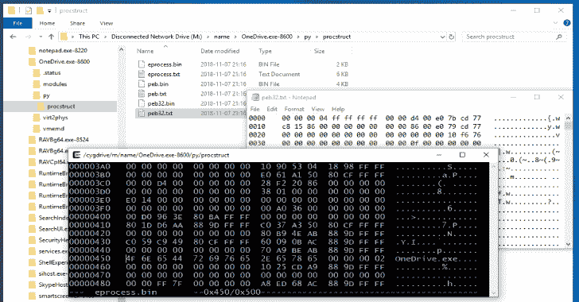
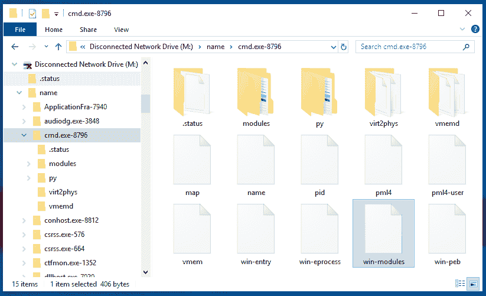
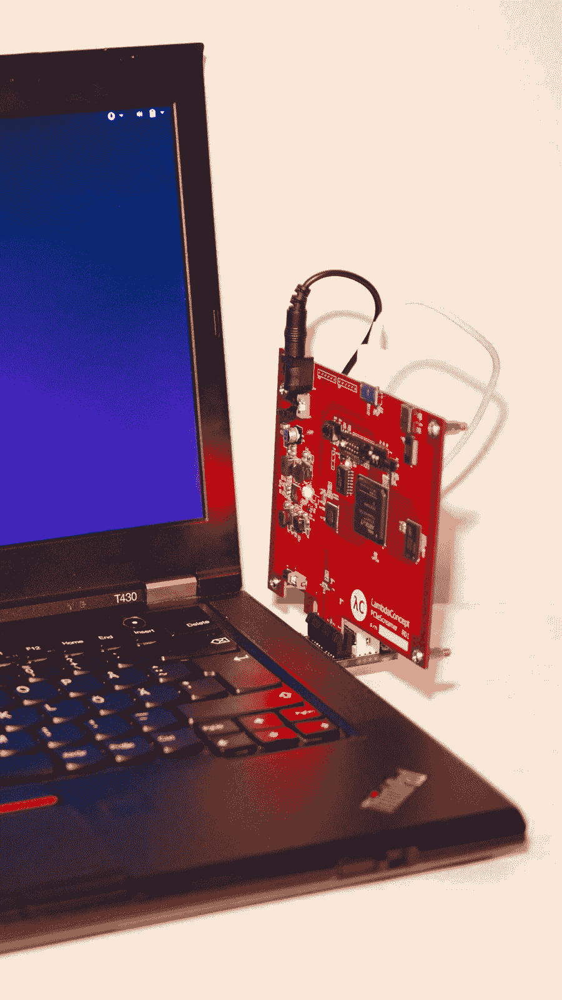
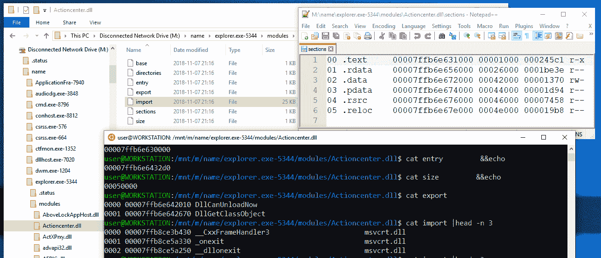
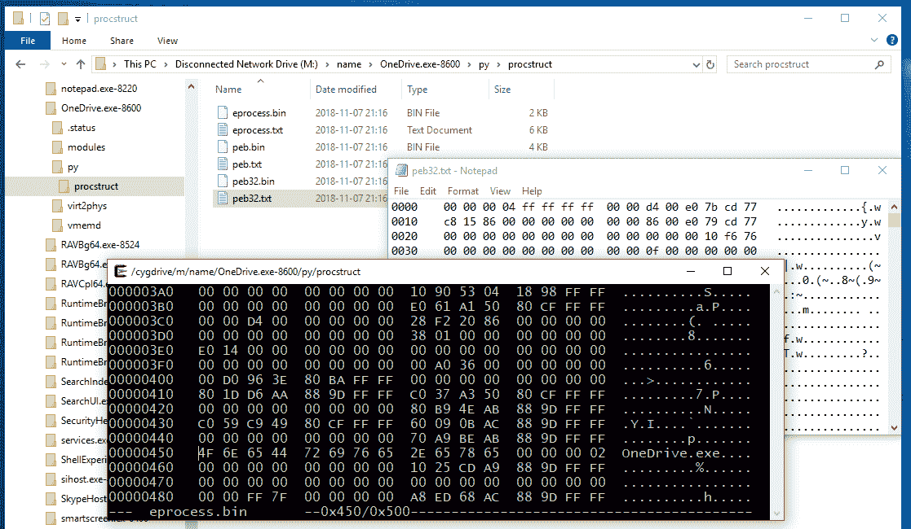
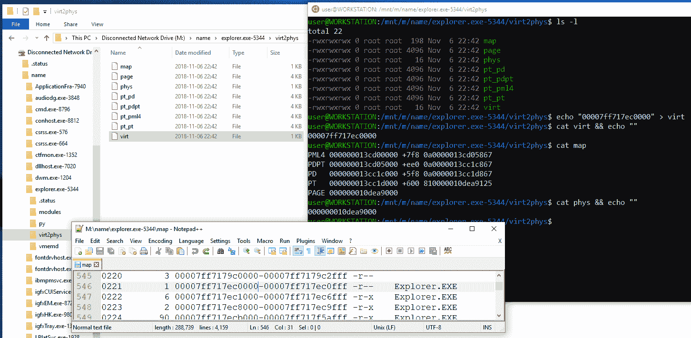

# 内存进程文件系统

> 原文：<https://kalilinuxtutorials.com/memprocfs-the-memory-process-file-system/>

内存进程文件系统是一种简单方便的访问物理内存的方式，就像访问虚拟文件系统中的文件一样。无需复杂的命令行参数，轻松进行简单的点击式内存分析！

通过挂载的虚拟文件系统中的文件或通过包含在您自己的项目中的功能丰富的应用程序库来访问内存内容和工件！

分析内存转储文件，通过 DumpIt 或 WinPMEM 实时内存，通过链接的 PCILeech 和 PCILeech-FPGA 设备在读写模式下实时内存！

甚至可以通过安全的连接连接到远程实时内存采集代理，从而实现远程实时内存事件响应，甚至通过延迟更高的低带宽连接！

使用您最喜欢的工具来分析内存——使用您最喜欢的十六进制编辑器、python 和 powershell 脚本、WinDbg 或您最喜欢的反汇编程序和调试器——所有这些都可以通过读写文件来轻松处理内存进程文件系统！

在您的 Python 或 C/C++编程项目中包含内存进程文件系统！

内存进程文件系统中的几乎所有东西都通过一个易于使用的 API 公开，以便在您自己的项目中使用！

插件友好的架构允许用户使用本地 C .DLL 插件或 Python 轻松扩展内存进程文件系统。py 插件–提供额外的分析能力！

**通过挂载的文件系统快速轻松地进行内存分析:**

不管你以前是否了解内存分析，或者你是一个高级用户，内存进程文件系统(和 API)都是有用的！单击文件系统中的内存对象。

**丰富的 Python 和 C/C++ API:**

内存进程文件系统中的一切都作为 API 公开。C/C++ vmmdll.h 和 Python vmmpy.py 都有 API。

文件系统本身通过 API 虚拟可用，而不需要挂载它。通过调用 API 功能，专门的过程分析和过程改变功能变得容易。

既可以读取虚拟进程内存，也可以读取物理内存！以下示例显示了从物理地址 0x1000 读取 0x20 字节:

> > > from VmmPy import *
>>>VmmPy _ Initialize(' c:/temp/win 10 _ memdump . raw ')
>>>print(VmmPy _ UtilFillHexAscii(VmmPy _ MemRead(-1，0x1000，0x 20)))0000 e9 4d 06 00 01 00 00 01 00 00 3f 00 18 10。M……？… 0010 00 00 00 00 00 00 00 00 00 00 00 00 00 00 00 00 …………….

**模块化插件架构:**

任何人都可以用自定义插件来扩展内存进程文件系统！

这就像把一个 python 文件放到正确的目录中或者编译一个微小的 C DLL 一样简单。

现有的功能已经实现为文档化的 C 和 Python 插件！

**安装**:

**窗户**

下载或克隆内存进程文件系统 github 库。预构建的二进制文件位于 files 文件夹中。

如果内存进程文件系统被用作 API，它只依赖于 Microsoft Visual C++可再发行版 for Visual Studio 2017(见下文)。

内存进程文件系统依赖于 LeechCore 项目来获取内存。

必要的 leechcore.dll 文件已经预先构建并包含在文件夹中。

内存进程文件系统也依赖于 Microsoft Visual C++可再发行版 for Visual Studio 2017。

可以从微软这里下载。或者，如果安装 Dokany 文件系统驱动程序，请安装 DokanSetup_redist 版本，它将安装所需的可再发行软件。

挂载文件系统需要安装 Dokany 文件系统库。

请在 https://github.com/dokan-dev/dokany/releases/latest 下载并安装 Dokany 的最新版本。建议下载并安装 DokanSetup_redist 版本。

Python 支持需要 Python 3.6 或更高版本。用户可以使用命令行参数-pythonhome 指定 Python 安装的路径，或者下载 Python 3.7–Windows x86-64 嵌入式 zip 文件，并在文件系统中使用 Python 模块时将其内容解压缩到 files/python 文件夹中。

要使用 Python API，需要安装适用于 Windows 的普通 64 位 Python 3.6 或更高版本。

要捕获实时内存(无 PCILeech FPGA 硬件),请下载 DumpIt 并通过 DumpIt /LIVEKD 模式启动内存进程文件系统。

或者，通过下载最新签名的 WinPMEM 驱动程序来获得 WinPMEM，并将它放在 MemProcFS 旁边 LeechCore Wiki 中有详细的说明。

PCILeech FPGA 需要将硬件和 FTD3XX.dll 放到 files 文件夹中。请查看 LeechCore 项目以获取说明。

**Linux**

Linux 上尚不支持内存进程文件系统。

**例子**:

从命令行启动内存进程文件系统——可以使用下面的例子之一。

或者向 MemProcFS.exe 注册内存转储文件扩展名，以便在双击内存转储文件时自动挂载文件系统！

*   将内存转储文件挂载为默认 M:
*   memprocfs.exe-设备 c:\temp\win10x64-dump.raw
*   将内存转储文件挂载为默认的 M:并附加额外的详细信息:
*   memprocfs.exe-设备 c:\temp\win10x64-dump.raw -v
*   将内存转储文件挂载为默认的 M:并附加额外的详细信息:
*   memprocfs.exe-设备 c:\temp\win10x64-dump.raw -v -vv
*   将内存转储文件挂载为 S:
*   memprocfs.exe 装载的 s 设备 c:\temp\win10x64-dump.raw
*   在详细只读模式下挂载实时目标内存，在/LIVEKD 模式下使用 DumpIt:
*   DumpIt.exe/LIVEKD/A memprocfs.exe/C "-v "
*   使用 WinPMEM 驱动程序以只读模式安装实时目标内存:
*   memprocfs.exe 设备 pmem
*   使用 PCILeech FPGA 内存采集设备在读/写模式下安装实时目标内存:
*   memprocfs.exe 器件 fpga
*   使用 TotalMeltdown 漏洞采集设备以读/写模式安装实时目标内存:
*   memprocfs.exe-设备完全熔化
*   通过在 cr3 选项中指定进程或内核页表基来挂载任意 x64 内存转储:
*   memprocfs.exe-设备 c:\ temp \ unknown-x64-dump . raw-Cr3 0x1aa 000

**演示**

[https://www.youtube.com/embed/Da_9SV9FA34?feature=oembed&enablejsapi=1](https://www.youtube.com/embed/Da_9SV9FA34?feature=oembed&enablejsapi=1)

[Download](https://github.com/ufrisk/MemProcFS)