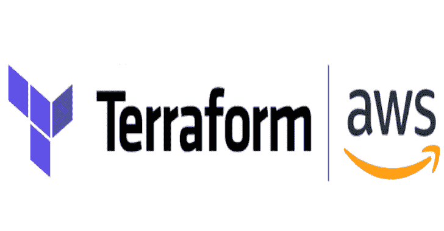

# Terraform AWS 安全基线:设置您的 AWS 帐户

> 原文：<https://kalilinuxtutorials.com/terraform-aws-secure-baseline/>

**Terraform**Aws Secure Baseline 是一个 terra form 模块，用于根据 CIS Amazon Web Services Foundations 的安全基线配置来设置您的 Aws 帐户。

**地形模块注册表**

一个 terraform 模块，用合理安全的配置基线设置您的 AWS 帐户。大多数配置都基于 CIS Amazon Web Services Foundations 1 . 2 . 0 版。

从 v0.10.0 开始，此模块需要 Terraform v0.12 或更高版本。如果需要使用 Terraform v0.11 或更早版本，请使用 v0.9.0。

**特性**

1 .**身份和访问管理:**

*   设置 IAM 密码策略。
*   创建单独的 IAM 角色，用于定义权限并将其分配给实体，如 IAM 用户和组。
*   创建 IAM 角色，用于联系 AWS 支持人员进行事件处理。
*   启用 AWS 配置规则来审核 root 帐户状态。

2.**测井&监控**:

*   在所有地区启用 CloudTrail，并将事件交付到 CloudWatch 日志。
*   CloudTrail 日志使用 AWS 密钥管理服务加密。
*   所有日志都存储在启用了访问日志记录的 S3 存储桶中。
*   在给定的时间段(默认为 90 天)后，日志会自动归档到 Amazon Glacier 中。
*   设置 CloudWatch 警报，以便在您的 AWS 帐户发生重大变化时通知您。
*   在所有区域启用 AWS 配置，以自动拍摄配置快照。
*   启用 SecurityHub 并订阅 CIS 基准标准。

3。**联网**:

*   在所有区域的默认 VPC 中删除与默认路由表、默认网络 ACL 和默认安全组相关联的所有规则。
*   启用 AWS 配置规则来审核安全组规则中不受限制的公共端口。
*   在所有地区启用默认 VPC 的 VPC 流量日志。
*   在所有地区启用警戒。

**亦读-****[SKA:简单因缘攻击](https://kalilinuxtutorials.com/ska-simple-karma-attack/)**

**用法**

**数据" aws_caller_identity " "当前" {}
数据" aws_region " "当前" {}

模块" secure _ baseline " {
source = " nozaq/secure-baseline/AWS "

audit _ log _ BUCKET _ NAME = " YOUR _ BUCKET _ NAME "
AWS _ account _ id = data . AWS _ caller _ identity . current . account _ id
region = data . AWS _ region . current . NAME
support _ IAM _ role _ principal _ arn = " YOUR _ IAM _ USER "

提供者= { 【T12 = AWS . sa-east-1
AWS . us-east-1 = AWS . us-east-1
AWS . us-east-2 = AWS . us-east-2
AWS . us-west-1 = AWS . us-west-1
AWS . us-west-2 = AWS . us-west-2
}
}**

查看示例，了解这些提供者是如何定义的。注意，您需要为每个 AWS 区域定义一个提供者，并将它们传递给模块。

目前，这是在一个模块中处理多个区域的推荐方法。详细信息可在模块中的提供商处找到——terra form 文档。

默认情况下，会自动创建一个新的 S3 存储桶来存储审核日志，同时可以指定外部 S3 存储桶。

当您已经有一个集中的 S3 存储桶来存储所有日志时，这是非常有用的。有关更多详细信息，请参见外部存储桶示例。

**管理 AWS 组织中的多个帐户**

当您的 AWS 组织中有多个 AWS 帐户时，安全基线模块会为每个 AWS 帐户配置独立的环境。

您可以更改此行为，以便在一个主帐户中集中管理所有帐户的安全信息和审核日志。

有关更多详细信息，请查看组织示例。

**子模块**

该模块由几个子模块组成，每个子模块都可以独立使用。包子目录中的模块——Terraform 描述了如何获取子模块。

*   警报-基线
*   云迹-基线
*   守卫职责-基线
*   iam 基线
*   VPC-基线
*   安全桶

**输入**

| 名字 | 描述 | 类型 | 默认 | 需要 |
| --- | --- | --- | --- | --- |
| 账户类型 | AWS 帐户的类型。可能的值有`individual`、`master`和`member`。指定`master`和`member`为 AWS 组织中的多个帐户设置集中日志记录。否则使用个人`。 | 线 | `"individual"` | 不 |
| 报警名称空间 | 设置所有报警的名称空间。 | 线 | `"CISBenchmark"` | 不 |
| alarm_sns_topic_name | 执行任何警报时将被通知的 SNS 主题的名称。 | 线 | `"CISAlarm"` | 不 |
| 允许 _ 用户 _ 更改 _ 密码 | 是否允许用户更改自己的密码。 | 线 | `"true"` | 不 |
| 审计 _ 日志 _ 存储桶 _ 强制销毁 | 一个布尔值，指示应该从审核日志存储桶中删除所有对象，以便可以无错误地销毁该存储桶。这些对象不可恢复。 | 线 | `"false"` | 不 |
| 审计 _ 日志 _ 存储桶 _ 名称 | 存储各种审计日志的 S3 存储桶的名称。 | 线 | 不适用的 | 是 |
| 审计 _ 日志 _ 生命周期 _ 冰川 _ 过渡 _ 天数 | 日志文件归档到 Glacier 中时，日志创建后的天数。 | 线 | `"90"` | 不 |
| aws_account_id | 帐户的 AWS 帐户 ID 号。 | 线 | 不适用的 | 是 |
| 云踪迹 _ 云观察 _ 日志 _ 组名 | 将 CloudTrail 事件传递到的 CloudWatch 日志组的名称。 | 线 | `"cloudtrail-multi-region"` | 不 |
| cloudtrail_iam_role_name | CloudTrail 用于将日志传送到 CloudWatch 日志组的 IAM 角色的名称。 | 线 | `"CloudTrail-CloudWatch-Delivery-Role"` | 不 |
| 云迹 _ iam _ 角色 _ 策略 _ 名称 | CloudTrail 用于将日志传送到 CloudWatch 日志组的 IAM 角色策略的名称。 | 线 | `"CloudTrail-CloudWatch-Delivery-Policy"` | 不 |
| cloud trail _ key _ deletion _ windows _ in _ days | 销毁资源后删除密钥的持续天数必须在 7 到 30 天之间。默认为 30 天。 | 线 | `"10"` | 不 |
| 云迹 _ 名称 | 这条小路的名字。 | 线 | `"cloudtrail-multi-region"` | 不 |
| cloudtrail _ s3 _ key _ 前缀 | CloudTrail 将事件传递到 S3 存储桶时使用的前缀。 | 线 | `"cloudtrail"` | 不 |
| 云观察日志保留天数 | 保留日志的天数。CIS 建议 365 天。可能的值为:0、1、3、5、7、14、30、60、90、120、150、180、365、400、545、731、1827 和 3653。设置为 0 可无限期保留日志。 | 线 | `"365"` | 不 |
| 配置 _ 聚合器 _ 名称 | 组织 AWS Config 配置聚合器的名称。 | 线 | `"organization-aggregator"` | 不 |
| 配置 _ 聚合器 _ 名称 _ 前缀 | 附加到组织 AWS 配置聚合器的 IAM 角色的名称前缀。 | 线 | `"config-for-organization-role"` | 不 |
| 配置 _ 交付 _ 频率 | AWS 配置将快照发送到 S3 存储桶的频率。 | 线 | `"One_Hour"` | 不 |
| 配置 _ 角色 _ 名称 | AWS 配置将使用的 IAM 角色的名称。 | 线 | `"Config-Recorder"` | 不 |
| 配置 _ iam _ 角色 _ 策略 _ 名称 | AWS 配置将使用的 IAM 角色策略的名称。 | 线 | `"Config-Recorder-Policy"` | 不 |
| 配置 _ s3 _ 存储桶 _ 关键字 _ 前缀 | 将 AWS 配置快照写入 S3 存储桶时使用的前缀。 | 线 | `"config"` | 不 |
| 配置 _ 社交网络 _ 主题 _ 名称 | 用于通知配置更改的 SNS 主题的名称。 | 线 | `"ConfigChanges"` | 不 |
| 守卫职责 _ 禁用 _ 电子邮件 _ 通知 | 布尔值表示是否向客户发送电子邮件通知。 | 线 | `"false"` | 不 |
| 守卫职责 _ 寻找 _ 发布 _ 频率 | 指定为后续发现事件发送通知的频率。 | 线 | `"SIX_HOURS"` | 不 |
| 守卫职责 _ 邀请 _ 消息 | 邀请信息。 | 线 | `"This is an automatic invitation message from guardduty-baseline module."` | 不 |
| 经理 _ iam _ 角色 _ 姓名 | IAM 管理员角色的名称。 | 线 | `"IAM-Manager"` | 不 |
| manager_iam_role_policy_name | IAM 管理员角色策略的名称。 | 线 | `"IAM-Manager-Policy"` | 不 |
| 主账户 id | 与当前 AWS 帐户关联的主 AWS 帐户的 ID。如果`account\_type`为`member`则需要。 | 线 | `""` | 不 |
| 主人 _ iam _ 角色 _ 姓名 | IAM 主角色的名称。 | 线 | `"IAM-Master"` | 不 |
| 主 _ iam _ 角色 _ 策略 _ 名称 | IAM 主角色策略的名称。 | 线 | `"IAM-Master-Policy"` | 不 |
| max_password_age | 用户密码有效的天数。 | 线 | `"90"` | 不 |
| 成员 _ 帐户 | 作为会员帐户关联的 AWS 帐户的 id 和电子邮件列表。 | 目标 | `[]` | 不 |
| 最小密码长度 | 用户密码所需的最小长度。 | 线 | `"14"` | 不 |
| 密码 _ 重用 _ 预防 | 禁止用户重复使用的以前密码的数量。 | 线 | `"24"` | 不 |
| 地区 | 设置全局资源的 AWS 区域。 | 线 | 不适用的 | 是 |
| 要求 _ 小写 _ 字符 | 用户密码是否需要小写字符。 | 线 | `"true"` | 不 |
| 要求 _ 数字 | 用户密码是否需要数字。 | 线 | `"true"` | 不 |
| 要求 _ 符号 | 用户密码是否需要符号。 | 线 | `"true"` | 不 |
| 要求 _ 大写 _ 字符 | 用户密码是否需要大写字符。 | 线 | `"true"` | 不 |
| 支持 _ iam _ 角色 _ 名称 | 支持角色的名称。 | 线 | `"IAM-Support"` | 不 |
| 支持 _ iam _ 角色 _ 策略 _ 名称 | 支持角色策略的名称。 | 线 | `"IAM-Support-Role"` | 不 |
| support_iam_role_principal_arn | 可以承担支持角色的 IAM 主要元素的 ARN。 | 线 | 不适用的 | 是 |
| 标签 | 指定对象标记的键和值。这适用于该模块创建的所有资源。 | 地图 | `{}` | 不 |
| 目标区域 | 要用此模块设置的区域列表。 | 目录 | `[ "ap-northeast-1", "ap-northeast-2", "ap-south-1", "ap-southeast-1", "ap-southeast-2", "ca-central-1", "eu-central-1", "eu-north-1", "eu-west-1", "eu-west-2", "eu-west-3", "sa-east-1", "us-east-1", "us-east-2", "us-west-1", "us-west-2" ]` | 不 |
| 使用 _ 外部 _ 审计 _ 日志 _ 存储桶 | 一个布尔值，指示特定的审核日志存储桶是否已经存在。如果设置为 false，则创建新的 S3 时段。 | 线 | `"false"` | 不 |
| vpc 角色名称 | VPC 流日志将使用的 IAM 角色的名称。 | 线 | `"VPC-Flow-Logs-Publisher"` | 不 |
| 虚拟角色角色角色策略名称 | VPC 流日志将使用的 IAM 角色策略的名称。 | 线 | `"VPC-Flow-Logs-Publish-Policy"` | 不 |
| vpc 日志组名 | VPC 流日志传送到的 CloudWatch 日志组的名称。 | 线 | `"default-vpc-flow-logs"` | 不 |
| vpc 日志保留天数 | 保留日志的天数。CIS 建议 365 天。可能的值为:0、1、3、5、7、14、30、60、90、120、150、180、365、400、545、731、1827 和 3653。设置为 0 可无限期保留日志。 | 线 | `"365"` | 不 |

**输出**

| 名字 | 描述 |
| --- | --- |
| 警报 _ 社交网络 _ 主题 | CloudWatch 警报将发送到的 SNS 主题。 |
| 审计 _ 存储桶 | 用于存储审计日志的 S3 存储桶。 |
| 云尾 | 记录所有地区事件的踪迹。 |
| 云迹 _ 公里 _ 关键 | 用于加密 CloudTrail 事件的 KMS 密钥。 |
| 云迹 _ 日志 _ 交付 _ iam _ 角色 | 用于将 CloudTrail 事件传递到 CloudWatch 日志的 IAM 角色。 |
| 云迹日志组 | 存储 CloudTrail 事件的 CloudWatch 日志组。 |
| 配置 _ 配置 _ 记录器 | 每个区域的配置记录器。 |
| 配置 _ iam _ 角色 | 用于将 AWS 配置记录传递到 CloudWatch 日志的 IAM 角色。 |
| 配置 _ 社交网络 _ 主题 | AWS 配置向其发送通知的 SNS 主题。 |
| 默认网络访问控制列表 | 默认网络 ACL。 |
| 默认路径表 | 默认路由表。 |
| 默认 _ 安全 _ 组 | 默认安全组的 ID。 |
| 默认 _vpc | 默认的 VPC。 |
| 守卫职责 _ 检测器 | 每个区域的值勤检测器。 |
| 经理 _ iam _ 角色 | 用于经理用户的 IAM 角色。 |
| 主人 _ iam _ 角色 | 用于主用户的 IAM 角色。 |
| 支持 _ iam _ 角色 | 用于支持用户的 IAM 角色。 |
| vpc 流日志组 | CloudWatch Logs 日志组，存储每个地区的 VPC 流量日志。 |
| vpc _ 流 _ 日志 _ iam _ 角色 | 用于将 VPC 流日志传送到 CloudWatch 日志的 IAM 角色。 |

[Download](https://github.com/nozaq/terraform-aws-secure-baseline)