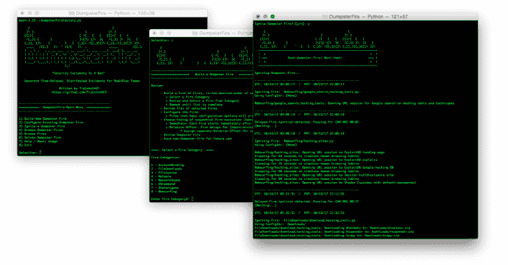
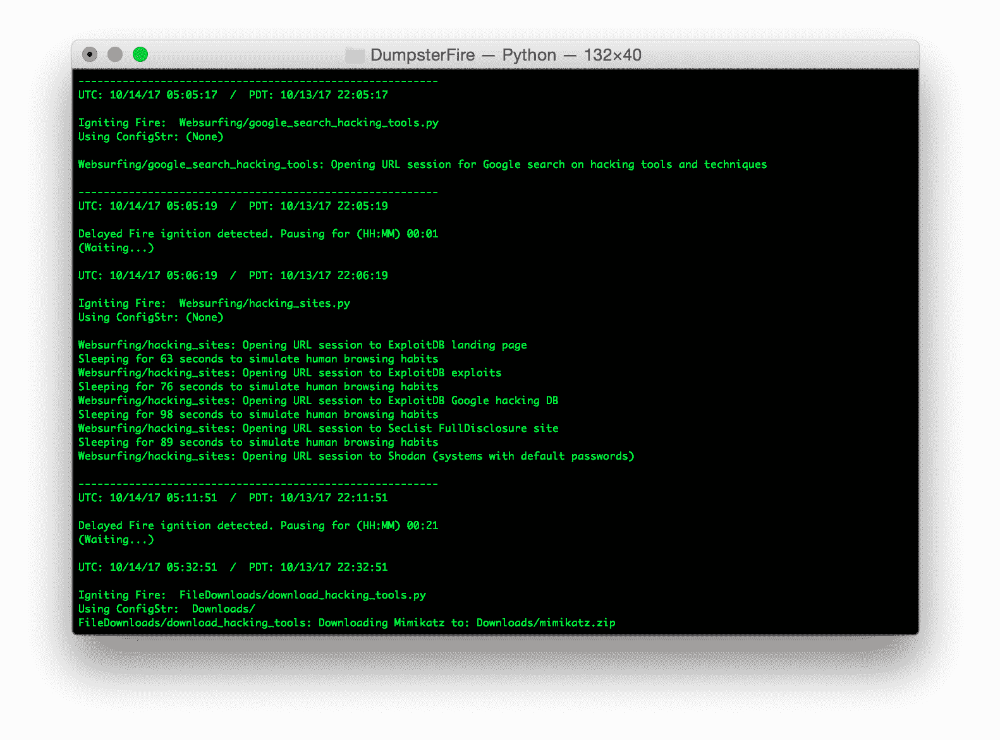
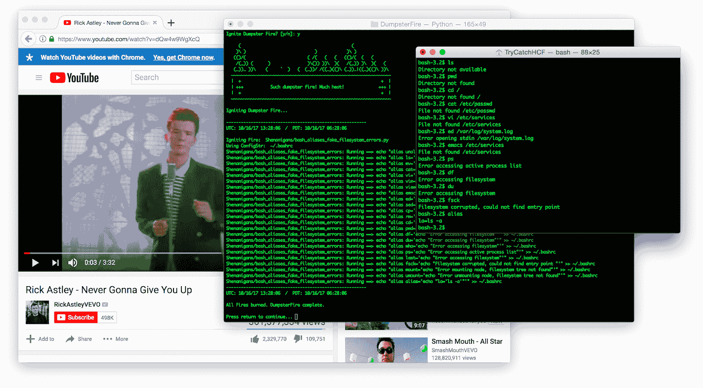
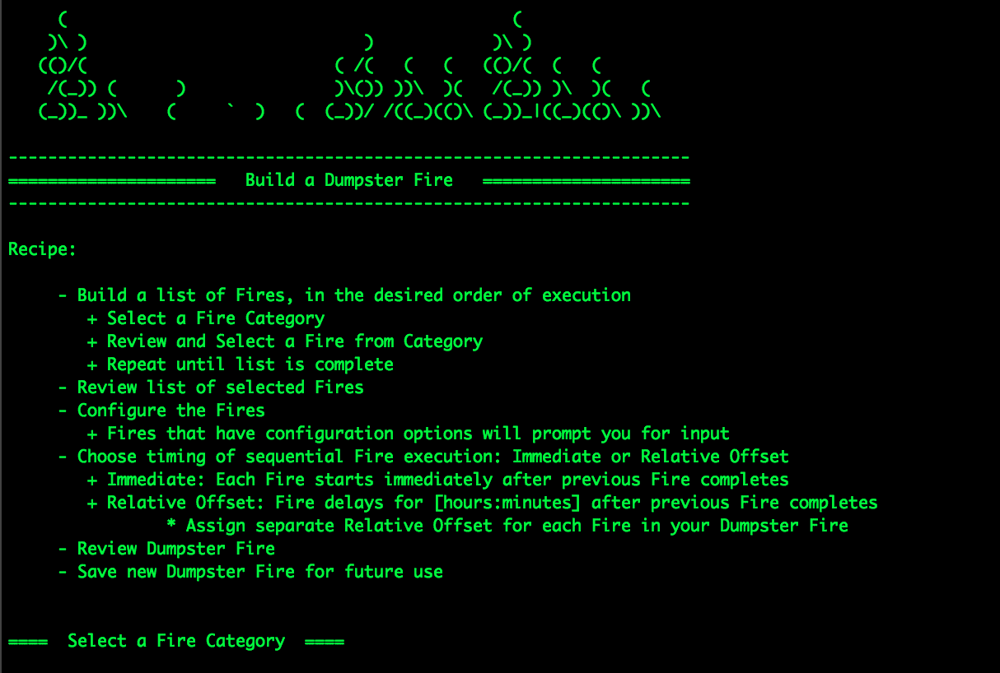
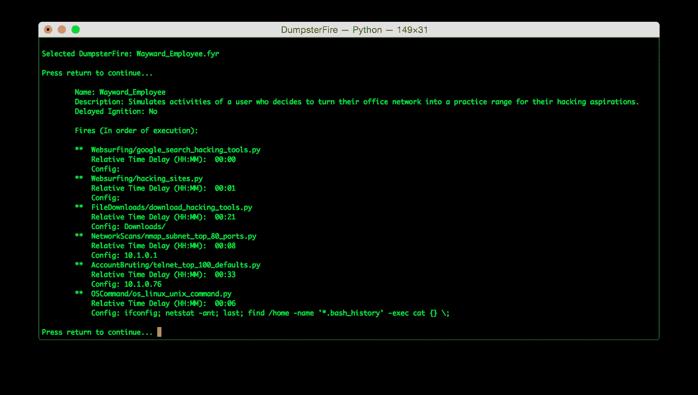
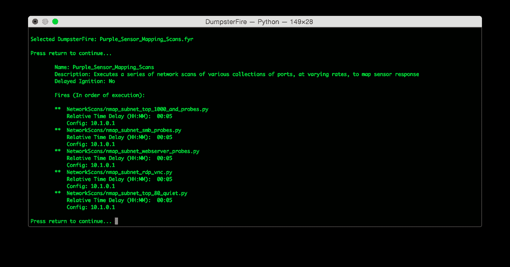
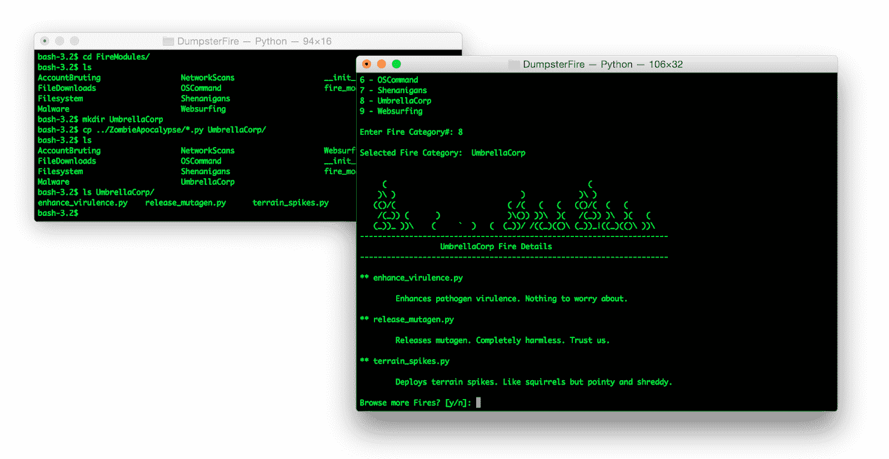

# DumpsterFire:工具集–一个盒子里的安全事件！

> 原文：<https://kalilinuxtutorials.com/dumpsterfire-toolset-security-incidents/>

**DumpsterFire 工具集**是一个模块化、菜单驱动、跨平台的工具，用于构建可重复、延时、分布式安全事件。轻松为蓝队演习和传感器/警报映射创建自定义事件链。红队可以制造假事件、干扰和诱饵来支持和扩大他们的行动。

将纸上桌面练习变成受控的“实弹”靶场活动。构建事件序列(“叙述”)来模拟现实场景，并生成相应的网络和文件系统工件。

该工具集被设计为可动态扩展的，允许您创建自己的 fire(事件模块)来添加到包含的工具集 fire 集合中。

只需编写自己的 Fire 模块并将其放入 FireModules 目录中。DumpsterFire 工具集将在启动时自动检测您的自定义 Fire，并使它们可供使用。

**又读-[security Not Found:404 Page Not Found Webshell](https://kalilinuxtutorials.com/securitynotfound-404-page-not-found-webshell/)**

**问责**

DumpsterFire 会创建一个带有日期和时间标记的事件日志，以便红队和蓝队可以协调和跟踪事件，将它们与您的传感器检测到(或未检测到)的事件、触发或未触发的警报等相关联。

它还允许团队确认哪些事件是您的操作/练习的一部分，使每个人都远离麻烦。所有日期时间追踪均以 UTC 时间执行，因此您可以轻松关联全球运营，而无需担心时区和国际日期变更线之间的转换。

自动生成的带有日期和时间戳的事件日志也能轻松为您的服务增值。为您的客户互动生成一系列垃圾邮件，根据他们的攻击面进行定制。

在您的操作结束时，您可以将日志作为额外的紫色团队交付物移交给您的客户，以进行后期分析。

**概述**

DumpsterFire 工具集工作流被设计为用户友好和健壮的。一切都可以在菜单驱动的 **dumpsterFireFactory.py** 脚本中完成。启动脚本，该工具将指导您进行操作。您可以从浏览现有的 Fire 模块和保存的 DumpsterFires 开始。

当您准备好创建自己的 DumpsterFires 时，该工具将引导您完成工作流程。最后，是时候点燃你的垃圾箱了。在选择了您选择的 DumpsterFire 之后，您将检查 DumpsterFire 的 Fire 模块和设置。如果一切看起来都很好，点亮它！

当您构建一个 DumpsterFire 时，在您选择了所有想要包含的 Fire 模块之后，该工具将遍历 Fire 列表。如果 Fire 具有自定义设置选项，该工具将调用该 Fire 的 Configure()方法来提示您进行设置(例如，目标网络的 IP 地址)。

一旦所有的火都配置好了，你就可以选择给你的火分配单独的延时。这允许 DumpsterFire 在执行其事件链时更好地模拟真实操作。

例如，第一次火灾可能会访问各种黑客网站，下一次火灾会在启动第三次火灾之前下载一些常用的黑客工具，第三次火灾会开始扫描本地网络。如果这一切都发生在几秒钟内，没有足球分析家会相信这是一个人。

通过在这些事件之间增加几分钟甚至几个小时，你创建了一个更真实的事件链。

在所有的火被配置和可选的单个火延迟被分配后，你将被要求命名你的 DumpsterFire。不要使用空格或奇怪的特殊字符，只使用字母、数字、下划线和连字符。

瞧啊。你现在已经制造了你的第一场垃圾大火。是时候点燃一支了！

当你准备好点燃垃圾站的时候，这个工具会首先显示垃圾站的设置。如果一切看起来都很好，你会被询问是否要在点火前指定一个日期时间延迟。

所有的日期时间处理都在 UTC 中完成，以确保一致的执行，而不管 DumpsterFire 的执行位置。否则，您可以拒绝日期时间延迟，执行将在您给出最终确认后立即开始。

随着 DumpsterFire 的执行，您将获得关于每个火灾的状态和关键事件的定期日期时间戳反馈。这不仅有助于您跟踪进度，还能按时间顺序记录您的垃圾站火灾活动——这对于协调您的活动和消除活动与充斥每个 SOC 的一般背景噪音之间的冲突至关重要。

您还可以在操作完成后将时间顺序记录移交给外部客户端，作为您活动的增值记录，供他们查看传感器和警报设置。所有这些都不需要你额外的努力。

**恶作剧**

4 月 1 日发生！网络战争游戏或你最好朋友的生日也是如此。有些情况下需要一些额外的东西。最终在网战比赛中渗透到对手的外围？庆祝恶作剧，同时锁定你的胜利！最好的朋友在游戏之夜不锁屏？分享就是关爱！DumpsterFire 的恶作剧让你的操作更有味道。

想打开系统的默认浏览器，欣赏里克·阿斯特利的精彩吗？把他们的系统音量调到最大后？打开你选择的任何网址怎么样？或者设置系统的 shell 别名来假装文件系统已经损坏？

**文件&目录**

**dumpsterfirefactory . py**–菜单驱动的工具，用于创建、配置、调度和执行转储文件

**Fire modules/**–包含 Fire 子目录的目录，每个子目录都是一个特定的 Fire 类别，用于组织您的 Fire 模块。Fire 被添加到 DumpsterFire 以创建一系列事件和操作。

**DumpsterFires/**–包含您收集的垃圾邮件的目录

**ignitedumpsterfire . py**–无头脚本，在命令行调用，文件名为您希望执行的 DumpsterFire。用于点燃分散的垃圾焚烧场。

**test Fire module . py**–用于单元测试自定义 Fire 模块的类方法的实用程序脚本，无需运行整个 DumpsterFire 工厂流程进行调试。也有助于运行一个单一的消防检查您的设置。 **testFireModule.py** 会提示你进行配置设置是否适用。

**__init__。py** 文件——使 Python 将目录视为包含 Python 包所需的文件，允许 DumpsterFire 工具集找到并加载 Fire 模块。

**创建垃圾站火灾:**

菜单驱动的 DumpsterFire 工厂脚本会引导您完成每个步骤，并在整个过程中提供上下文相关的帮助。

**垃圾焚烧样本**

在我们第一个例子中，我们有一个垃圾场火灾可能是足球训练或红队分心。DumpsterFire 首先在谷歌上搜索黑客工具。下一把火打开了各种黑客网站的网页会话。

接下来，一个跟火下载一些常用的黑客工具。然后对子网进行端口扫描，接着通过 Telnet 对单个主机进行暴力登录尝试。

最后一个 Fire 运行一系列 Linux 命令。请注意，在每次火灾之间，这个垃圾站火灾的制造者插入了一些时间延迟。这使得事件的流程显得更加真实。

在下一个示例中，Purple Teamers 创建了一个 DumpsterFire 来帮助分析和验证他们的传感器和警报配置。这个 DumpsterFire 运行一系列精心设计的端口扫描，每个扫描针对不同的端口和服务集合，探测率也各不相同。

他们在每次扫描火灾之间插入了 5 分钟的延迟，以简化与每次扫描火灾相关的交通隔离。当他们运行 DumpsterFire 时，他们还会在每次火灾开始时看到日期时间戳，以帮助他们消除火灾的网络活动与其他网络事件之间的冲突。

**定制你的垃圾箱火**

DumpsterFire 的模块化设计让您可以灵活地创建任意数量的事件链叙事。具有可配置设置的 Fire 模块允许您设置目标网络或系统等。但是，有几个 Fire 模块可以让您立即灵活地扩展 DumpsterFire 事件序列。

无需创建任何新的 FireModule 类，您可以使用这些现有的“自定义”Fire 模块来利用和扩展您的 DumpsterFires:

*   fire modules/web surfing/custom _ URL . py
*   FireModules/file downloads/download _ custom _ URL . py
*   fire modules/OS command/OS _ Linux _ UNIX _ command . py
*   fire modules/OS command/OS _ win _ cmd _ command . py
*   fire modules/OS command/OS _ win _ powershell _ script . py
*   fire modules/OS command/OS _ OS x _ applescript _ command . py

您可以向 DumpsterFire 中添加任意数量的这类组件，每个组件都有自己的自定义操作。例如，你可以将十几个“custom _ URL . py”Fire 模块链接在一起，构建一个完整的、定制的浏览叙事。然后，您可以使用各种“OS command/”Fire 实例来执行系统命令，以进一步强化您想要的事件叙述。特别是“OS command/”Fires 给了你难以置信的灵活性。DumpsterFire 事件链中的每个 Fire 都接受适用于主机操作系统的任何 shell 命令:

例如:Linux/Unix (& OSX 终端)

查找/家庭名称' *。bash _ history '-exec cat { }；；echo "永远不会放弃你" > rickroll.txtwall rickroll.txt

**编写自己定制的火力模块**

DumpsterFire 是现成可用的，但它的真正价值在于您可以通过创建自己的自定义 Fire 模块来轻松扩展 DumpsterFire 的场景工具箱。通过创建和定制 Fire 模块来满足您的特定需求，您可以快速扩展可以构建和执行的 DumpsterFire 场景的类型。只需编写新的 Fire 模块并将其放入 FireModules/下的现有目录中，DumpsterFire 工具集就会在运行时自动加载它并使其可用。

想让你的自定义 Fire 模块在自己的类别中完全独立吗？轻松点。只需在 FireModules/下创建一个新目录，DumpsterFire 工具集就会自动检测并将其作为一个新的火灾类别。

注意:确保您的新目录有一个名为 **__init__ 的空文件。py** 否则 Python 包管理器找不到，DumpsterFire 也看不到。

您的 Fire 模块继承自一个名为 Fire module 的类。首先，您可以复制一个现有的 Fire 模块。确保更改文件名和文件中的所有类名引用，以匹配新的 Fire。(如果需要，也更新类的构造函数方法中的类别路径引用。)

**必需的类方法:**

*   **Configure()**–提示用户输入，填充 FireModule 的参数
*   **Description()**–返回包含 FireModule 描述的字符串
*   **get parameters()**–返回 Fire 参数的单个字符串
*   **set parameters(string)**–取单个字符串&填充 Fire 的成员
*   **activate logging(boolean)**–为 Fire 设置标志，以生成其活动的日志(非常适合查看)注意:对于初始版本，记录到 stdout 总是打开的。
*   **Ignite()**–执行火焰的动作

**实用脚本**

测试 Python 类可能会很烦人，尤其是当您想要对每个类的方法进行单元测试时，这迫使您仔细检查应用程序的所有用例，以确保每个类方法都以正确的顺序执行。

糟糕。因此，我编写并包含了一个脚本，该脚本将正确地调用新的 FireModule 派生类的每个方法，使您能够通过调试快速地进行转换。不客气🙂这也是运行一个火来测试你的设置，看看它能做什么，等等的好方法。

在命令行中，给 **testFireModule.py** 脚本一个自定义 Fire 模块的相对文件路径。测试脚本将为您调用每个必需的 FireModule 方法，按照正确的顺序(在保存之前获取配置，等等)。).

测试脚本不使用异常处理，因为 Python 只在崩溃时给出有用的错误(比如指出丢失的双引号)。坠毁和燃烧你的方式成功定制火灾！

**信用:乔·热尔韦**

[**Download**](https://github.com/TryCatchHCF/DumpsterFire)