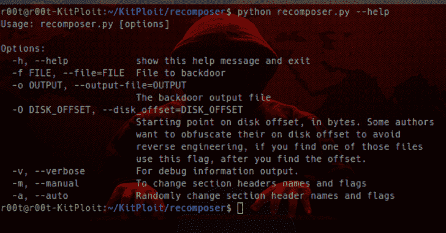

# 重组:随机更改 Win32/64 PE 文件，以便更安全地上传到恶意软件和沙盒网站

> 原文：<https://kalilinuxtutorials.com/recomposer-randomly-changes-win32-64/>

有没有因为可以通过哈希查找二进制文件而将恶意软件二进制文件上传到 VirusTotal 或其他反病毒网站的不安全感觉？**重组器**将获取您的二进制文件，并随机执行以下操作:

*   更改文件名
*   更改节名
*   更改分区标志
*   将五种不同类型的 nop 的随机数注入到长度超过 20 字节的每个可用代码中

顺便说一下，你的文件仍然会执行，所以上传吧！*

**支持 win32/64 PE 文件！！**

两种模式:

*   手动:像 PE 编辑器一样工作，更改部分名称和标志
*   自动:随机更改二进制文件

通过从一个二进制文件中创建 11200 个样本进行测试。结果:

*   没有哈希冲突
*   与原始文件的深度匹配百分比从 94%到 77%不等

**也读作——[HR Shell:用烧瓶构建的 HTTPS/HTTP 反向 Shell](https://kalilinuxtutorials.com/hrshell-https-http-reverse-shell-built-with-flask/)**

**用法**

**自动模式**

。/recomposer . py-f live.sysinternals.com/Tcpview.exe-a
旧文件名:live.sysinternals.com/Tcpview.exe
新文件名:zYmycO4NO2LYW.exe
[*]检查是否支持二进制[* ]收集文件信息
1 节:。text | Section flags:0x 60000020
2 Section:。rdata | Section flags:0x 40000040
3 Section:。data | Section flags:0xc 0000040
4 Section:。rsrc | Section flags:0x 40000040
[*]更改节。文本名称[* ]更改部分。rdata 名称
[ *]更改部分。数据标志[* ]更改部分。数据名称
[ *]更改部分。rsrc 名称更新的二进制文件:Updated file/zymyco 4 no 2 lyw . exe[*]检查是否支持二进制文件
[*]收集文件信息
1 部分:。MHz | Section flags:0x 60000020
2 Section:。

您可能会看到以下警告:\

[!]警告，。文本节哈希未更改！
【！]没有可注射 nop 的洞穴。

也就是说。文本部分散列将与原始文件相同，并且一旦 google 索引 VT 结果(当然，如果您上传文件)，就可以(在网上)进行搜索。如果发生这种情况，对重组文件进行 upx 编码应该可以解决这个问题(除非文件已经进行了 upx 编码)。

重新编译完成后，您的文件将位于 updatedfile 目录中。请随意上传到您最喜欢的恶意软件沙箱服务！

**手动模式:**

一个简单的 PE 编辑器:

。/recomposer . py-f live.sysinternals.com/Tcpview.exe-m
[*]检查是否支持二进制[* ]收集文件信息
[？]您想要更改哪些部分:
1 部分:。text | Section flags:0x 60000020
2 Section:。rdata | Section flags:0x 40000040
3 Section:。data | Section flags:0xc 0000040
4 Section:。rsrc | Section flags:0x 40000040
节号:1
[-]您选择了。文本部分。
【？]您想要(A)更改分区名称还是(B)分区标志？你挑的 b
[-]b
[*]当前属性:
。text | 0x 60000020
[-]IMAGE _ SCN _ MEM _ READ，IMAGE _ SCN _ MEM _ EXECUTE
[-]IMAGE _ SCN _ CNT _ CODE
[*]命令'清零'标志，' help '，' write '，或(' exit '，' quit '，' q '，' done ')[【T18]]使用' write '提交更改或' clear '重新开始。
【？]输入要添加的属性或键入“帮助”或“退出”:
[…]*

只需按照菜单，您的结果将在 updatedfile 目录中作为 change.filename.exe 或任何您使用-o 标志时选择的输出。

如果您不清楚文件的位置，只需查看 log_recomposer.txt，了解文件更改的位置和哈希:

filename | filename _ hash | changedfile | changedfile _ hash
psinfo . exe | AE 1554 F2 f1b 1454 a 91 c 56110747603824 | updated file/8dv 5 . exe | 791 ff 4b 2010 acebc 718 afda 58 f83 a pseexec . exe | d0 df 36671 c 8 b 2966800840336 b 6 FD | updated file/udi 6 ei vfi . exe | 6 fafatcpview . exe | c33 eee 089 a3 和 4f 9 以及 6fd0218a2 至 27ca4c2

重组器不会阻止恶意软件通知恶意软件所有者他们的二进制文件在预期环境之外运行。

[**Download**](https://github.com/secretsquirrel/recomposer)