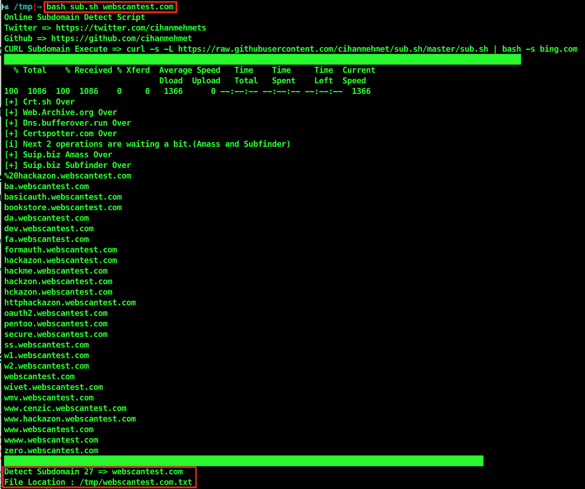
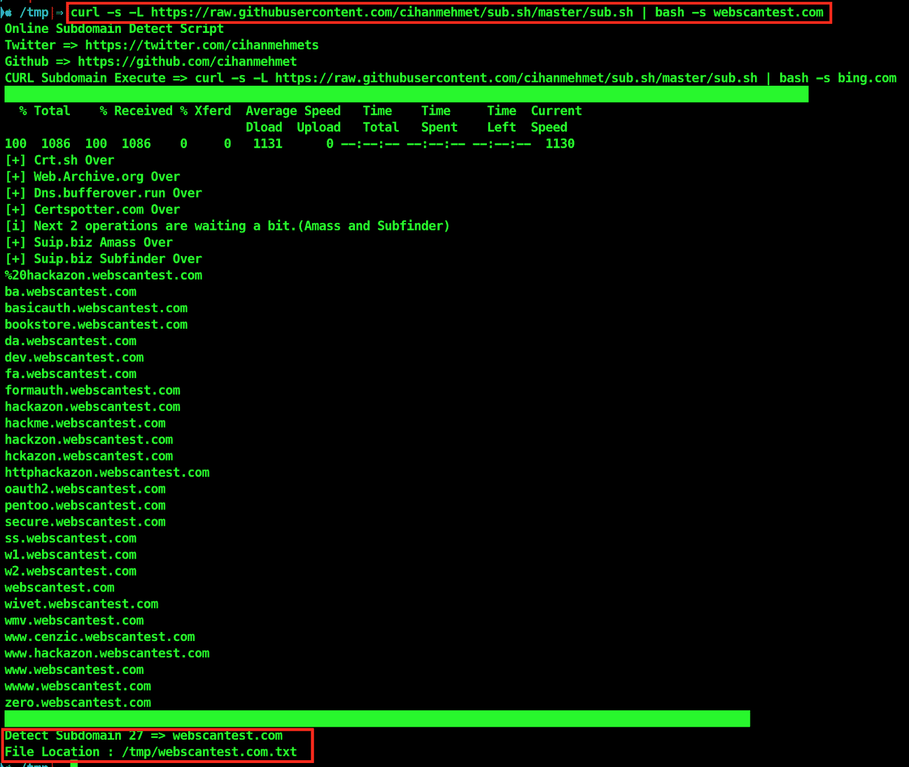
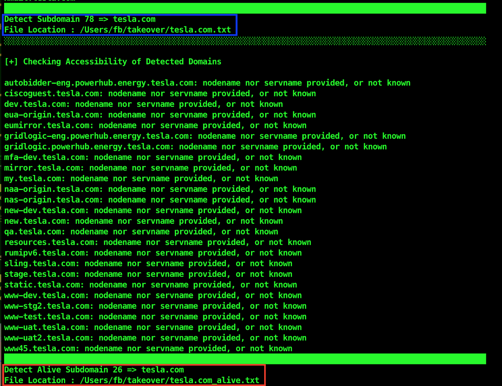
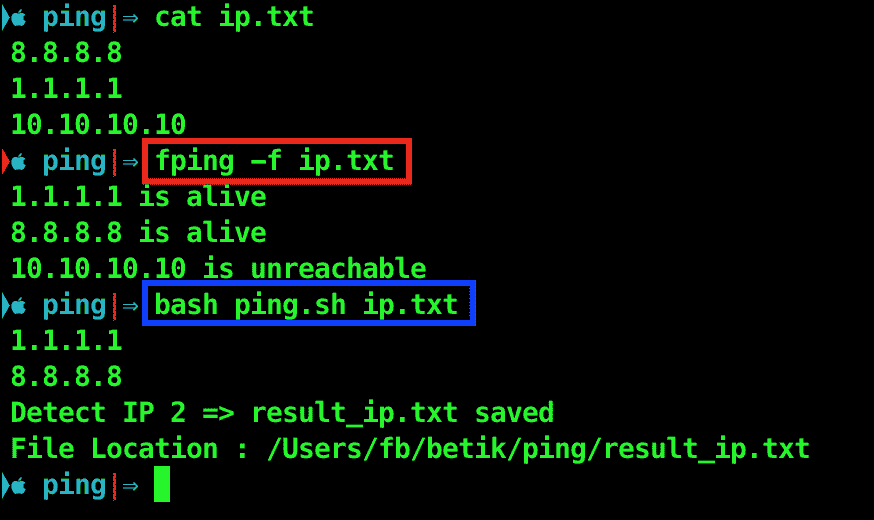
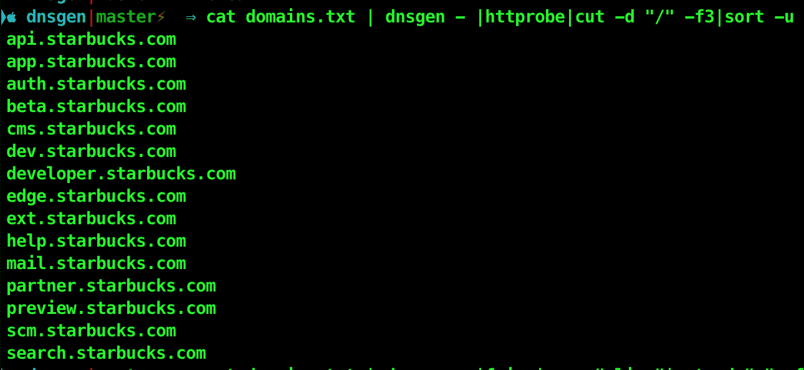

# Sub.sh:在线子域检测脚本

> 原文：<https://kalilinuxtutorials.com/sub-sh-online-subdomain-detect-script/>

**subsh**是一个在线检测子域的脚本。所以让我们来看看它的用法。

**脚本**

痛击 webscantest.com
。/sub . sh webscantest.com

**卷曲**

curl-s-L https://raw . githubusercontent . com/cihanmehmet/sub . sh/master/sub . sh | bash-s webscantest.com

**也可阅读-[重组:随机更改 Win32/64 PE 文件，以便“更安全”地上传到恶意软件&沙盒网站](https://kalilinuxtutorials.com/recomposer-randomly-changes-win32-64/)**

**子域存活检查**

bash sub _ alive . sh bing.com
curl-s-L https://raw . githubusercontent . com/cihanmehmet/sub . sh/master/sub _ alive . sh | bash-s bing . com "

**需要 Fping】**

**Nmap -sn(无端口扫描)扫描实时 IP 检测脚本**

**fping -f ip.txt**

**用法**用法`**bash nmap_sn.sh ip.txt**`

#!/bin/bash

nmap-sn-iL $ 1 | grep " grep-Eo 的 Nmap 扫描报告"(25[0-5]|2[0-4][0-9]|[01]？[0-9][0-9]?).(25[0-5]|2[0-4][0-9]|[01]?[0-9][0-9]?).(25[0-5]|2[0-4][0-9]|[01]?[0-9][0-9]?).(25[0-5]|2[0-4][0-9]|[01]?[0-9][0-9]?)" | sort-u | tee $ 1 . txt

echo " Detect IP $(WC-l $ 1 . txt | awk ' { print $ 1 } ')" " =>result _ $ { 1 } " " saved "
echo "文件位置:" $(pwd)/"result_$1 "

**样品用途**

**用法 1(平)平镖**

cat domains . txt | dnsgen –| fping | grep " alive " | cut-d " "-f1 > resolvers . txt

**用法 2(http probe)dart**

cat domains . txt | DNS gen –| http probe | cut-d "/"-F3 | sort-u | tee resolvers . txt

[**Download**](https://github.com/cihanmehmet/sub.sh)