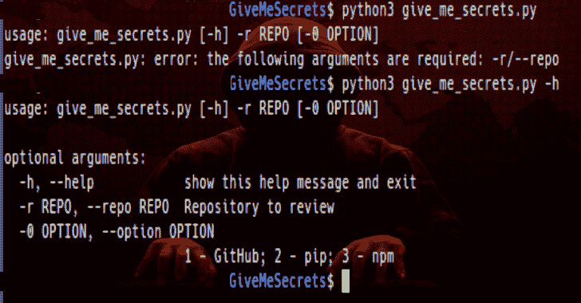

# 使用正则表达式获取敏感信息

> 原文：<https://kalilinuxtutorials.com/givemesecrets/>

**GiveMeSecrets** 使用正则表达式从给定的存储库(GitHub、pip 或 npm)获取敏感信息。您只需安装 python 3.6 或更高版本即可启动该脚本。此外，您必须在系统中安装 git、pip 和 npm。

**如何使用**？

非常好用，只需运行脚本，传递选项(1-GitHub；2–pip；3–NPM)和存储库。示例:

**python 3 give _ me _ secrets . py–选项 1–回购 https://github.com/Josue87/BoomER.git**

**也可理解为-[lock door 框架:一个具有网络安全资源的渗透测试框架](https://kalilinuxtutorials.com/lockdoor-framework-penetration-testing-framework-cyber-security/)**

**贷方:霍苏埃·恩西纳**

[**Download**](https://github.com/Josue87/GiveMeSecrets)