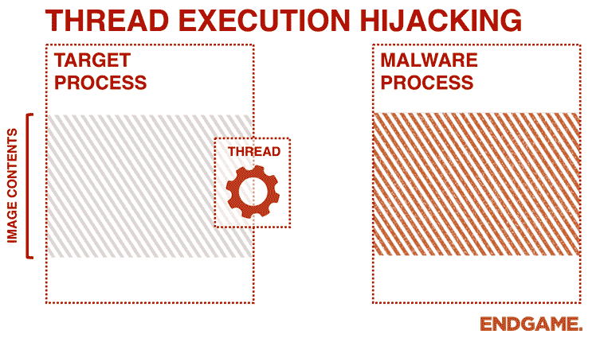

# ThreadBoat:程序使用线程执行劫持将本机外壳代码注入标准 Win32 应用程序

> 原文：<https://kalilinuxtutorials.com/threadboat-thread-execution-hijacking/>

**ThreadBoat** 程序使用线程劫持将本机外壳代码注入标准 Win32 应用程序。我开发这个小项目是为了继续体验不同的代码注入方法。

通过线程劫持，它允许 hijacker.exe 程序挂起 target.exe 程序中的一个线程，从而允许我们向一个线程写入外壳代码。

**ThreadBoat 用法**

**int main()
{
系统 sys
截击机 incp
异常 exp
sys . returnversionstate()；
if(sys . returnprivilegeescalationstate())
{
STD::cout<<"令牌权限已调整\ n "；
}
if (DWORD m_procId = incp。find win 32 process id((PCHAR)m _ win 32 process name))
{
incp。execute win 32 shell code(m _ procId)；
}
系统(“暂停”)；
返回 0；
}**

**也可阅读-[重组:随机更改 Win32/64 PE 文件，以便“更安全”地上传到恶意软件&沙盒网站](https://kalilinuxtutorials.com/recomposer-randomly-changes-win32-64/)**

**环境**

*   Windows Vista+
*   Visual C++

**Libs**

*   Winapi
    *   user32.dll
    *   kernel32.dll
*   ntdll.dll

[**Download**](https://github.com/cutesunshine/ThreadBoat)