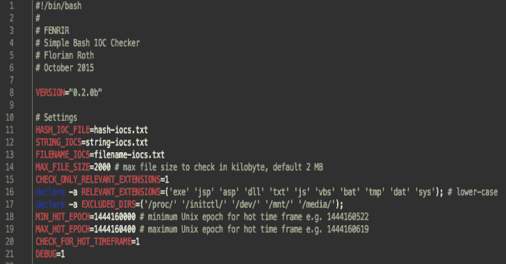
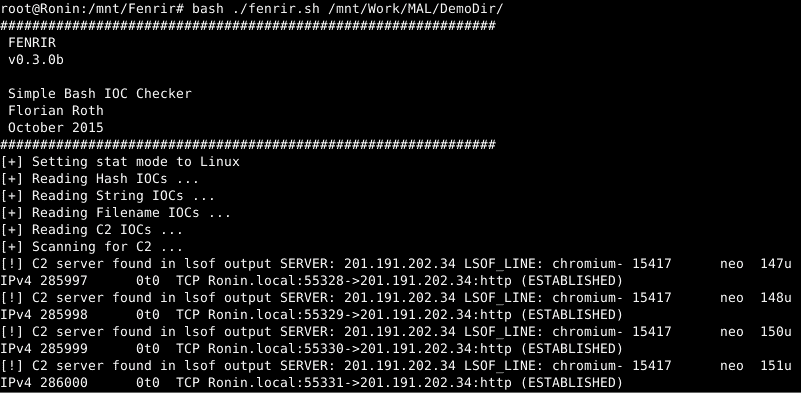
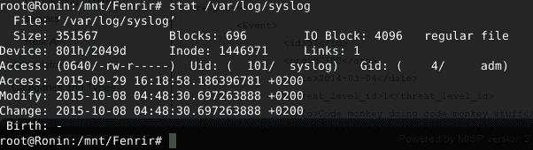

# 芬里尔:简单的 Bash IOC 扫描器

> 原文：<https://kalilinuxtutorials.com/fenrir-simple-bash-ioc-scanner/>

芬里尔是一个简单的 IOC 扫描器 bash 脚本。它允许对 Linux/Unix/OSX 系统进行扫描，以查找以下危害指标(IOC):

*   哈希 sMD5、SHA1 和 SHA256(使用 md5sum、sha1sum、sha -a 256)
*   文件名字符串–检查完整路径的子字符串，例如“/var/temp/p.exe”中的“temp/p.exe”
*   文件中的字符串组
*   C2 服务器检查“lsof -i”和“lsof -i -n”输出中的 C2 服务器字符串
*   热时间帧在不同模式下使用 stat–定义最小和最大纪元时间戳，并获取在此期间创建的所有文件

**基本特征:**

*   Bash 脚本
*   不需要安装或代理
*   使用常用工具提取属性(例如不同模式下的 md5sum、grep、stat)
*   旨在使用 Bash 在任何 Linux / Unix / OS X 上运行
*   占地面积小–采用 RAM 驱动器解决方案的可行行动手册
*   智能排除(文件大小、扩展名、特定目录)加快了扫描过程

**也读作-[Cryptondie:一个为研究目的开发的勒索软件](https://kalilinuxtutorials.com/cryptondie-ransomware-developed-study-purposes/)**

**为什么要破裂？**

FENRIR 是继 THOR 和 LOKI 之后的第三个工具。 [THOR](http://www.bsk-consulting.de/apt-scanner-thor/) 是我们面向企业客户的全功能 APT 扫描仪，具有许多模块和出口类型。 [LOKI](https://github.com/Neo23x0/Loki) 是一款免费开放的 IOC 扫描仪，使用 [YARA](https://plusvic.github.io/yara/) 作为签名格式。

这两位前辈的问题在于，他们都对 Linux 平台有一定的要求。我们为某个 Linux 版本构建 THOR，以匹配 YARA 模块所需的正确的 libc。LOKI 需要在 Linux 上安装 Python 和 YARA 才能运行。

我们面临的问题是，在没有安装代理或软件包的情况下，检查 100 多个不同的 Linux 系统的某些危害指标(IOCs)。我们已经有了一个在一组定义好的 Linux 远程系统上发布 THOR 的可行的剧本。这个剧本在远程系统上创建一个 RAM 驱动器，将本地程序二进制文件复制到远程系统，运行它，然后检索日志。这确保了程序在远程系统上的足迹最小。我为芬里尔改编了剧本。(仍未经测试)

芬里尔仍在“测试”。请通过 github 上的“问题”部分报告错误(和解决方案)。

如果您发现脚本中的评估有更好/更可靠/更不容易出错的解决方案，请反馈给我们。我不是全职 bash 程序员，所以我希望有一些改进的空间。

**用法**

**用法:。/fenrir.sh 目录
目录–递归扫描的起始点**

所有设置都可以在脚本头中配置。

**步步为营**

芬里尔做的是:

*   阅读国际奥委会文件
*   接受一个参数作为递归遍历的起始目录
*   检查 lsof 输出中的 C2 服务器
*   检查目录排除(可在脚本头中配置)
*   检查要检查的某些文件扩展名(可在脚本头中配置)
*   在 IOC 文件中检查文件名(完整路径)是否匹配
*   检查文件大小排除(可在脚本头中配置)
*   检查文件中的某些字符串(通过 grep)
*   检查某些哈希值
*   检查更改/创建时间戳

**截图**

**显示演示目录上不同匹配类型的扫描运行。**

**检测 C2 连接**

**检测 GZIP 打包日志文件中的字符串**

**配置**

**可行的剧本**

**Stat 问题(关于在 Linux 文件系统上创建的文件戳)**

[**Download**](https://github.com/Neo23x0/Fenrir)