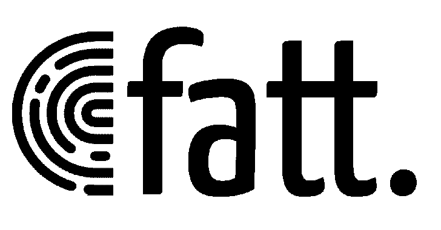

# FATT-指纹所有的东西

> 原文：<https://kalilinuxtutorials.com/fatt-fingerprint-all-the-things/>

**FATT**(fingerprintAllTheThings)是一个基于 pyshark 的脚本，用于从 pcap 文件和实时网络流量中提取网络元数据和指纹。

用于从数据包捕获文件(pcap)或实时网络流量中提取网络元数据和指纹的脚本，如 [JA3](https://github.com/salesforce/ja3) 和 [HASSH](https://github.com/salesforce/hassh) 。主要用例是监控蜜罐，但是您也可以将其用于其他用例，例如网络取证分析。fatt 可以在 Linux、macOS 和 Windows 上运行。

注意，fatt 使用 pyshark(t shark 的 python 包装器),因此性能不是很好！但这不是一个大问题，因为显然这不是一个你在生产中使用的工具。对于更严重的用例，您可以使用其他网络分析工具，如 [Bro/Zeek](https://github.com/bro/bro) 、 [Suricata](https://github.com/OISF/suricata) 或 [Netcap](https://github.com/dreadl0ck/netcap) 。Joy 是另一个可以用来捕获和分析网络流量数据的伟大工具。

除此之外，我正在开发一个更快的基于 go 的 fatt 版本，你可以在基于 gopacket 的工具中使用它的库，比如 packetbeat。我发布了它的 gQUIC 库的初始版本( [QUICk](https://github.com/0x4D31/quick) )。

**特色**

*   协议支持:SSL/TLS，SSH，RDP，HTTP，gQUIC。
    *   即将添加:IETF QUIC，MySQL，MSSQL 等。
*   指纹识别
    *   JA3: TLS 客户机/服务器指纹
    *   HASSH: SSH 客户机/服务器指纹
    *   RDFP:我的标准 RDP 安全协议的实验性 RDP 指纹(注意，其他 RDP 安全模式使用 TLS，可以用 JA3 采集指纹)
    *   HTTP 头指纹
    *   很快将添加指纹
*   JSON 输出

**另请阅读-[Manati:一个基于网络的工具，用于帮助直观的威胁分析人员](https://kalilinuxtutorials.com/manati-intuitive-threat-analysts/)**

**入门**

*   安装 tshark

你需要先安装 [tshark](https://github.com/wireshark/wireshark) 。确保您拥有版本 2.9.0 或更高版本。Tshark/Wireshak 从 v2.9.0 版本将' ssl '重命名为' tls '，fatt 是基于 Tshark 新版本编写的。

如果你有老版本的 t shark(< v2.9.0), you can use the fatt script from [“old-t shark”分支](https://github.com/0x4D31/fatt/tree/old-tshark))。

*   安装依赖项

**cd fatt/
pip3 安装
pipenv pipenv 安装**

或者，如果您不想使用虚拟环境，只需安装 pyshark:

**pip3 安装 pyshark==0.4.2.2**

要激活 virtualenv，请运行 pipenv shell:

**$ pipenv shell
在虚拟环境中启动 subshell……
bash-3.2 $。/Users/adel/。local/share/virtualenvs/fatt-ucJHMzzt/bin/activate(fatt-ucJHMzzt)bash-3.2 $ python 3 fatt . py-h**

或者，在 virtualenv 中用`pipenv run`运行命令:

**$ pipenv 运行 python3 fatt.py -h**

输出:

用法:fatt . py[-h][-r READ _ FILE][-d READ _ DIRECTORY][-I INTERFACE]
[-FP[{ TLS，ssh，rdp，http，gquic} [{tls，ssh，rdp，http，gquic }…]]]
[-da DECODE _ AS][-f BPF _ FILTER][-j][-o OUTPUT _ FILE]
[-w WRITE _ PCAP][-p]

一个 python 脚本 Default: all
-da DECODE_AS，–DECODE _ AS DECODE _ AS
一个{ DECODE _ criterion _ string:
DECODE _ AS _ protocol }的字典，用于告诉 tshark 在通常不会的情况下使用
解码协议。
-f bpf _ 滤镜，–bpf _ 滤镜 BPF _ 滤镜
要使用的 BPF 捕捉滤镜(仅用于现场捕捉)。
-j，–json _ logging 以 JSON 格式记录输出
-o OUTPUT_FILE，–OUTPUT _ FILE OUTPUT _ FILE
指定输出日志文件。默认:fatt.log
-w WRITE_PCAP，–WRITE _ pcap WRITE _ PCAP
将现场抓取的数据包保存到这个文件
-p，–print _ output 打印输出

**用法**

**实时网络流量捕捉:**

**python 3 fact . py-I in 0–print _ output–JSON _ logging
192 . 168 . 1 . 10:595->192 . 168 . 1 . 3:80[http]hash = 598 c34 a 2838 e 82 F9 EC 3175305 f 233 b 89 user agent = " Spotify/1099600181 OSX/0(macbook pro 14.3)"
192 . 168 . 1**

JSON 输出:

$ cat fatt.log
{“timestamp”: “2019-05-28T03:41:25.415086”, “sourceIp”: “192.168.1.10”, “destinationIp”: “192.168.1.3”, “sourcePort”: “59565”, “destinationPort”: “80”, “protocol”: “http”, “http”: {“requestURI”: “/DIAL/apps/com.spotify.Spotify.TVv2”, “requestFullURI”: “http://192.168.1.3/DIAL/apps/com.spotify.Spotify.TVv2”, “requestVersion”: “HTTP/1.1”, “requestMethod”: “GET”, “userAgent”: “Spotify/109600181 OSX/0 (MacBookPro14,3)”, “clientHeaderOrder”: “connection,accept_encoding,host,user_agent”, “clientHeaderHash”: “598c34a2838e82f9ec3175305f233b89”}}
{“timestamp”: “2019-05-28T03:41:26.099574”, “sourceIp”: “13.237.44.5”, “destinationIp”: “192.168.1.10”, “sourcePort”: “22”, “destinationPort”: “59566”, “protocol”: “ssh”, “ssh”: {“server”: “SSH-2.0-babeld-80573d3e”, “hasshServer”: “3f0099d323fed5119bbfcca064478207”, “hasshServerAlgorithms”: “curve25519-sha256,curve25519-sha256@libssh.org,ecdh-sha2-nistp256,ecdh-sha2-nistp384,ecdh-sha2-nistp521,diffie-hellman-group-exchange-sha256;chacha20-poly1305@openssh.com,aes256-gcm@openssh.com,aes128-gcm@openssh.com,aes256-ctr,aes192-ctr,aes128-ctr,aes256-cbc,aes192-cbc,aes128-cbc;hmac-sha2-256-etm@openssh.com,hmac-sha2-512-etm@openssh.com,hmac-sha1-etm@openssh.com,hmac-sha2-256,hmac-sha2-512,hmac-sha1;none,zlib,zlib@openssh.com”, “hasshVersion”: “1.0”, “skex”: “curve25519-sha256,curve25519-sha256@libssh.org,ecdh-sha2-nistp256,ecdh-sha2-nistp384,ecdh-sha2-nistp521,diffie-hellman-group-exchange-sha256”, “seastc”: “chacha20-poly1305@openssh.com,aes256-gcm@openssh.com,aes128-gcm@openssh.com,aes256-ctr,aes192-ctr,aes128-ctr,aes256-cbc,aes192-cbc,aes128-cbc”, “smastc”: “hmac-sha2-256-etm@openssh.com,hmac-sha2-512-etm@openssh.com,hmac-sha1-etm@openssh.com,hmac-sha2-256,hmac-sha2-512,hmac-sha1”, “scastc”: “none,zlib,zlib@openssh.com”, “slcts”: “[Empty]”, “slstc”: “[Empty]”, “seacts”: “chacha20-poly1305@openssh.com,aes256-gcm@openssh.com,aes128-gcm@openssh.com,aes256-ctr,aes192-ctr,aes128-ctr,aes256-cbc,aes192-cbc,aes128-cbc”, “smacts”: “hmac-sha2-256-etm@openssh.com,hmac-sha2-512-etm@openssh.com,hmac-sha1-etm@openssh.com,hmac-sha2-256,hmac-sha2-512,hmac-sha1”, “scacts”: “none,zlib,zlib@openssh.com”, “sshka”: “ssh-dss,rsa-sha2-512,rsa-sha2-256,ssh-rsa”}}
{“timestamp”: “2019-05-28T03:41:26.106737”, “sourceIp”: “192.168.1.10”, “destinationIp”: “13.237.44.5”, “sourcePort”: “59566”, “destinationPort”: “22”, “protocol”: “ssh”, “ssh”: {“client”: “SSH-2.0-OpenSSH_7.9”, “hassh”: “ec7378c1a92f5a8dde7e8b7a1ddf33d1”, “hasshAlgorithms”: “curve25519-sha256,curve25519-sha256@libssh.org,ecdh-sha2-nistp256,ecdh-sha2-nistp384,ecdh-sha2-nistp521,diffie-hellman-group-exchange-sha256,diffie-hellman-group16-sha512,diffie-hellman-group18-sha512,diffie-hellman-group14-sha256,diffie-hellman-group14-sha1,ext-info-c;chacha20-poly1305@openssh.com,aes128-ctr,aes192-ctr,aes256-ctr,aes128-gcm@openssh.com,aes256-gcm@openssh.com;umac-64-etm@openssh.com,umac-128-etm@openssh.com,hmac-sha2-256-etm@openssh.com,hmac-sha2-512-etm@openssh.com,hmac-sha1-etm@openssh.com,umac-64@openssh.com,umac-128@openssh.com,hmac-sha2-256,hmac-sha2-512,hmac-sha1;none,zlib@openssh.com,zlib”, “hasshVersion”: “1.0”, “ckex”: “curve25519-sha256,curve25519-sha256@libssh.org,ecdh-sha2-nistp256,ecdh-sha2-nistp384,ecdh-sha2-nistp521,diffie-hellman-group-exchange-sha256,diffie-hellman-group16-sha512,diffie-hellman-group18-sha512,diffie-hellman-group14-sha256,diffie-hellman-group14-sha1,ext-info-c”, “ceacts”: “chacha20-poly1305@openssh.com,aes128-ctr,aes192-ctr,aes256-ctr,aes128-gcm@openssh.com,aes256-gcm@openssh.com”, “cmacts”: “umac-64-etm@openssh.com,umac-128-etm@openssh.com,hmac-sha2-256-etm@openssh.com,hmac-sha2-512-etm@openssh.com,hmac-sha1-etm@openssh.com,umac-64@openssh.com,umac-128@openssh.com,hmac-sha2-256,hmac-sha2-512,hmac-sha1”, “ccacts”: “none,zlib@openssh.com,zlib”, “clcts”: “[Empty]”, “clstc”: “[Empty]”, “ceastc”: “chacha20-poly1305@openssh.com,aes128-ctr,aes192-ctr,aes256-ctr,aes128-gcm@openssh.com,aes256-gcm@openssh.com”, “cmastc”: “umac-64-etm@openssh.com,umac-128-etm@openssh.com,hmac-sha2-256-etm@openssh.com,hmac-sha2-512-etm@openssh.com,hmac-sha1-etm@openssh.com,umac-64@openssh.com,umac-128@openssh.com,hmac-sha2-256,hmac-sha2-512,hmac-sha1”, “ccastc”: “none,zlib@openssh.com,zlib”, “cshka”: “rsa-sha2-512-cert-v01@openssh.com,rsa-sha2-256-cert-v01@openssh.com,ssh-rsa-cert-v01@openssh.com,rsa-sha2-512,rsa-sha2-256,ssh-rsa,ecdsa-sha2-nistp256-cert-v01@openssh.com,ecdsa-sha2-nistp384-cert-v01@openssh.com,ecdsa-sha2-nistp521-cert-v01@openssh.com,ssh-ed25519-cert-v01@openssh.com,ecdsa-sha2-nistp256,ecdsa-sha2-nistp384,ecdsa-sha2-nistp521,ssh-ed25519”}}
{“timestamp”: “2019-05-28T03:41:36.762811”, “sourceIp”: “192.168.1.10”, “destinationIp”: “93.184.216.34”, “sourcePort”: “59584”, “destinationPort”: “443”, “protocol”: “tls”, “tls”: {“serverName”: “example.com”, “ja3”: “e6573e91e6eb777c0933c5b8f97f10cd”, “ja3Algorithms”: “771,49200-49196-49192-49188-49172-49162-159-107-57-52393-52392-52394-65413-196-136-129-157-61-53-192-132-49199-49195-49191-49187-49171-49161-158-103-51-190-69-156-60-47-186-65-49170-49160-22-10-255,0-11-10-13-16,29-23-24,0”, “ja3Version”: “771”, “ja3Ciphers”: “49200-49196-49192-49188-49172-49162-159-107-57-52393-52392-52394-65413-196-136-129-157-61-53-192-132-49199-49195-49191-49187-49171-49161-158-103-51-190-69-156-60-47-186-65-49170-49160-22-10-255”, “ja3Extensions”: “0-11-10-13-16”, “ja3Ec”: “29-23-24”, “ja3EcFmt”: “0”}}
{“timestamp”: “2019-05-28T03:41:36.920935”, “sourceIp”: “93.184.216.34”, “destinationIp”: “192.168.1.10”, “sourcePort”: “443”, “destinationPort”: “59584”, “protocol”: “tls”, “tls”: {“ja3s”: “ae53107a2e47ea20c72ac44821a728bf”, “ja3sAlgorithms”: “771,49199,65281-0-11-16”, “ja3sVersion”: “771”, “ja3sCiphers”: “49199”, “ja3sExtensions”: “65281-0-11-16”}}
{“timestamp”: “2019-05-28T03:41:37.487609”, “sourceIp”: “192.168.1.10”, “destinationIp”: “192.168.1.3”, “sourcePort”: “59588”, “destinationPort”: “80”, “protocol”: “http”, “http”: {“requestURI”: “/DIAL/apps/com.spotify.Spotify.TVv2”, “requestFullURI”: “http://192.168.1.3/DIAL/apps/com.spotify.Spotify.TVv2”, “requestVersion”: “HTTP/1.1”, “requestMethod”: “GET”, “userAgent”: “Spotify/109600181 OSX/0 (MacBookPro14,3)”, “clientHeaderOrder”: “connection,accept_encoding,host,user_agent”, “clientHeaderHash”: “598c34a2838e82f9ec3175305f233b89”}}
{“timestamp”: “2019-05-28T03:41:48.700730”, “sourceIp”: “192.168.1.10”, “destinationIp”: “216.58.196.142”, “sourcePort”: “59601”, “destinationPort”: “80”, “protocol”: “http”, “http”: {“requestURI”: “/”, “requestFullURI”: “http://google.com/”, “requestVersion”: “HTTP/1.1”, “requestMethod”: “GET”, “userAgent”: “curl/7.54.0”, “clientHeaderOrder”: “host,user_agent,accept”, “clientHeaderHash”: “d6662c018cd4169689ddf7c6c0f8ca1b”}}
{“timestamp”: “2019-05-28T03:41:48.805393”, “sourceIp”: “216.58.196.142”, “destinationIp”: “192.168.1.10”, “sourcePort”: “80”, “destinationPort”: “59601”, “protocol”: “http”, “http”: {“server”: “gws”, “serverHeaderOrder”: “location,content_type,date,cache_control,server,content_length”, “serverHeaderHash”: “c5241aca9a7c86f06f476592f5dda9a1”}}
{“timestamp”: “2019-05-28T03:41:58.038530”, “sourceIp”: “192.168.1.10”, “destinationIp”: “216.58.203.99”, “sourcePort”: “54387”, “destinationPort”: “443”, “protocol”: “gquic”, “gquic”: {“tagNumber”: “25”, “sni”: “clientservices.googleapis.com”, “uaid”: “Chrome/74.0.3729.169 Intel Mac OS X 10_14_5”, “ver”: “Q043”, “aead”: “AESG”, “smhl”: “1”, “mids”: “100”, “kexs”: “C255”, “xlct”: “cd9baccc808a6d3b”, “copt”: “NSTP”, “ccrt”: “cd9baccc808a6d3b67f8adc58015e3ff”, “stk”: “d6a64aeb563a19fe091bc34e8c038b0a3a884c5db7caae071180c5b739bca3dd7c42e861386718982fbe6db9d1cb136f799e8d10fd5a”, “pdmd”: “X509”, “ccs”: “01e8816092921ae8”, “scid”: “376976b980c73b669fea57104fb725c6”}}

#### 数据包捕获文件(pcap):

让我们来看看最近 CVE-2019-0708 RDP 漏洞(BlueKeep)的 Metasploit 辅助扫描器捕获的流量。

**python 3 fact . py-r RDP/CVE-2019-0708 _ metaploit _ aux . pcap-p-j；cat fact . log | python-m JSON . tool
192 . 168 . 1 . 10:39079->192 . 168 . 1 . 20:3389[RDP]rdfp = 525 E1 CB 20980 b81 c24f 1668 DD 55 e 94 cookie = " msshash = user 0 "；【req _ protocols = 0x 00000000】
destination IP:" 192.168
【4】:
【名称】:【rdpdr】，
【选项】:【8080】
}
}，
【客户端构建】:【2600】，
【客户端产品 id】:【000000000000 000000 000000 000000 000000 000000000】，【t】
【rdfpversion】:【0.3】、
【requested dprotcols】:【0x 00000000】、
【sassequence】:【4323】、
【serial number】:【0】、
【supported colordepts】:【0x 00000007】、
【Verma JOR】:【4】、
【蛭**

让我们用另一个 CVE-2019-0708 概念验证来测试它:

**$ python 3 fatt . py-r RDP/CVE-2019-0708 _ POC . pcap-p-j；cat fatt . log | python-m JSON . tool
192 . 168 . 1 . 10:54303->192 . 168 . 1 . 20:3389【RDP】req _ protocols = 0x 00000001
{
" destination IP ":" 192 . 168 . 1 . 20 "，
"destinationPort": "3389 "，
"protocol": "rdp "，**

这次我们没有看到 RDP ClientInfo 消息，因为 PoC 使用 TLS(不是标准的 RDP 安全协议)。因此我们只能看到`Negotiation Request`消息，但是如果您将数据包解码为 TLS，您可以看到 TLS clientHello 和 JA3 指纹。以下是将特定端口解码为另一种协议的方法:

$ python 3 fact . py-r RDP//CVE-2019-0708 _ POC . pcap-p-j–decode _ as " { " TCP . port = = 3389 ":" TLS " } " t0 " 192 . 168 . 1 . 10:50026->192 . 168 . 1 . 20:3389[TLS]是 3 = 67 e3d 18 FD 9 DDD BBC 8 ECA 65 F7 dedac 674 servername = 192 . 168 . 1 . 20]

[Download](https://github.com/0x4D31/fatt)