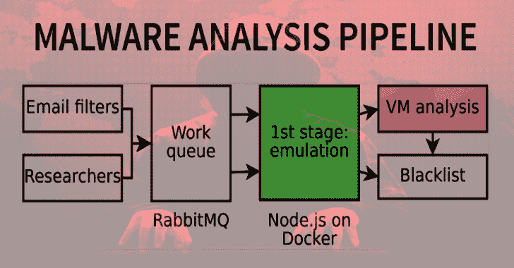

# 盒子。JS:一个研究 JavaScript 恶意软件的工具

> 原文：<https://kalilinuxtutorials.com/box-js-tool-for-studying-javascript-malware/>

**box.js** 是一个分析恶意 JavaScript 的实用程序。

**安装**

只需从 npm 安装 box-js:

**npm 安装框-js–全局**

**用法**

想在布谷鸟上使用 box-js 吗？使用`**cuckoo-package.py**`作为分析包。

假设您有一个名为`sample.js`的样本:要分析它，只需运行

**box-js sample.js**

你可能还想下载任何有效载荷；使用标志`**--download**`启用下载。否则，引擎将模拟一个 404 错误，这样脚本将被欺骗以为分发站点关闭并联系任何备用站点。

Box.js 将模拟一个 Windows JScript 环境，将模拟的摘要打印到控制台，并创建一个名为`**sample.js.results**`的文件夹(如果已经存在，它将创建`**sample.js.1.results**`等等)。该文件夹将包含:

*   `**analysis.log**`，打印在屏幕上的分析日志；
*   由 UUIDs 标识的一系列文件；
*   `**snippets.json**`，样本执行的代码段列表(JavaScript、shell 命令等)。);
*   `**urls.json**`，联系的 URL 列表；
*   `**active_urls.json**`，看似掉落主动恶意软件的 URL 列表；
*   `**resources.json**`、ADODB 流(即脚本写入磁盘的文件)，带有文件类型和哈希；
*   `**IOC.json**`，一个被确定为 IOC(危害指标)的行为列表。这些包括注册表访问、写入文件、HTTP 请求等等。

你可以自己分析这些，也可以自动提交给 Malwr、VirusTotal 或者 Cuckoo 沙箱:更多信息，运行`box-export --help`。

为了进一步隔离，建议在临时 Docker 容器中运行分析。更多信息请咨询`**integrations/README.md**`。

如果您希望自动化分析，您可以使用返回代码(记录在`**integrations/README.md**`中)来区分不同类型的错误。

**也可阅读-[芬里尔:简单的 Bash IOC 扫描仪](https://kalilinuxtutorials.com/fenrir-simple-bash-ioc-scanner/)**

**批量使用**

虽然 box.js 通常用于单个文件，但它也可以运行批量分析。您可以简单地传递要分析的文件或文件夹列表:

**box-js sample 1 . js sample 2 . js/var/data/my samples…**

默认情况下，box.js 将并行处理样本，每个内核运行一次分析。您可以通过为`--threads`指定一个值来使用不同的设置:特别是，0 将取消限制，使 box-js 产生尽可能多的分析线程，并导致非常快速的分析，但可能会使系统过载(注意，**分析通常是 CPU 绑定的**，而不是 RAM 绑定的)。

您可以使用`**--loglevel=warn**`来隐藏与分析相关的消息，只显示进度信息。

分析完成后，您可以像这样提取活动的 URL:

**猫。/*.results/active _ URLs . JSON | sort | uniq**

**旗帜**

名称描述
-h，–help 显示帮助文本并退出
-v，–version 显示软件包版本并退出
–license 显示许可证并退出
–出现仿真错误时调试芯片，即使在“批处理模式”下，并传递退出代码。
–log level 日志级别(调试、详细、信息、警告、错误–默认“信息”)
–线程以批处理模式运行时，同时运行多少个分析(0 =无限制， 默认:与 CPU 内核数量一样多)
–下载实际下载有效负载
–编码输入样本的编码(默认情况下会自动检测)
–超时脚本将在此秒数后超时(默认为 10)
–output-dir 将结果文件和文件夹写入磁盘的位置(默认为当前目录)
–预处理预处理原始源代码(使逆向工程更容易，但需要几秒钟)
–不安全-预处理更激进的预处理。 通常会产生更好的代码，但在某些边缘情况下可能会中断(例如重新定义原型)
–不终止在出现运行时错误时不终止应用程序
–当脚本打印数据时不回显，不将其打印到控制台
–不重写根本不重写源代码，除了为了`@cc_on`支持
–不捕获重写不重写尝试..catch 子句使异常成为全局范围的
–no-cc _ on-rewrite Do not rewrite`/*@cc_on <...>@*/`to`<...>`
–no-eval-rewrite Do not rewrite`eval`以便重写其参数
–no-file-exists 返回`false`用于脚本编写。file system object . file exists(x)
–no-folder-exists 返回`false`用于脚本编写。file system object . file exists(x)
–函数重写重写函数调用以捕获 eval 调用
–no-rewrite-prototype 不要将类似于`function A.prototype.B()`的表达式重写为`A.prototype.B = function()`
–no-hinge-prototype 不要提升类似于`function A.prototype.B()`的表达式(由 no-Rewrite-prototype 暗示)
–no-shell-error 执行`WScriptShell.Run`时不要抛出假错误(默认情况下抛出假错误以假装分发站点关闭，因此脚本将尝试轮询每个站点如果–download 标志不存在，这是不相关的。
–Windows-XP 仿真 Windows XP(影响环境变量的值)
–dangerous-VM 使用`vm`模块，而不是`vm2`。这个沙盒可以被打破，所以**不要使用这个**，除非你 100%确定你在做什么。通过提供正确的堆栈跟踪来帮助调试。

**分析输出**

**控制台输出**

第一个信息源是控制台输出。在一次成功的分析中，它通常会打印如下内容:

使用 10 秒超时，传递超时以秒为单位指定另一个超时
分析 http://foo.bar/baz:用户代理 Mozilla/4.0 的 sample.js
头集(兼容；MSIE 6.0windows NT 5.0)【http://foo.bar/baz】仿真一个 GET 请求到 T2
下载了 301054 字节。【保存的 sample.js.results/a0af1253-597c-4eed-9e8f-5b633ff5f66a(301054 字节)
sample.js.results/a0af1253-597c-4eed-9e8f-5b633ff5f66a 已被检测为数据。
已保存的 sample.js.results/f8df7228-7e0a-4241-9dae-c4e1664dc5d8(303128 字节)
已将 sample.js.results/f8df7228-7e0a-4241-9dae-c4e1664dc5d8 检测为适用于 MS Windows 的 PE32 可执行文件(GUI)英特尔 80386。
http://foo.bar/baz 是一个活跃的网址。
执行 http://somethingelse.com/:用户代理 Mozilla/4.0(兼容；MSIE 6.0Windows NT 5.0)
模拟对 http://somethingelse.com/的 GET 请求
…

在本例中，我们看到一个下载程序从`**http://foo.bar/baz**`下载一个文件，将 HTTP 头`**User-Agent**`设置为`**Mozilla/4.0 (compatible; MSIE 6.0; Windows NT 5.0)**`。然后，它进行解码，并将结果写入磁盘(一个 PE32 可执行文件)。最后，它在 Windows shell 中运行一些命令。

*   `**sample.js.results/a0af1253-597c-4eed-9e8f-5b633ff5f66a**`将包含从[http://foo.bar/baz](http://foo.bar/baz)下载的有效载荷；
*   `**sample.js.results/f8df7228-7e0a-4241-9dae-c4e1664dc5d8**`将包含实际有效载荷(PE 可执行)；
*   `**sample.js.results/d241e130-346f-4c0c-a698-f925dbd68f0c**`将包含在 Windows shell 中运行的命令。

**JSON 日志**

每个 HTTP 请求都被打印在终端上并记录在`**urls.json**`中。不会插入重复的 URL(即两次请求相同的 URL 将导致`**urls.json**`中只有一行)。

`**active_urls.json**`包含最终产生可执行负载的 URL 列表。如果您想拿下分发站点，这个文件是最有趣的。

`**snippets.json**`包含了`**box-js**`遇到的每一段代码，JavaScript、cmd.exe 命令或 PowerShell 脚本。

`**resources.json**`包含由样本写入磁盘的每个文件。例如，如果应用程序试图将`**Hello world!**` 保存到`**$PATH/foo.txt**`，`**resources.json**`的内容将是:

{
" 9a 24…":{
" path ":"(path)\ foo . txt "，
"type": "ASCII 文本，不带行终止符"，
" MD5 ":" 86fb 269d 190 D2 c8 5f 6 e 0468 ceca 42 a 20 "，
" sha1 ":" d 3486 AE 9136 e 7856 BC 42212385 ea 79709475802 "，

`**resources.json**`文件也很重要:注意任何可执行资源(比如用`**"type": "PE32 executable (GUI) Intel 80386, for MS Windows"**`)。

**打补丁**

已经观察到一些野生的脚本使用`**new Date().getYear()**` where `**new Date().getFullYear()**`。如果一个样本没有显示出任何可疑的行为，就要小心`**Date**`检查了。

如果你遇到。JSE 文件，编译解码器，并像这样运行它:

**cc 解码器. c -o 解码器
。/decoder foo.jse bar.js
节点运行 bar.js**

**展开**

您可能偶尔会遇到不支持的组件。在这种情况下，你可以在 GitHub 上提交一个问题，或者如果你懂 JavaScript 的话，自己模拟这个组件。

错误通常如下所示(行号可能不同):

1 Jan 00:00:00–未知的 ActiveXObject WinHttp。winhttp request . 5.1
Trace
at kill(/home/capacitor set/box-js/run . js:24:10)
at Proxy。evalmachine 上的 ActiveX object(/home/capacitor set/box-js/run . js:75:4)
。:1:6471
在 ContextifyScript。script . runinnewcontext(VM . js:18:15)
at…

您可以看到异常是在`**Proxy.ActiveXObject**`中引发的，如下所示:

function ActiveX object(name){
name = name . tolowercase()；
/*…*/switch(name){ case " wscript . shell ":return require(" ./emulator/WScriptShell ")；/*……*/
默认:
杀(`Unknown ActiveXObject ${name}`)；
破；
}
}

添加新的`**case "winhttp.winhttprequest.5.1"**`(注意小写！)，并让它返回一个 ES6 `**Proxy**`对象(如`**ProxiedWinHttpRequest**`)。这用于在恶意示例请求未实现的功能时捕获它们:

/* emulator/winhttp request . exe */
const lib = require("../lib ")；

module . exports = function proxiedwinhttp request(){
return new Proxy(new winhttp request()，{
get: function(target，name，receiver){
switch(name){
/*在此添加带有 case 语句的“特殊”陷阱*/
默认:
if(name in target)return target[name]；
else lib . kill(`WinHttpRequest.${name} not implemented!`)
}
}
})
}
函数 WinHttpRequest() {
}

重新运行分析:它会再次失败，告诉你到底是什么没有实现。

1 月 00:00:00–winhttp request . open 未实现！
Trace
at kill(/home/capacitor set/box-js/run . js:24:10)
at Object。proxiedwinhttp request . proxy . get(/home/capacitor set/box-js/run . js:89:7)

根据需要模拟`**WinHttpRequest.open**`:

function winhttp request(){
this . open = function(method，url) {
URLLogger(method，URL)；
this . URL = URL；
}
}

[**Download**](https://github.com/CapacitorSet/box-js)