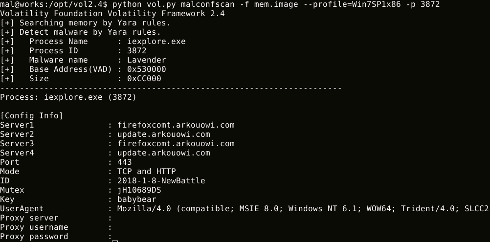

# MalConfScan:提取已知恶意软件的配置数据的易失性插件

> 原文：<https://kalilinuxtutorials.com/malconfscan-extracts-configuration-data-malware/>

**MalConfScan** 是一个[波动](https://github.com/volatilityfoundation/volatility)插件，提取已知恶意软件的配置数据。Volatility 是一个用于事件响应和恶意软件分析的开源内存取证框架。该工具在内存映像中搜索恶意软件，并转储配置数据。此外，该工具具有列出恶意代码引用的字符串的功能。

**支持的恶意软件家族**

它可以转储以下恶意软件配置数据、解码字符串或 DGA 域:

*   乌尔斯尼夫
*   Emotet
*   烟雾装载机
*   毒葛
*   钴罢工
*   novell 公司出的网络操作系统
*   PlugX
*   红叶/喜玛拉雅/薰衣草/犰狳/ zark20rk
*   TSCookie
*   TSC_Loader
*   xxmm
*   衣冠楚楚的
*   掉下去了
*   用潜望镜侦察潜水艇的装置
*   洛基特
*   Bebloh (Shiotob/URLZone)
*   偶氮染料
*   纳米核心鼠
*   特斯拉代理
*   表格簿
*   NodeRAT([https://blogs.jpcert.or.jp/ja/2019/02/tick-activity.html](https://blogs.jpcert.or.jp/ja/2019/02/tick-activity.html))
*   njRAT
*   特技机器人
*   雷麦斯人
*   类星体
*   矮种马

**也可阅读-[Penta:自动化测试的开源一体化 CLI 工具](https://kalilinuxtutorials.com/penta-open-source-cli-automate-pentesting/)**

**补充分析**

它有一个列出恶意代码引用的字符串的功能。配置数据通常由恶意软件编码。恶意软件将解码的配置数据写入内存，它可能在内存中。该特征可以列出解码的配置数据。

**如何安装**

**安装包**

如果您没有 Yara，请检查此页面并安装它。
波动率只支持 Python2。如果您没有 Python2，请安装它。

**下载波动**

*   下载[波动源代码](https://www.volatilityfoundation.org/releases)。
*   从 zip 或 tar.gz 文件中提取挥发性源代码。

**$ wget http://downloads . volatility foundation . org/releases/2.6/volatility-2.6 . zip
$ unzip volatility-2.6 . zip**

或者从 Github 克隆。

**$ git 克隆 https://github.com/volatilityfoundation/volatility.git**

**安装**

*   **克隆 MalConfScan Github 库**

**git 克隆 https://github . com/jpcertccc/malconfscan . git**

*   **安装 Python 需求**

**$ pip install-r MalConfScan/requirements . txt**

*   **复制到 Volatility 插件文件夹**

**$ CD MalConfScan
$ CP-R MalConfScan . py utils yara【提取挥发性文件夹】/挥发性/插件/恶意软件**

关于 Linux 上的易变性，请参考[易变性 wiki](https://github.com/volatilityfoundation/volatility/wiki/Installation#installing-volatility) 。

**如何使用**

它有两个功能 **malconfscan** 和 **malstrscan** 。

**导出已知恶意软件配置**

$ python vol . py malconfscan-f images . mem–profile = win 7 sp 1x 64

**列出引用的字符串**

$ python vol . py malstrscan-f images . mem–profile = win 7 sp 1x 64

**同布谷鸟**

恶意软件配置数据可以通过添加到 Cuckoo 沙箱中自动转储。如果您需要关于 Cuckoo 和工具集成的更多细节，请使用 Cuckoo 检查 [MalConfScan。](https://github.com/JPCERTCC/MalConfScan-with-Cuckoo)

[**Download**](https://github.com/JPCERTCC/MalConfScan)