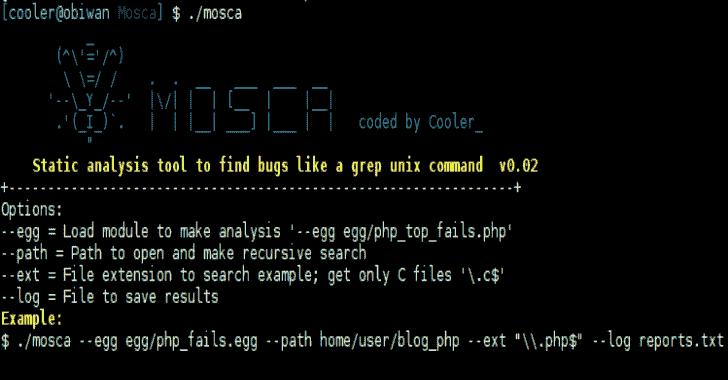

# Mosca:像 Grep Unix 命令一样查找 bug 的手动搜索工具

> 原文：<https://kalilinuxtutorials.com/mosca-search-tool-bugs-grep-unix-command/>

Mosca 是一个手动分析工具，可以像 grep unix 命令一样查找 bug，因为它不是动态的，所以使用静态代码进行搜索，不要与学术观点混淆，哈哈哈这里没有 graph 或 CFG，这是一个简单的“grep”

*   egg 模块是一种发现漏洞的配置
*   你可以使用 at C，PHP，javascript，ruby 等等
*   在 XML 文件中保存结果
*   创建自己的模块等…
*   为什么是静态？

**也读作-[方框。JS:研究 JavaScript 恶意软件的工具](https://kalilinuxtutorials.com/box-js-tool-for-studying-javascript-malware/)**

[**Download**](https://github.com/CoolerVoid/Mosca)