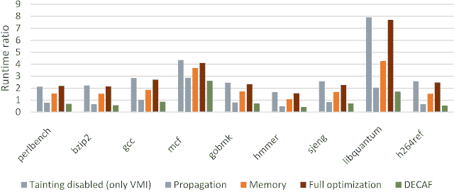

# DECAF:动态可执行代码分析框架

> 原文：<https://kalilinuxtutorials.com/decaf-dynamic-executable-code-analysis-framework/>

**DECAF** (动态可执行代码分析框架的简称)是基于 QEMU 的二进制分析平台。这也是 DroidScope 动态 Android 恶意软件分析平台的所在地。DroidScope 现在是 DECAF 的延伸。

DECAF++是 DECAF 的新版本，污点分析速度提高了约 2 倍，据我们所知，这是最快的全系统动态污点分析框架。当不存在可疑的(被污染的)输入时，这导致了更好的可用性，只增加了 4%的开销(SPEC CPU2006)。即使在繁重的污点分析工作负载下，DECAF++也有更好的性能，在 nbench 上快 25%左右，这是因为它的弹性。

DECAF++弹性使其非常适合选择性分析输入的安全分析任务，例如可以过滤掉良性流量的入侵检测系统(IDS)。有关进一步的技术细节，请参见我们的 [RAID 2019 论文](https://www.cs.ucr.edu/~adava003/RAID__Elastic_Whole_System_Dynamic_Taint_Analysis.pdf)。要激活优化，请查看我们的 [DECAF++ wiki](https://github.com/decaf-project/DECAF/wiki/DECAF--plus-plus) 页面。

**亦读-[FATT-指纹所有的东西](https://kalilinuxtutorials.com/fatt-fingerprint-all-the-things/)**

**出版物**

1.  Ali Davanian，Zhenxiao Qi，Yu Qu，和 Heng Yin，DECAF++:弹性全系统动态污点分析，在第 22 届攻击、入侵和防御研究国际研讨会(RAID)上，2019 年 9 月。**(如果你想引用新的优化版脱咖啡因咖啡，请引用这篇论文)**
2.  “让它工作，让它正确，让它快速:构建一个平台中立的全系统动态二进制分析平台”，Andrew Henderson，Aravind Prakash，Lok Kwong Yan，Xunchao Hu，Xujiewen Wang，Zhou，和 Heng Yin，发表于 2014 年 7 月在加利福尼亚州圣何塞举行的软件测试与分析国际研讨会(ISSTA’14)。**(如果你想引用无咖啡因咖啡，请引用本文)**
3.  乐广仁、安德鲁·亨德森、胡勋超、恒胤和斯蒂芬·麦卡曼？。动态污点分析的可靠性和精确性。锡拉丘兹大学 2014-04 年锡拉丘兹-EECS 技术报告，2014 年 1 月。
4.  DroidScope:为动态 Android 恶意软件分析无缝重构操作系统和 Dalvik 语义视图”，Lok-Kwong Yan 和 Heng Yin，在第 21 届 USENIX 安全研讨会上，华盛顿州贝尔维尤，2012 年 8 月 8-10 日。

**简介**

DECAF(动态可执行代码分析框架)是为穆特开发的二进制分析技术( [BitBlaze](http://bitblaze.cs.berkeley.edu/) 的动态分析组件)的继承者，作为[恒银](http://lcs.syr.edu/faculty/yin/)在由[黎明宋](http://www.cs.berkeley.edu/~dawnsong/)领导的 [BitBlaze](http://bitblaze.cs.berkeley.edu/) 项目上工作的一部分。无咖啡因咖啡建立在穆特的基础上。我们感谢所有在那个项目上与我们一起工作的人。

**图 1 DECAF 的整体架构**

图 1 显示了脱咖啡因咖啡的整体结构。DECAF 是一个平台无关的全系统动态二进制分析框架。它提供了以下主要功能。

**准时虚拟机自检**

与穆特不同，DECAF 不使用客户驱动程序来检索操作系统级语义。DECAF 的 VMI 组件能够重建虚拟机的全新操作系统级视图，包括进程、线程、代码模块和符号，以支持二进制分析。此外，为了支持多种体系结构和操作系统，它遵循与平台无关的设计。提取 OS 级语义信息的工作流在多种体系结构和操作系统中是通用的。唯一特定于平台的处理取决于从什么内核数据结构和什么字段中提取信息。

**支持多平台**

理想情况下，我们希望拥有相同的分析代码(最少的特定于平台的代码)来为不同的 CPU 架构(例如 x86 和 ARM)和不同的操作系统(例如 Windows 和 Linux)工作。它要求分析框架对分析插件隐藏架构和操作系统的具体细节。此外，为了使分析框架本身可维护并可扩展到新的体系结构和操作系统，框架中特定于平台的代码也应该最小化。DECAF 可以支持多种架构和多种操作系统。目前 DECAF **支持 32 位 Windows xp/Windows 7/linux 和 X86/arm** 。

**精确无损污染**

DECAF 通过维护 CPU 寄存器和内存的位级精度，并在翻译后的代码块中内联精确的污染规则，来确保精确的污染。因此，在虚拟机的代码执行期间，每个 CPU 寄存器和存储器位置的污点状态被同步处理和更新。污点标签的传播是以异步方式完成的。通过主要在中间表示层(更具体地说，TCG IR 层)实现这种污染逻辑，将污染支持扩展到新的 CPU 架构变得很容易。

**事件驱动编程接口**

DECAF 提供了事件驱动的编程接口。这意味着“在翻译阶段使用工具，然后在执行阶段进行分析”的范例对于分析插件是不可见的。分析插件只需要注册感兴趣的事件，并实现相应的事件处理功能。代码检测的细节由框架负责。

**动态仪表管理**

为了减少运行时开销，只有在必要时才在翻译后的代码中插入插装代码。例如，当一个插件在一个函数的入口点注册一个函数钩子时，这个钩子的插装代码只放在函数入口点。当插件取消注册该函数挂钩时，插装代码也将相应地从翻译后的代码中移除。为了简化插件的开发，动态代码插装的管理完全由框架负责，因此对插件是不可见的。

[**Download**](https://github.com/decaf-project/DECAF)