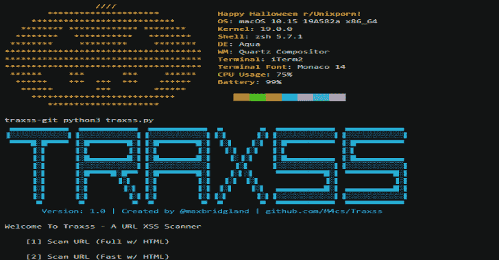

# Traxss:自动 xss 漏洞扫描器

> 原文：<https://kalilinuxtutorials.com/traxss-automated-xss-vulnerability-scanner/>

Traxss 是一个自动框架，用于扫描 URL 和网页中的 xss 漏洞。它包括超过 575 个有效载荷进行测试，并为测试的健壮性提供了多种选择。查看上面的 gif 来预览最快类型的扫描。

**入门**

**先决条件**

Traxss 依赖于 Chromedriver。在 MacOS 上，这可以用 homebrew 命令安装:

**brew 安装木桶 chromedriver**

**也可阅读-[Maryam:开源智能(OSINT)框架](https://kalilinuxtutorials.com/maryam-open-source-intelligenceosint-framework/)**

或者，在这里找到其他操作系统的版本:[https://sites . Google . com/a/chromium . org/chrome driver/downloads](https://sites.google.com/a/chromium.org/chromedriver/downloads)

**安装**

运行命令:

**pip 3 install-r requirements . txt**

**运行 Traxss**

Traxx 可以通过以下命令启动:

python3 traxss.py

这将启动一个交互式 CLI 来引导您完成整个过程。

**扫描类型**

*   **全扫描 w/ HTML :** 使用具有 575+有效负载的查询扫描，并试图通过 URL 传递参数来查找 XSS 漏洞。它还会呈现 HTML 并试图发现手动 XSS 漏洞(此功能仍处于测试阶段)。
*   **不含 HTML 的完全扫描:**此扫描将仅运行查询扫描。
*   **快速扫描网页:**这种扫描与全面扫描网页相同，但它将只使用 7 个攻击向量，而不是 575+个向量。
*   **快速扫描 w/o HTML :** 此扫描与快速 w/o HTML 相同，但它将只使用 7 个攻击向量，而不是 575+个向量。

**特约**

感谢您的关注！欢迎各种类型的贡献。

*   派生并克隆此存储库
*   从主分支创建您的分支
*   请以总分行为基础打开您的 PR

[**Download**](https://github.com/M4cs/traxss)